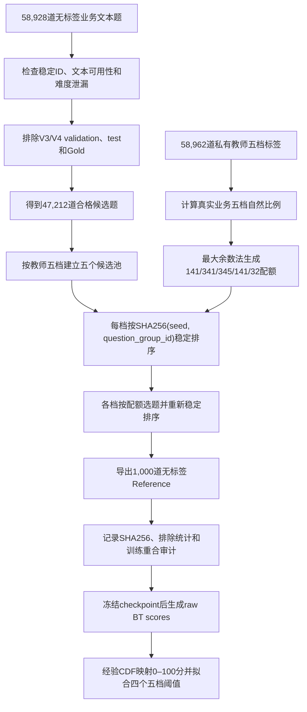

# 业务自然分布 Reference 1000 选集说明

> Reference ID：`business_reference_pilot_1000_v2`  
> 构建日期：2026-08-04  
> 随机种子：`20260804`  
> 用途：单题 BT 分数校准、0–100 分映射和五档阈值 Pilot  
> 不属于：训练集、模型选择集、最终效果测试集或人工 Gold 集

## 1. 建设目的

Pairwise 模型训练时学习的是两道题之间的相对难度：

\[
P(A \succ B)=\sigma(s_A-s_B)
\]

模型推理时可以为单道题输出连续 BT 标量 `s(q)`，但这个原始标量存在平移和尺度自由度：

- 不固定在 `[0,1]` 或 `[0,100]`；
- 不同 checkpoint 的 raw score 不能直接比较；
- 单独看到 `-1.2` 或 `0.8` 时，没有直观业务含义；
- 不能仅凭 pairwise 训练结果自然得到“送分题—压轴题”的四个绝对边界。

因此需要冻结一批能够代表真实业务题目分布的题，作为单题分数的参照系。对新题得到 raw BT score 后，可以计算它在这批参考题中的经验百分位，再转换为 0–100 分和五档难度。

Reference 1000 的目标不是验证模型“准不准”，而是先回答：

1. 当前 checkpoint 的单题分数分布是什么样；
2. 一道新题在真实业务题库中大约处于什么难度分位；
3. 按真实业务五档占比切分时，四个 raw score 阈值大约在哪里；
4. 1,000 题能否支撑阈值链路的 Pilot 验证。

## 2. Reference、Validation 与 Gold 的区别

| 数据类型 | 主要用途 | 能否选 checkpoint | 是否要求与训练题完全隔离 |
|---|---|---:|---:|
| Pairwise validation | 评价 BT log loss、Brier、AUC，选择 checkpoint | 是 | 是 |
| Calibration reference | 拟合分数经验 CDF、0–100 映射和五档边界 | 否 | 不强制，但必须审计 |
| Independent gold test | 报告最终泛化能力和教育有效性 | 否 | 是 |
| Challenge set | 检查长文本、实验、图表、多小题等风险切片 | 否 | 是 |

本次 Reference 1000 属于第二类。它不能代替 validation，也不能用来决定哪一个训练 checkpoint 最好。

正确顺序是：

```text
Pairwise validation
→ 冻结最佳 checkpoint
→ 最佳 checkpoint 跑同一份 Reference
→ 拟合 0–100 分数和五档阈值
→ 独立 Gold/Test 报告最终效果
```

## 3. 数据来源

### 3.1 文本题池

Reference 的输入题池为：

```text
/data/zhangyonglin/physics-difficulty-runtime/
  pairwise_v4/questions/all.jsonl
```

输入文件包含 `58,928` 道已经完成文本清洗的题。每道题保留：

- 稳定 `question_id`；
- 题干；
- 选项；
- 解析；
- 小题；
- 文本长度、是否含图片元数据等必要诊断字段。

模型输入中不包含：

- 历史 `difficulty`；
- `raw_difficulty`；
- 教师最终五档；
- Aux10/Aux11 标签；
- 任何显式难度描述。

图片不上传，仍使用此前冻结的文本渲染规则。原题中存在图片元数据并不意味着将图片送入模型。

### 3.2 私有分层标签

为了让抽出的 1,000 题保持真实业务五档自然占比，选集程序另外读取：

```text
/data/zhangyonglin/physics-difficulty-runtime/
  rater-data/curated/physics_teacher_v5_aux11_step3_58977.jsonl
```

使用字段：

```yaml
stratification_field: teacher_difficulty_level
```

该文件去重后包含 `58,962` 道题的教师标签。用户已确认这批题来自真实业务流量，因此其五档边际分布可以声明为：

```yaml
distribution_claim: business_natural_distribution
```

这些教师标签只在私有选集阶段用于计算每档应抽多少题。输出给学生模型的 Reference JSONL 不携带五档标签。

需要区分两个数字：

```yaml
curated_teacher_records: 58962
clean_text_question_records: 58928
```

- `58,962` 是完成教师标签和 Aux11 转换后的私有 Curated 数据；
- `58,928` 是进一步通过文本可用性、去重和泄漏检查后，可进入无标签文本题池的数据。

## 4. 五档自然分布

教师 Curated 总体的五档数量和比例为：

| 难度档位 | 总体数量 | 总体比例 |
|---|---:|---:|
| 送分题 | 8,319 | 14.1091% |
| 基础题 | 20,102 | 34.0931% |
| 中等题 | 20,359 | 34.5290% |
| 拔高题 | 8,278 | 14.0396% |
| 压轴题 | 1,904 | 3.2292% |
| 合计 | 58,962 | 100% |

这个分布不是人为设置的五档均衡比例，也不是旧错误 `difficulty` 字段的采样比例，而是当前真实业务流量经过教师 Pipeline 后形成的自然五档分布。

Reference 不采用：

```yaml
送分题: 20%
基础题: 20%
中等题: 30%
拔高题: 20%
压轴题: 10%
```

因为该固定比例会把压轴题从真实的约 `3.23%` 放大到 `10%`，无法代表当前业务总体。

## 5. 排除规则

### 5.1 硬排除数据

Reference 构建时排除了以下集合中的题目 ID和规范化文本：

1. V3 validation；
2. V3 test；
3. V4 validation；
4. V4 test；
5. `physics_adjudicated_labels_gpt56_rereview_1066.csv` Gold 数据。

排除同时检查：

- `id`；
- `question_id`；
- pair 文件中的 `question_a_id`、`question_b_id`；
- Gold CSV 中的题目 ID；
- 规范化后的题目文本。

这样可以防止同一道题仅因 ID 变化或格式差异重新进入 Reference。

清洗与排除统计为：

```yaml
source_text_questions: 58928
excluded_overlap: 11716
eligible_questions: 47212
```

最终有 `47,212` 道题满足 Reference 抽样资格，足够覆盖 1,000 题自然分布配额。

### 5.2 为什么不硬排除全部训练题

Reference 的任务是估计真实业务题库的分数边际分布，不是估计未见题泛化性能。因此它允许与训练节点发生一定重合。

如果把全部训练题硬排除，在压轴题等稀有档位上会显著压缩可选题池，甚至无法满足自然分布配额。此前尝试硬排除训练题时，压轴题出现过：

```yaml
required: 323
available: 90 或 226
```

这说明“完全不与训练题重合”和“严格保持业务自然分布”在当前数据规模下存在冲突。

最终策略是：

- validation、test、gold：硬排除；
- train/pilot：不硬排除，但记录重合率；
- Reference 只用于校准，不用于报告泛化准确率。

非排除重合审计结果：

| 数据集合 | ID 重合数量 | 规范化文本重合 | 重合率 |
|---|---:|---:|---:|
| V3 pilot 题目 | 52 | 52 | 5.2% |
| V4 10k 训练题 | 231 | 231 | 23.1% |

这些重合不会造成模型输入标签泄漏，但意味着 Reference 上的五档一致性指标不能直接当作独立泛化结果。

## 6. 候选题清洗规则

在分层抽样前，每道候选题依次经过以下检查：

1. `question_id` 必须存在且在输入题池中唯一；
2. 不得携带禁止使用的历史难度字段；
3. 渲染后的 `text` 不能为空；
4. 文本不得包含显式难度标签或难度泄漏描述；
5. 不得与硬排除文件发生 ID 重合；
6. 不得与硬排除文件发生规范化文本重合；
7. 题池内部不得出现规范化文本重复；
8. 必须能在私有教师标签文件中找到有效五档标签。

文本规范化用于消除空白、Unicode 表达和格式差异造成的伪不同题。抽样对象实际以 `question_group_id` 为稳定分组单位，避免同一父题或同组题因表现形式变化造成不稳定选择。

## 7. 1,000 题配额计算

### 7.1 精确期望数量

按照总体比例乘以 1,000：

| 档位 | 计算结果 |
|---|---:|
| 送分题 | 141.0909 |
| 基础题 | 340.9314 |
| 中等题 | 345.2902 |
| 拔高题 | 140.3955 |
| 压轴题 | 32.2920 |

### 7.2 最大余数法取整

先对每个精确配额向下取整：

```yaml
送分题: 141
基础题: 340
中等题: 345
拔高题: 140
压轴题: 32
subtotal: 998
```

还剩两个名额。按照小数余数从大到小分配：

```text
基础题余数 0.9314 → +1
拔高题余数 0.3955 → +1
```

最终配额为：

| 难度档位 | Reference 配额 | 实际选中 |
|---|---:|---:|
| 送分题 | 141 | 141 |
| 基础题 | 341 | 341 |
| 中等题 | 345 | 345 |
| 拔高题 | 141 | 141 |
| 压轴题 | 32 | 32 |
| 合计 | 1,000 | 1,000 |

所有档位均满足配额，没有发生稀有档位降额或用其他档位补齐。

## 8. 每档内部如何抽题

选集使用固定种子和稳定哈希，不使用运行时随机打乱。

对于每个候选题组，计算：

\[
k(q)=SHA256(seed\;\Vert\;"\\0"\;\Vert\;question\_group\_id)
\]

其中：

```yaml
seed: 20260804
```

具体过程为：

1. 根据私有教师五档将 `47,212` 道合格题分成五个池；
2. 每道题按 `SHA256(seed, question_group_id)` 生成稳定排序键；
3. 每档内部按哈希键升序排序；
4. 从每档头部取该档配额数量；
5. 将五档结果合并；
6. 合并后再次按相同稳定键排序，得到最终 Reference 顺序。

该方法具有以下性质：

- 同一输入文件、同一种子和同一排除集合会得到完全相同的结果；
- 不依赖 Python、NumPy 的随机数实现；
- 不按原文件顺序偏向某一来源或时间段；
- 不使用错误的历史 `difficulty`；
- 不根据学生模型分数选题；
- 不挑选“模型表现好”的题。

## 9. 输出数据结构

最终输出文件：

```text
/data/zhangyonglin/physics-difficulty-runtime/
  calibration/business_reference_pilot_1000_v2/
    reference_1000.jsonl
    smoke_1000.jsonl
    reference.manifest.json
```

Reference 中每条题目被标记为：

```yaml
split: calibration_reference
source_split: train
```

其中：

- `split=calibration_reference` 表示当前文件的使用角色；
- `source_split=train` 记录它原先来自业务题池的 train 区域；
- 不代表它被重新作为训练监督使用。

输出明确不携带：

```yaml
teacher_difficulty_level: 不导出
teacher_difficulty_id: 不导出
raw_difficulty: 不导出
difficulty: 不导出
teacher_features: 不导出
```

最终文件校验值：

```yaml
reference_records: 1000
reference_sha256: 628daefc45f431f16ede79daaf689cea4e7eaff762f23412e5dfed6a2c0f26d4
```

`reference_1000.jsonl` 与 `smoke_1000.jsonl` 当前具有相同记录和相同 SHA256。这是因为本轮请求的正式 Pilot 数量和 smoke 数量都设置为 1,000：

```yaml
records: 1000
smoke_records: 1000
```

因此二者只是两个同内容文件名，不是两套独立样本，不能把它们当作 2,000 道题，也不能用其中一个拟合阈值、另一个报告独立效果。

## 10. 标签到底在哪里使用

### 10.1 用于选择自然分布配额

教师五档用于：

- 计算业务总体五档比例；
- 将候选题分层；
- 确保选出的 1,000 题准确满足五档配额。

### 10.2 不进入学生模型输入

学生模型实际读取的 `reference_1000.jsonl` 不含教师五档。单题评分过程是：

```text
无标签题目文本
→ 学生模型
→ raw_difficulty_score
```

模型不会看到这道题属于哪一档，也不会根据标签生成分数。

### 10.3 个体标签不直接拟合 raw score

构建 Reference 时没有做以下事情：

- 用每道题的教师档位回归一个绝对分数；
- 强制“送分题分数必须为 10”；
- 强制“压轴题分数必须为 95”；
- 根据教师标签调整学生模型输出。

当前五档边界使用的是业务总体的聚合比例，而不是逐题标签监督：

```yaml
individual_labels_used_for_score_regression: false
individual_labels_exported_to_model_input: false
aggregate_label_distribution_used_for_stratification: true
aggregate_label_distribution_used_for_level_quantiles: true
```

原 manifest 中的：

```yaml
labels_used_for_threshold_fitting: false
```

准确含义应理解为“单题标签没有参与 raw score 的监督拟合”。如果后续继续使用总体五档比例确定四个分位边界，建议在新版 manifest 中拆成上面的个体标签与聚合分布两个字段，避免歧义。

## 11. Reference 如何用于 0–100 分

对一个冻结 checkpoint，先对 1,000 道 Reference 题分别生成 raw BT score，并按从低到高排序。

对于新题分数 `s`，使用 mid-rank 经验 CDF：

\[
difficulty\_score=100\times
\frac{\#(r_i<s)+0.5\#(r_i=s)}{N}
\]

得到的 0–100 分解释为：

```text
这道题比冻结业务 Reference 中大约多少比例的题更难。
```

例如：

```yaml
raw_difficulty_score: -0.83
difficulty_score: 69.4
interpretation: 比约69.4%的业务参考题更难
```

四个五档边界对应业务总体累计比例：

| 边界 | 0–100 分位位置 |
|---|---:|
| 送分题 / 基础题 | 14.109 |
| 基础题 / 中等题 | 48.202 |
| 中等题 / 拔高题 | 82.731 |
| 拔高题 / 压轴题 | 96.771 |

每个 checkpoint 都必须在同一 Reference 上重新生成自己的 raw score 分布和 raw score 阈值。不能把 Qwen3.5-4B 的 raw 阈值复制给 Qwen3-4B，也不能把 V1 的 raw 阈值直接复制给 V3。

## 12. 为什么这份 Reference 可以跨模型复用

Reference 定义的是目标业务题目总体，而不是某个模型的训练数据。因此：

- Qwen3.5-4B V1；
- Qwen3.5-4B V3；
- Qwen3-4B BT-only；
- Qwen3-4B Aux10；
- 后续 V4 模型；

都可以读取同一份 `reference_1000.jsonl`。

需要分别保存的是：

```text
相同 Reference 题目
×
不同 checkpoint 生成的 raw scores
×
各自 checkpoint fingerprint 绑定的 calibration 文件
```

跨模型比较时，不比较 raw score 的绝对大小，而比较：

- Spearman/Kendall 排序一致性；
- Top/Bottom 分位集合重合；
- 校准后的 0–100 分；
- 教师档位单调性；
- 独立 validation/gold 指标。

## 13. 当前 Reference 1000 的限制

### 13.1 只适合 Pilot

最高档压轴题只有 32 道。少数边界题变化就可能移动最高阈值，因此 1,000 题适合：

- 验证单题推理链路；
- 检查分数是否塌缩；
- 比较不同 checkpoint 的排序趋势；
- 生成临时 0–100 分；
- 估计 Pilot 五档阈值。

不适合直接冻结长期生产阈值。

### 13.2 存在训练题重合

Reference 与 V4 10k 训练题有 23.1% 重合。它仍可用于边际校准，但必须避免把 Reference 上的教师标签一致率解释成未见题泛化效果。

### 13.3 分层标签不是人工 Gold

五档来自当前教师 Prompt + 后处理 Pipeline。它代表当前业务标注标准，不等于完全可靠的人工教研真值。

### 13.4 自然分布会随业务变化

当前业务分布是一个有版本的数据事实。如果未来题库来源、年级范围、题型构成或业务流量发生明显变化，需要新建 Reference 版本，而不是静默覆盖旧文件。

## 14. 正式版本建议

建议在链路验证完成后构建：

```yaml
business_reference_v1:
  minimum_records: 5000
  preferred_records: 10000
  sampling: business_natural_five_level_distribution
  stable_seed: frozen
  validation_test_gold_overlap: 0
  train_overlap: audited
```

正式版本应报告：

- 五档自然比例和整数配额；
- 每个排除文件的 SHA256；
- 题目 ID 与规范化文本重合；
- 不同来源、题型、长度、是否含解析等切片覆盖；
- 1k、2k、5k、10k 阈值敏感性；
- bootstrap 阈值置信区间；
- seen/unseen 子集的分数分布差异；
- Reference SHA256；
- checkpoint fingerprint；
- calibration ID。

建议将 Reference、校准文件和模型权重作为三个独立但绑定的版本对象：

```text
reference_version
  + checkpoint_fingerprint
  + business_distribution_version
  = calibration_id
```

## 15. 构建流程总结



最终 Reference 1000 的核心定义是：

> 从真实业务流量题池中，排除所有 validation、test 和 gold 重合题后，按照私有教师五档的业务自然比例分层，并在每档内使用固定种子与稳定哈希确定性抽取的 1,000 道无标签文本题。它只用于单题 BT 分数校准和阈值 Pilot，不用于 checkpoint 选择或最终泛化效果报告。

