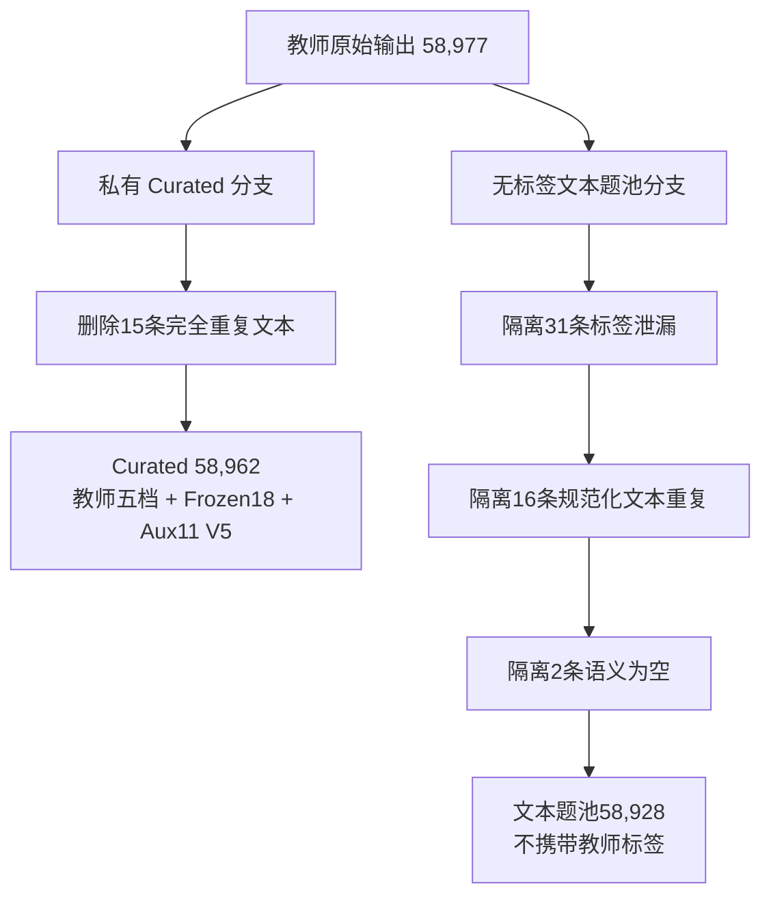

# Frozen18 → Aux10 / Aux11

- V3：Frozen18 → Aux10；
- 当前 V4 10k/40k 扩量实验：Frozen18 → Aux11。

这次 5.9 万教师数据实际使用的是 Aux11，不是旧 Aux10。需要额外区分：

```yaml
experiment_version: V4_10k_40k
current_feature_schema: aux11_step3_v5
```

“V4”是本次扩量实验的名称，`aux11_step3_v5` 是当前辅助特征契约版本。当前下游训练仍然
使用 11 个辅助头，但 `step_count` 已根据全量统计从旧四档调整为三档。

## 一、Frozen18

上游 Prompt 输出的 Frozen18 为：

```yaml
frozen18:
  - step_count                 # 解题步骤数量
  - formula_count              # 公式使用数量
  - calculation_complexity     # 计算复杂度
  - reasoning_chain            # 推理链复杂度
  - problem_structure          # 题目主体结构
  - additional_structure       # 附加结构
  - information_carrier        # 信息载体
  - reality_question           # 真实情境要求
  - subquestion_dependency     # 小题依赖关系
  - knowledge_count            # 知识点数量
  - knowledge_diff             # 知识点理解或调用难度
  - cross_module               # 跨模块程度
  - state_count                # 状态数量
  - constraint_count           # 约束条件数量
  - variable_relation          # 变量关系复杂度
  - experiment_requirement     # 实验能力要求
  - graph_table_requirement    # 图表处理要求
  - error_risk                 # 易错风险
```

这些特征来自上游冻结 Prompt 和 V7 后处理，不是学生模型预先预测出来的。Frozen18 转换成
Aux10 或 Aux11 时也不再调用大模型，而是进行确定性的字段选择、枚举规范化和字段映射。

字段来源为：

```yaml
primary_label:
  source: difficulty_rating.difficulty_level
  values: [送分题, 基础题, 中等题, 拔高题, 压轴题]

frozen18:
  source: difficulty_rating.features

ignored_field:
  source: difficulty
  reason: 历史题库字段，无意义，不作为训练标签
```

### 1. `step_count`：有效物理推理步骤数

表示完成题目最高难任务所需的连续有效物理决策链长度。有效步骤包括物理判断、建模、关系
推导、关键计算和结论判断；不按解析句号数、机械代数展开次数或重复代入次数统计。

| 候选值 | 含义 |
|---|---|
| `1-2步` | 一个直接判断或一两个直接关系即可完成 |
| `3-5步` | 需要较短且连续的推理或计算链 |
| `6-8步` | 需要较长的建模、推理或多阶段计算 |
| `9-12步` | 需要很长的连续推理链或多阶段递进 |
| `12步以上` | 极长推理链、复杂分支或多阶段综合过程 |

### 2. `formula_count`：必要公式数量

统计解题过程中实际需要调用的不同物理公式或核心关系数量，不把同一公式的重复代入机械累加。

| 候选值 | 含义 |
|---|---|
| `0-1个` | 无需公式或只需一个核心关系 |
| `2-3个` | 需要少量公式衔接 |
| `4-6个` | 公式链较长，需要多个关系联立 |
| `7个以上` | 极长公式链或高度综合计算 |

### 3. `calculation_complexity`：计算复杂度

| 候选值 | 含义 |
|---|---|
| `口算或直接判断` | 几乎不需要书面计算，或可直接定性判断 |
| `简单笔算` | 单公式代入、常规四则运算或短计算 |
| `多公式联立` | 多个公式、方程或状态关系需要联立 |
| `复杂方程或范围计算` | 包含复杂方程、取值范围、极值、有效解筛选等计算 |

### 4. `reasoning_chain`：推理方式与链条复杂度

| 候选值 | 含义 |
|---|---|
| `直接套用` | 识别知识点后直接应用结论或公式 |
| `简单因果推理` | 存在一层或少量直接因果关系 |
| `多层因果推理` | 多个前提和中间结论连续依赖 |
| `逆向推理或临界分析` | 需要从结果反推，或处理临界条件、边界和极值 |

### 5. `problem_structure`：题目主体结构

该字段描述题目的主要任务类型，是单标签字段。综合类名称表示题目的主要物理模块和任务重心，
不等同于完整知识域列表。

| 候选值 | 含义 |
|---|---|
| `概念判断` | 以概念辨析、规律判断或定性分析为主 |
| `直接计算` | 以直接代入和常规计算为主 |
| `实验探究` | 以实验操作、变量控制、方案或误差分析为主 |
| `图像表格分析` | 以图像、表格读取、比较、归纳或反推为主 |
| `电路综合` | 电路状态、测量、故障、功率或动态电路综合 |
| `力学综合` | 受力、运动、压强、浮力、功与机械等力学综合 |
| `热学综合` | 温度、热量、内能、物态变化等热学综合 |
| `光学声学综合` | 光学或声学规律的综合应用 |
| `跨模块综合` | 多个物理模块形成实质性依赖关系 |

### 6. `additional_structure`：附加结构标签

用于补充主体结构之外的重要次级结构。

| 候选值 | 含义 |
|---|---|
| `无` | 没有额外突出结构 |
| `图像表格` | 题目附带重要图像或表格加工任务 |
| `实验探究` | 附带实验操作、探究或评价任务 |
| `电路约束` | 存在电路连接、状态、安全范围或测量约束 |
| `力学约束` | 存在受力、运动、平衡或几何位置约束 |
| `跨模块` | 存在额外跨模块关系 |

### 7. `information_carrier`：信息载体

描述题目信息主要通过什么形式呈现，不直接等同于信息加工难度。

| 候选值 | 含义 |
|---|---|
| `纯文字` | 主要依赖文字条件 |
| `单图识别` | 需要识别一张普通示意图 |
| `电路图` | 主要载体为电路图 |
| `实验装置图` | 主要载体为实验装置图 |
| `图像或表格` | 主要载体为函数图像、统计图或表格 |
| `多图表综合` | 需要联合处理多个图、表或载体 |

### 8. `reality_question`：真实情境要求

| 候选值 | 含义 |
|---|---|
| `否` | 标准教材、抽象模型或常规题型情境 |
| `是` | 需要理解生活、工程、科技或陌生真实情境 |

### 9. `subquestion_dependency`：小题依赖关系

| 候选值 | 含义 |
|---|---|
| `无多问` | 没有多小问，或仅一个主要任务 |
| `多问但相互独立` | 多个小问可分别完成，前问不是后问必要条件 |
| `多问且层层递进` | 后续小问依赖前问结论或中间变量 |

### 10. `knowledge_count`：连续推理中使用的知识点数量

不把选择题各独立选项中的知识点机械相加，只统计完成核心推理链所需的知识点。

| 候选值 | 含义 |
|---|---|
| `1个` | 单一知识点即可完成 |
| `2-3个` | 少量知识点联合使用 |
| `4个及以上` | 多知识点形成综合推理 |

### 11. `knowledge_diff`：知识理解或调用难度

| 候选值 | 含义 |
|---|---|
| `低` | 常规知识，识别和调用直接 |
| `中` | 需要一定迁移、辨析或组合 |
| `高` | 知识调用隐蔽、陌生或需要深度迁移 |

### 12. `cross_module`：跨模块程度

| 候选值 | 含义 |
|---|---|
| `同一模块内部` | 核心推理发生在一个物理模块内 |
| `跨模块综合` | 多个模块之间形成实质性依赖 |

### 13. `state_count`：物理状态或过程阶段数量

| 候选值 | 含义 |
|---|---|
| `单状态` | 只分析一个稳定状态或单一阶段 |
| `双状态` | 需要比较前后两个状态 |
| `多状态` | 三个及以上状态或多个阶段相互关联 |
| `连续变化或临界状态` | 状态连续变化，或需要确定临界点、边界和转折 |

### 14. `constraint_count`：约束条件复杂度

这里的约束指真正限制解空间的安全范围、边界、平衡、极值、有效解等条件，不是题干中普通
已知量的数量。

| 候选值 | 含义 |
|---|---|
| `无约束` | 不需要额外边界或有效性判断 |
| `单一约束` | 存在一个主要限制条件 |
| `多约束` | 多个限制条件需要同时满足 |

### 15. `variable_relation`：变量关系复杂度

| 候选值 | 含义 |
|---|---|
| `无变量关系` | 不需要建立变量之间的函数或比例关系 |
| `简单正反比` | 主要是简单正比、反比或一次关系 |
| `图像函数关系` | 需要读取、建立或解释图像和函数关系 |
| `多变量耦合关系` | 多个变量相互制约，需要联立建模 |

### 16. `experiment_requirement`：实验能力要求

| 候选值 | 含义 |
|---|---|
| `无` | 不涉及实验能力 |
| `基础操作或读数` | 仪器使用、基础操作或直接读数 |
| `控制变量或故障分析` | 控制变量、现象解释、电路或装置故障分析 |
| `方案设计或误差评价` | 设计实验、改进方案、评估误差和可行性 |

### 17. `graph_table_requirement`：图表加工要求

| 候选值 | 含义 |
|---|---|
| `无` | 不需要处理图像或表格信息 |
| `直接读数` | 从图表中直接读取单个或少量数值 |
| `多组比较归纳` | 比较多组数据并归纳规律 |
| `图像反推或外推` | 根据图像反推参数、过程、边界或进行外推 |

### 18. `error_risk`：易错风险

| 候选值 | 含义 |
|---|---|
| `无明显易错点` | 解题路径直接，没有突出的误区 |
| `轻微易错点` | 存在单位、符号、对象或常规细节风险 |
| `明显易错点` | 存在容易混淆的条件、模型或中间判断 |
| `高易错点` | 存在关键陷阱、边界、反直觉关系或多重误判风险 |

58,977 条原始教师数据中，Frozen18 所有字段均存在且取值合法，没有缺失值或非预期枚举。

## 二、Frozen18 → Aux10

旧 V3 保留以下九个独立特征：

```yaml
directly_preserved:
  - problem_structure
  - step_count
  - calculation_complexity
  - reasoning_chain
  - knowledge_count
  - subquestion_dependency
  - state_count
  - constraint_count
  - variable_relation
```

然后把以下两个特征合并：

```yaml
source:
  - graph_table_requirement
  - experiment_requirement

target:
  - information_processing
```

所以得到：

```text
9个独立特征 + 1个合并特征 = Aux10
```

### `information_processing` 的合并规则

只有图表要求：

```yaml
graph_table_requirement:
  直接读数: 图表直接读数
  多组比较归纳: 图表多组比较归纳
  图像反推或外推: 图像反推或外推
```

只有实验要求：

```yaml
experiment_requirement:
  基础操作或读数: 实验基础操作或读数
  控制变量或故障分析: 实验控制变量或故障分析
  方案设计或误差评价: 实验方案设计或误差评价
```

图表和实验同时存在：

```text
图表与实验混合处理
```

两者都没有：

```text
无
```

完整映射为：

| 图表要求 | 实验要求 | `information_processing` |
|---|---|---|
| `无` | `无` | `无` |
| `直接读数` | `无` | `图表直接读数` |
| `多组比较归纳` | `无` | `图表多组比较归纳` |
| `图像反推或外推` | `无` | `图像反推或外推` |
| `无` | `基础操作或读数` | `实验基础操作或读数` |
| `无` | `控制变量或故障分析` | `实验控制变量或故障分析` |
| `无` | `方案设计或误差评价` | `实验方案设计或误差评价` |
| 任一非 `无` | 任一非 `无` | `图表与实验混合处理` |

最终旧 Aux10 为：

```yaml
aux10:
  - problem_structure
  - step_count
  - calculation_complexity
  - reasoning_chain
  - knowledge_count
  - subquestion_dependency
  - state_count
  - constraint_count
  - variable_relation
  - information_processing
```

该合并头共有八个候选值。它的主要局限是：图表能力和实验能力可以同时存在，但一个互斥
分类头无法分别表达两者各自的复杂度。

## 三、Frozen18 → Aux11

图表信息加工和实验操作、实验设计、故障分析是两类不同能力。例如：

- 一道题可以要求读取函数图像，但不涉及实验；
- 一道题可以要求设计实验方案，但没有图表；
- 也可能同时包含图表和实验。

旧 `information_processing` 把这两类任务压进一个互斥分类头，会丢失信息。尤其当图表和
实验同时存在时，只能写成“图表与实验混合处理”，无法分别表达两者各自的复杂度。

所以当前版本将它们重新拆开：

```yaml
current_aux11:
  - problem_structure
  - step_count
  - calculation_complexity
  - reasoning_chain
  - knowledge_count
  - subquestion_dependency
  - state_count
  - constraint_count
  - variable_relation
  - graph_table_requirement
  - experiment_requirement
```

即：

```text
原来的9个独立特征
+ graph_table_requirement
+ experiment_requirement
= Aux11
```

### 当前 Aux11 每个分类头的候选值

| 辅助头 | 类型 | 候选值 |
|---|---|---|
| `problem_structure` | 9 类单标签 | 概念判断、直接计算、实验探究、图像表格分析、电路综合、力学综合、热学综合、光学声学综合、跨模块综合 |
| `step_count` | 3 类有序标签 | 1-2步、3-5步、6步以上 |
| `calculation_complexity` | 4 类有序标签 | 口算或直接判断、简单笔算、多公式联立、复杂方程或范围计算 |
| `reasoning_chain` | 4 类有序标签 | 直接套用、简单因果推理、多层因果推理、逆向推理或临界分析 |
| `knowledge_count` | 3 类有序标签 | 1个、2-3个、4个及以上 |
| `subquestion_dependency` | 3 类单标签 | 无多问、多问但相互独立、多问且层层递进 |
| `state_count` | 4 类有序标签 | 单状态、双状态、多状态、连续变化或临界状态 |
| `constraint_count` | 3 类有序标签 | 无约束、单一约束、多约束 |
| `variable_relation` | 4 类单标签 | 无变量关系、简单正反比、图像函数关系、多变量耦合关系 |
| `graph_table_requirement` | 4 类单标签 | 无、直接读数、多组比较归纳、图像反推或外推 |
| `experiment_requirement` | 4 类单标签 | 无、基础操作或读数、控制变量或故障分析、方案设计或误差评价 |

对应到当前 `aux11_step3_v5` 学生模型，11 个辅助分类头的输出维度为：

```text
shared question representation h
├── problem_structure: Linear(H, 9)
├── step_count: Linear(H, 3)
├── calculation_complexity: Linear(H, 4)
├── reasoning_chain: Linear(H, 4)
├── knowledge_count: Linear(H, 3)
├── subquestion_dependency: Linear(H, 3)
├── state_count: Linear(H, 4)
├── constraint_count: Linear(H, 3)
├── variable_relation: Linear(H, 4)
├── graph_table_requirement: Linear(H, 4)
└── experiment_requirement: Linear(H, 4)
```

这里的 `H` 是共享单题表示的隐藏维度，每个 `Linear(H, C)` 输出该特征 `C` 个候选类别的
logits。11 个头合计输出 45 个 logits：

```text
9 + 3 + 4 + 4 + 3 + 3 + 4 + 3 + 4 + 4 + 4 = 45
```

相比旧 Aux10，当前结构有两处关键变化：

1. `step_count` 从旧四类调整为三类，因此输出维度由 `Linear(H, 4)` 变为 `Linear(H, 3)`；
2. 删除 `information_processing: Linear(H, 8)`，改为两个相互独立的四分类头，使同一道题可以
   同时表达图表要求和实验要求。

学生模型中的 Aux11 是辅助任务，不是主任务。主任务仍然输出单题连续难度标量，并使用
Bradley–Terry pairwise loss。Aux11 使用较低权重作为表征正则，不在推理后通过硬规则自动
升降档。

## 四、18维中具体保留了哪些

| Frozen18字段 | 当前处理方式 | 说明 |
|---|---|---|
| `problem_structure` | 保留 | 描述主要任务结构 |
| `step_count` | 保留，映射为三档 | 解决高步数极小类问题 |
| `calculation_complexity` | 保留 | 比公式数量更直接描述计算负担 |
| `reasoning_chain` | 保留 | 描述推理方式和深度 |
| `knowledge_count` | 保留 | 描述知识整合数量 |
| `subquestion_dependency` | 保留 | 区分多问数量与递进依赖 |
| `state_count` | 保留 | 描述过程阶段和临界变化 |
| `constraint_count` | 保留 | 描述边界、范围和有效性限制 |
| `variable_relation` | 保留 | 描述变量建模复杂度 |
| `graph_table_requirement` | 保留为独立特征 | 不再并入互斥合并头 |
| `experiment_requirement` | 保留为独立特征 | 不再并入互斥合并头 |
| `formula_count` | 不作为辅助任务 | 与计算复杂度重叠，且 `7个以上` 只有15条 |
| `additional_structure` | 不作为辅助任务 | 与主体结构、图表和实验字段重叠 |
| `information_carrier` | 不作为辅助任务 | 更接近呈现形式，不等同于推理难度 |
| `reality_question` | 不作为辅助任务 | 与真实情境元数据重叠，正类占比4.259% |
| `knowledge_diff` | 不作为辅助任务 | 主观性较强，且与推理链和最终难度相关 |
| `cross_module` | 不作为辅助任务 | 与主体结构及知识域元数据重叠，正类占比3.857% |
| `error_risk` | 不作为辅助任务 | 主观性较强，且与V7最终难度规则相关 |

也就是：

```text
18个原始字段
保留11个
移除7个
```

被移除的字段并没有从数据中删除。完整 Frozen18 原样保存在：

```text
teacher_features_legacy18
```

当前确定性派生的 Aux11 保存在：

```text
teacher_features
```

### 58,977 条原始数据中，当前 Aux11 的具体分布

以下统计基于去重前的 58,977 条教师输出，用于判断类别支持度；它不等于最终10k节点分布。

| 字段 | 类别分布 |
|---|---|
| `problem_structure` | 概念判断25,400 (43.068%)；实验探究9,998 (16.952%)；力学综合9,588 (16.257%)；电路综合7,525 (12.759%)；光学声学综合1,839 (3.118%)；跨模块综合1,720 (2.916%)；热学综合1,237 (2.097%)；直接计算897 (1.521%)；图像表格分析773 (1.311%) |
| `step_count`（当前映射后） | 1-2步30,084 (51.010%)；3-5步25,495 (43.229%)；6步以上3,398 (5.761%) |
| `calculation_complexity` | 口算或直接判断33,670 (57.090%)；简单笔算17,271 (29.284%)；多公式联立7,509 (12.732%)；复杂方程或范围计算527 (0.894%) |
| `reasoning_chain` | 多层因果推理25,871 (43.866%)；简单因果推理17,384 (29.476%)；直接套用12,248 (20.767%)；逆向推理或临界分析3,474 (5.890%) |
| `knowledge_count` | 2-3个41,513 (70.388%)；1个9,358 (15.867%)；4个及以上8,106 (13.744%) |
| `subquestion_dependency` | 无多问36,783 (62.368%)；多问但相互独立13,139 (22.278%)；多问且层层递进9,055 (15.353%) |
| `state_count` | 单状态42,192 (71.540%)；双状态12,304 (20.862%)；多状态4,175 (7.079%)；连续变化或临界状态306 (0.519%) |
| `constraint_count` | 无约束37,920 (64.296%)；单一约束16,436 (27.868%)；多约束4,621 (7.835%) |
| `variable_relation` | 无变量关系32,873 (55.739%)；简单正反比16,017 (27.158%)；图像函数关系6,775 (11.488%)；多变量耦合关系3,312 (5.616%) |
| `graph_table_requirement` | 无44,683 (75.763%)；多组比较归纳5,872 (9.956%)；直接读数5,518 (9.356%)；图像反推或外推2,904 (4.924%) |
| `experiment_requirement` | 无47,296 (80.194%)；控制变量或故障分析7,698 (13.053%)；基础操作或读数2,059 (3.491%)；方案设计或误差评价1,924 (3.262%) |

其中需要重点监控的尾部类别是：

```yaml
calculation_complexity:
  category: 复杂方程或范围计算
  count: 527

state_count:
  category: 连续变化或临界状态
  count: 306
```

这两个类别明显不均衡，但仍有数百个独立题目，不属于 `step_count` 最高档只有25条的同级
问题。当前策略是保留类别，通过节点覆盖和训练权重处理，而不是直接合并。

### 未进入 Aux11 的七个字段的具体分布

| 字段 | 类别分布 |
|---|---|
| `formula_count` | 0-1个34,925 (59.218%)；2-3个17,977 (30.481%)；4-6个6,060 (10.275%)；7个以上15 (0.025%) |
| `additional_structure` | 无29,276 (49.640%)；实验探究8,704 (14.758%)；电路约束7,304 (12.384%)；力学约束7,069 (11.986%)；图像表格4,569 (7.747%)；跨模块2,055 (3.484%) |
| `information_carrier` | 纯文字19,025 (32.258%)；单图识别17,550 (29.757%)；电路图7,279 (12.342%)；图像或表格6,981 (11.837%)；实验装置图4,589 (7.781%)；多图表综合3,553 (6.024%) |
| `reality_question` | 否56,465 (95.741%)；是2,512 (4.259%) |
| `knowledge_diff` | 低36,539 (61.955%)；中20,326 (34.464%)；高2,112 (3.581%) |
| `cross_module` | 同一模块内部56,702 (96.143%)；跨模块综合2,275 (3.857%) |
| `error_risk` | 轻微易错点36,974 (62.692%)；明显易错点16,611 (28.165%)；无明显易错点3,769 (6.391%)；高易错点1,623 (2.752%) |

## 五、step_count 怎么转换

Frozen18 原始 `step_count` 包含：

```yaml
- 1-2步
- 3-5步
- 6-8步
- 9-12步
- 12步以上
```

58,977 条原始教师记录中的实际分布为：

| 原始类别 | 数量 | 占比 |
|---|---:|---:|
| `1-2步` | 30,084 | 51.010% |
| `3-5步` | 25,495 | 43.229% |
| `6-8步` | 3,373 | 5.719% |
| `9-12步` | 22 | 0.037% |
| `12步以上` | 3 | 0.005% |

旧 V4 特征契约曾转换成四档：

```yaml
- 1-2步
- 3-5步
- 6-8步
- 9步以上
```

旧映射为：

```yaml
1-2步: 1-2步
3-5步: 3-5步
6-8步: 6-8步
9-12步: 9步以上
12步以上: 9步以上
```

但最高两档合并以后，`9步以上` 仍然只有25条，占全部数据的0.042%，无法形成可学习且可
稳定评估的分类类别。因此当前 `aux11_step3_v5` 改成三档：

```yaml
current_values:
  - 1-2步
  - 3-5步
  - 6步以上

mapping:
  1-2步: 1-2步
  3-5步: 3-5步
  6-8步: 6步以上
  9-12步: 6步以上
  12步以上: 6步以上
  historical_9步以上: 6步以上
```

映射后的去重前分布为：

| 当前类别 | 数量 | 占比 |
|---|---:|---:|
| `1-2步` | 30,084 | 51.010% |
| `3-5步` | 25,495 | 43.229% |
| `6步以上` | 3,398 | 5.761% |

采用三档不是因为“6-8步”和“9步以上”在物理意义上完全相同，而是因为现有教师数据无法支撑
独立高步数分类头。原始五档仍保存在 `teacher_features_legacy18`，以后如果有足够的独立重标
数据，可以建立新的 schema 恢复更细粒度，而不是覆盖当前版本。

另外，`step_count` 不等于最终难度。1,905道压轴题中：

```yaml
6-8步: 1880
9-12步: 22
12步以上: 3
```

即98.688%的压轴题原始 `step_count` 不足9步。这说明压轴难度还来自临界分析、多约束、
多变量耦合、知识整合和非常规突破口，不能使用“步骤达到某档就自动升难度”的外部硬规则。

## 六、这5万多数据都转换了吗

转换统计如下：

```yaml
source_teacher_records: 58977
curated_records: 58962
exact_duplicates_removed: 15
quarantined_records: 0

conversion_audit:
  matched_records: 58962
  auxiliary_exact_match: 58962
  frozen18_preserved: true
  auxiliary_exactly_derived: true
  raw_difficulty_used: false
  errors: 0
  status: PASS
```

准确地说：

- 原始教师输出有58,977条；
- 其中15条是完全重复题目；
- 去重后保留58,962道不同题；
- 这58,962道全部完成了 Frozen18 → Aux11 V5 转换；
- 58,962条全部通过逐条一致性审计；
- 没有出现转换错误；
- 原始 Frozen18 完整保留；
- 原始 `difficulty` 没有参与转换。

所以不能表述为“58,977条全部作为独立数据转换”。更准确的表述是：

> 58,977条原始记录经过完全重复文本去重后得到58,962道有效题，58,962道有效题全部完成
> Frozen18到Aux11 V5的确定性转换。

去重后的五档难度分布为：

| 难度 | 数量 |
|---|---:|
| 送分题 | 8,319 |
| 基础题 | 20,102 |
| 中等题 | 20,359 |
| 拔高题 | 8,278 |
| 压轴题 | 1,904 |
| 合计 | 58,962 |

当前 Curated 文件位于35号服务器：

```text
/local_data/zhangyonglin/physics-difficulty-runtime/rater-data/curated/
physics_teacher_v5_aux11_step3_58977.jsonl
```

文件已从45号服务器同步到35号服务器，行数检查为58,962。后续在35号服务器训练时必须使用
这份 V5 文件，不再使用旧四档 V4 Curated 文件。

## 七、后面的58,928又是什么

58,962和58,928对应不同用途的数据产物：

```yaml
curated_private_data:
  records: 58962
  contains:
    - 教师最终五档
    - Frozen18
    - Aux11 V5
    - 数据来源和版本信息

label_free_text_pool:
  records: 58928
  contains:
    - 稳定题目ID
    - 规范化题目文本
    - split
    - 必要诊断字段
  excludes:
    - 教师最终五档
    - Frozen18
    - Aux11
    - 原始difficulty
```

需要注意：58,928并不是简单从58,962继续减出来的。两者是从同一份58,977条源记录分出的
两条处理支路：



正确的数据关系为：

```yaml
curated_branch:
  source_records: 58977
  exact_duplicates_removed: 15
  output_records: 58962

text_pool_branch:
  source_records: 58977
  label_leakage: 31
  duplicate_normalized_text: 16
  semantically_empty: 2
  output_records: 58928
```

最终选出的10,000道训练题全部能够通过 `question_id` 在 Curated 数据中找到对应的 Aux11：

```yaml
selected_questions: 10000
aux11_question_coverage: 1.0
missing_aux11_questions: 0
```

这10,000道题构成了40,000条候选pair：

```yaml
questions: 10000
pairs: 40000
node_coverage: 1.0
connected_components: 1
degree:
  minimum: 6
  p10: 7
  median: 8
  mean: 8
  p90: 9
  maximum: 12
```

40,000条边不是完全随机抽取，而是同时考虑辅助特征、文本相似性、题目结构和比较图拓扑。
各策略的实际产出为：

| 构边策略 | 数量 | 实际占比 | 核心作用 |
|---|---:|---:|---|
| `feature_near` | 12,347 | 30.87% | 构造辅助特征相近、区分难度较高的细粒度比较 |
| `feature_contrast` | 10,158 | 25.40% | 构造辅助特征差异较大的跨度比较，帮助稳定全局次序 |
| `random_global` | 6,733 | 16.83% | 提供不受局部相似性限制的全局连接，并承接部分策略找不到合格候选时的回退 |
| `lexical_near` | 4,063 | 10.16% | 在题目文本相似时比较真实物理难度，减少模型依赖表面词汇判断 |
| `structure_matched` | 4,033 | 10.08% | 在输入形态和题目结构相近时进行受控比较 |
| `low_degree_repair` | 2,096 | 5.24% | 优先连接当前比较次数较少的题，修复节点覆盖和度数不均衡 |
| `graph_bridge` | 570 | 1.43% | 连接当时仍属于不同连通分量的节点，最终形成单一连通图 |

### 1. `feature_near`：辅助特征近邻边

每道题由当时用于构图的 11 个辅助特征形成一个离散特征向量。两道题的距离采用汉明距离：
11 个特征中有多少个字段取值不同，距离就是多少，取值范围为 0～11。

构边时优先寻找 11 个特征完全相同的题；如果不存在可用题，则从最多 512 道候选题中计算
特征距离，保留距离最小的一组，并从最接近的前 8 道中随机选取一题。候选题还必须满足：

- 不能与自身组成 pair；
- 不能形成重复无向边；
- 对端节点不能超过最大度数。

这类边的主要价值是制造“条件相近但仍需判断谁更难”的 hard pair。例如两道题可能同为
多层推理、双状态和多公式联立，但具体知识组织方式不同，教师仍要做细粒度比较。

需要注意，`feature_near` 只表示辅助特征相近，不保证两题真实难度一定接近。构图过程没有读取
教师五档难度，也没有读取原始 `difficulty`；最终难度关系仍由后续 Qwen3-32B pair 教师判定。

### 2. `feature_contrast`：辅助特征对比边

该策略同样使用 11 维离散特征的汉明距离，但目标与 `feature_near` 相反。它从最多 512 道
候选题中优先选择特征差异最大的一组，再从距离最大的前 8 道中随机选取一题。

这类边用于增加比较跨度，使图中不仅存在局部近邻比较，也存在跨结构、跨推理复杂度和跨信息
处理方式的比较。跨度边通常更容易得到明确方向，有助于把不同局部区域放到同一个全局难度
标尺上。

但“特征差异大”也不等价于“难度差一定大”。例如实验题与计算题的特征差异可能很大，但二者
仍可能处于相同难度水平。因此它只是候选边设计策略，不是直接生成 BT 标签的规则。

### 3. `lexical_near`：文本近邻边

该策略基于规范化后的完整题目文本，包括用于学生模型输入的题干、选项和解析。实现上先提取
字符 3-gram，再通过 64 位 SimHash 和分桶快速找到候选近邻，之后结合：

- SimHash 汉明距离，越小越相似；
- 3-gram Jaccard 相似度，越大越相似；
- 候选节点当前度数，避免少数题被过度连接。

最终从最相近的前 8 道候选题中随机选择。若近邻分桶内没有可用候选，则从最多 256 道确定性
随机候选中寻找最相近题，而不是直接把该边记成普通随机边。

它的作用是构造“表面很像、难度未必相同”的比较。例如同一知识点、相似措辞或相似解析模板
下，两题可能因为约束条件、状态变化或推理深度不同而具有不同难度。这类边可以抑制学生模型
仅根据题目长度和关键词判断难度。

### 4. `structure_matched`：结构匹配边

每道题先生成结构签名，签名由以下字段组成：

```yaml
structure_signature:
  - input_length_bucket      # short / medium / long
  - subquestion_count_bucket # 0 / 1 / 2-3 / 4+
  - has_analysis             # 是否有解析
  - has_options              # 是否有选项
  - image_dependency_risk    # 图像依赖风险
```

构边时先寻找完整结构签名一致的题；如果没有可用候选，则退化为只匹配文本长度档和小题数量档。
在满足结构匹配的候选中，优先选择当前度数较低的节点。

这类边控制了输入形态差异，使教师更多比较题目本身的认知难度，而不是把“长文本”“多小问”或
“有选项”等外观特征直接当作难度。它与 `feature_near` 的区别是：前者匹配输入与数据结构，
后者匹配上游教师抽取的物理认知特征。

### 5. `random_global`：全局随机边

该策略在全部尚可连接的题目中随机选择对端，不要求文本、结构或辅助特征相似。它有两个作用：

1. 打破由近邻策略形成的局部团簇，增加远距离和跨类型比较；
2. 当指定策略找不到满足去重和度数限制的候选时，作为统一回退策略继续完成构图。

因此实际的 `random_global` 数量不仅包括按 15% 目标权重主动抽取的随机边，也包括其他策略失败
后回退形成的边。这也是其实际占比 16.83% 高于目标权重 15% 的主要原因。

### 6. `low_degree_repair`：低度节点修复边

“度数”表示一道题参与了多少条 pair。该策略为当前节点选择全图中度数最低的可用题作为对端，
主要用于防止热门题被反复比较、冷门题比较次数不足。

构图首先要求每道题至少达到配置的最低度数；如果按正常混合策略无法为低度题找到合格候选，
就使用该策略兜底。后续填充 40,000 条边时，左端节点同样从当前低度节点中优先选择。因此最终：

```yaml
zero_degree_nodes: 0
minimum_degree: 6
median_degree: 8
mean_degree: 8
maximum_degree: 12
```

实际最小度数达到 6，高于构图要求的最低度数 4；平均度数为 8，也与无向图关系
`2 × 40,000 / 10,000 = 8` 一致。

### 7. `graph_bridge`：连通分量桥接边

构图过程中使用并查集实时维护连通分量。该策略只在两道题仍属于不同连通分量时建立边，并在
候选中优先选择度数较低的节点。接近 pair 预算末尾时，如果图仍未完全连通，程序会为剩余分量
强制预留桥接边，避免 40,000 条边用完后仍存在互不相连的子图。

桥接边对于 Bradley–Terry 全局标尺尤其重要：若比较图分成多个互不连通的分量，每个分量内
可以得到相对排序，但不同分量之间的分数平移量无法确定，因而不能形成统一的全局难度尺度。
本次最终结果为：

```yaml
connected_components: 1
largest_component_ratio: 1.0
```

`graph_bridge: 0.05` 是构边过程中的目标请求权重，不是必须占满 5% 的固定配额。图已经连通后，
便不存在“不同连通分量”的合格对端，后续抽到该策略的请求会回退为 `random_global`。因此本次
只需要 570 条实际桥接边就实现了单连通，其占比 1.43% 不表示桥接不足。

### 8. 七种策略如何共同执行

在启用辅助特征构图时，各策略的目标抽样权重为：

```yaml
feature_near: 0.30
feature_contrast: 0.25
lexical_near: 0.10
structure_matched: 0.10
random_global: 0.15
graph_bridge: 0.05
low_degree_repair: 0.05
```

程序不是先独立生成七批边再简单拼接，而是在同一张图上分两阶段增量构边：

1. **覆盖阶段**：优先处理当前度数不足的题，按上述权重选择构边策略，直到所有节点达到最低
   度数；若选定策略失败，则用 `low_degree_repair` 兜底。
2. **预算填充阶段**：继续优先从当前低度节点中选左端题，按策略权重增加边，直到达到40,000
   条；若预算即将用完但仍有多个连通分量，则优先使用 `graph_bridge`。

所有策略共享三项硬约束：无自环、无重复无向边、节点不超过最大度数。因此目标权重不等于最终
精确比例；候选可用性、低度优先、策略回退和连通性修复共同决定上表中的实际数量。这里的
`pair_source` 记录的是最终实际采用的策略，而不是最初请求但失败的策略。

该10k/40k图是在旧四档 Aux11 口径下构建的，随后才根据全量统计把下游辅助监督升级为
`aux11_step3_v5`。不需要重新构图或停止正在进行的teacher pair打标，因为：

1. pair teacher只读取两侧题目文本，不读取Aux11、教师五档或原始`difficulty`；
2. 原始`9-12步`和`12步以上`合计只有25条，只影响极少节点的旧特征距离；
3. 现有图仍满足全覆盖、单连通和健康度数约束；
4. Bradley–Terry主任务监督来自pair比较结果，不来自Aux11。

teacher pair完成后，再把35号服务器上的Aux11 V5 Curated文件按`question_id`关联到最终pair。
BT-only版本不受辅助schema变化影响；BT+Aux11版本必须使用V5数据从头训练，不能从旧四档
Aux11 checkpoint断点续训。旧checkpoint仍可按照其内嵌候选词表做只读评估。
