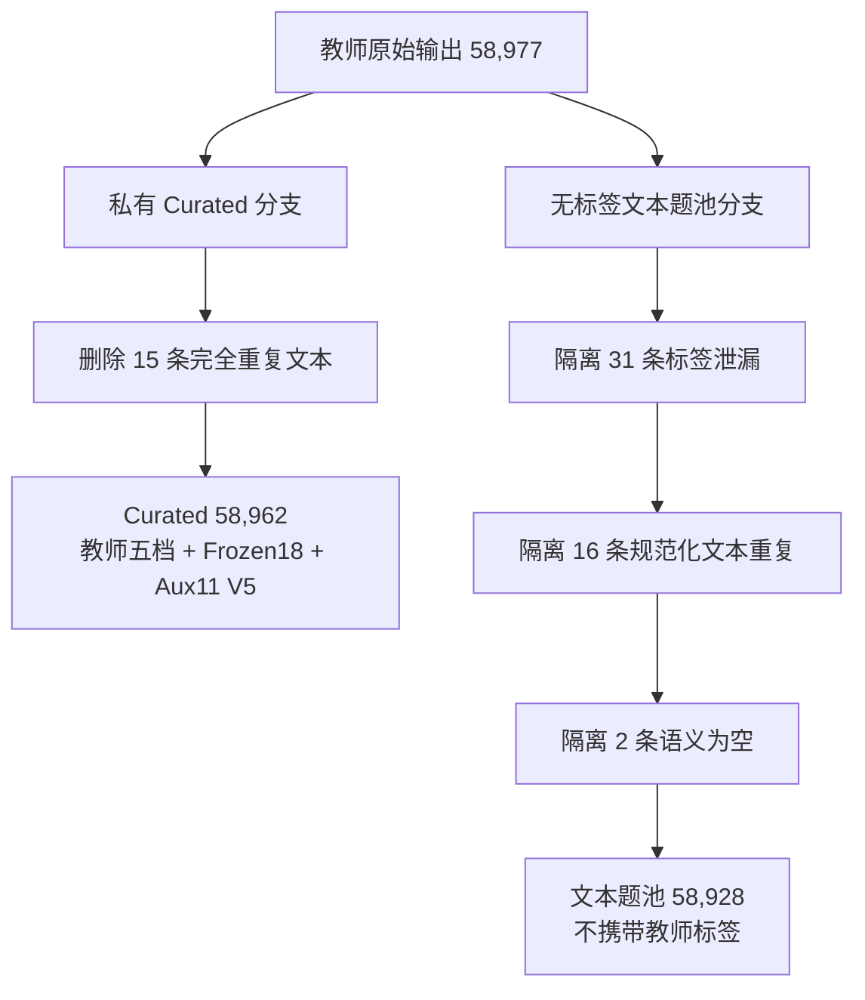

# Frozen18 到 Aux10 / Aux11：特征契约、字段字典与 58,977 条数据处理报告

## 1. 文档目的

本文说明物理题难度项目中三套辅助特征口径之间的关系：

- 上游教师链路输出的 `Frozen18`；
- 历史 V3 学生模型使用的 `Aux10`；
- 当前 10k/40k 扩量实验下游训练使用的 `Aux11`。

本文同时记录 58,977 条教师输出经过清洗、转换、构图和训练准备后的真实数据规模，避免把
原始教师记录、私有 Curated 数据、无标签文本池和 pair 图节点混为一谈。

当前结论如下：

```yaml
teacher_output:
  schema: Frozen18
  records: 58977

historical_v3_student:
  schema: Aux10
  graph_and_experiment: merged_as_information_processing

current_expansion:
  experiment_name: V4_10k_40k
  student_feature_schema: aux11_step3_v5
  auxiliary_heads: 11
  step_count_classes: 3
```

这里需要区分两个版本概念：

- “V4 10k/40k”是本次扩量实验的名称；
- `aux11_step3_v5` 是当前辅助特征的数据契约版本。

因此，“当前 V4 实验使用 Aux11”是正确的，但不能再把当前 `step_count` 描述为旧 V4
schema 的四档；下游训练使用的是 V5 三档口径。

---

## 2. 数据来源与监督边界

每条原始教师记录包含：

```text
题干、选项、解析、小题
        ↓
冻结物理 Prompt
        ↓
教师模型输出难度与 Frozen18
        ↓
V7 后处理得到最终 difficulty_level
```

核心字段来源为：

```yaml
primary_label:
  source: difficulty_rating.difficulty_level
  values: [送分题, 基础题, 中等题, 拔高题, 压轴题]

frozen18:
  source: difficulty_rating.features

forbidden_raw_label:
  source: difficulty
  usage: ignored
```

需要明确：

1. Frozen18 是上游 Prompt 与 V7 教师链路的输出，不是学生模型预先预测的结果；
2. Frozen18 到 Aux10/Aux11 不再调用大模型，而是确定性的字段选择、枚举规范化和映射；
3. 原始 `difficulty` 字段没有参与选题监督、pair 标注、Aux11 转换或学生训练；
4. 教师最终五档与 Frozen18 来自同一教师链路，二者存在规则相关性，不能把辅助特征当成
   独立人工真值；
5. 学生模型推理时只输入题目文本，不输入 Frozen18 或教师五档。

---

## 3. Frozen18 完整字段字典

### 3.1 `step_count`：有效物理推理步骤数

表示完成题目最高难任务所需的连续有效物理决策链长度。有效步骤包括物理判断、建模、关系
推导、关键计算和结论判断；不按解析句号数、机械代数展开次数或重复代入次数统计。

| 候选值 | 含义 |
|---|---|
| `1-2步` | 一个直接判断或一两个直接关系即可完成 |
| `3-5步` | 需要较短且连续的推理或计算链 |
| `6-8步` | 需要较长的建模、推理或多阶段计算 |
| `9-12步` | 需要很长的连续推理链或多阶段递进 |
| `12步以上` | 极长推理链、复杂分支或多阶段综合过程 |

### 3.2 `formula_count`：必要公式数量

统计解题过程中实际需要调用的不同物理公式或核心关系数量，不把同一公式的重复代入机械累加。

| 候选值 | 含义 |
|---|---|
| `0-1个` | 无需公式或只需一个核心关系 |
| `2-3个` | 需要少量公式衔接 |
| `4-6个` | 公式链较长，需要多个关系联立 |
| `7个以上` | 极长公式链或高度综合计算 |

### 3.3 `calculation_complexity`：计算复杂度

| 候选值 | 含义 |
|---|---|
| `口算或直接判断` | 几乎不需要书面计算，或可直接定性判断 |
| `简单笔算` | 单公式代入、常规四则运算或短计算 |
| `多公式联立` | 多个公式、方程或状态关系需要联立 |
| `复杂方程或范围计算` | 包含复杂方程、取值范围、极值、有效解筛选等计算 |

### 3.4 `reasoning_chain`：推理方式与链条复杂度

| 候选值 | 含义 |
|---|---|
| `直接套用` | 识别知识点后直接应用结论或公式 |
| `简单因果推理` | 存在一层或少量直接因果关系 |
| `多层因果推理` | 多个前提和中间结论连续依赖 |
| `逆向推理或临界分析` | 需要从结果反推、处理临界条件、边界或极值 |

### 3.5 `problem_structure`：题目主体结构

该字段描述题目的主要任务类型，是单标签字段；综合类名称表示题目的主要物理模块和任务重心，
不等同于完整知识域列表。

| 候选值 | 含义 |
|---|---|
| `概念判断` | 以概念辨析、规律判断或定性分析为主 |
| `直接计算` | 以直接代入和常规计算为主 |
| `实验探究` | 以实验操作、变量控制、方案或误差分析为主 |
| `图像表格分析` | 以图像、表格读取、比较、归纳或反推为主 |
| `电路综合` | 电路状态、测量、故障、功率或动态电路综合 |
| `力学综合` | 受力、运动、压强、浮力、功与机械等力学综合 |
| `热学综合` | 温度、热量、内能、物态变化等热学综合 |
| `光学声学综合` | 光学或声学规律的综合应用 |
| `跨模块综合` | 多个物理模块形成实质性依赖关系 |

### 3.6 `additional_structure`：附加结构标签

用于补充主体结构之外的重要次级结构。它与 `problem_structure`、图表要求和实验要求存在一定
重叠，因此没有进入当前 Aux11。

| 候选值 | 含义 |
|---|---|
| `无` | 没有额外突出结构 |
| `图像表格` | 题目附带重要图像或表格加工任务 |
| `实验探究` | 附带实验操作、探究或评价任务 |
| `电路约束` | 存在电路连接、状态、安全范围或测量约束 |
| `力学约束` | 存在受力、运动、平衡或几何位置约束 |
| `跨模块` | 存在额外跨模块关系 |

### 3.7 `information_carrier`：信息载体

描述题目信息主要通过什么形式呈现，不直接等同于信息加工难度。

| 候选值 | 含义 |
|---|---|
| `纯文字` | 主要依赖文字条件 |
| `单图识别` | 需要识别一张普通示意图 |
| `电路图` | 主要载体为电路图 |
| `实验装置图` | 主要载体为实验装置图 |
| `图像或表格` | 主要载体为函数图像、统计图或表格 |
| `多图表综合` | 需要联合处理多个图、表或载体 |

### 3.8 `reality_question`：真实情境要求

| 候选值 | 含义 |
|---|---|
| `否` | 标准教材、抽象模型或常规题型情境 |
| `是` | 需要理解生活、工程、科技或陌生真实情境 |

### 3.9 `subquestion_dependency`：小题依赖关系

| 候选值 | 含义 |
|---|---|
| `无多问` | 没有多小问，或仅一个主要任务 |
| `多问但相互独立` | 多个小问可分别完成，前问不是后问必要条件 |
| `多问且层层递进` | 后续小问依赖前问结论或中间变量 |

### 3.10 `knowledge_count`：连续推理中使用的知识点数量

不把选择题各独立选项中的知识点机械相加，只统计完成核心推理链所需的知识点。

| 候选值 | 含义 |
|---|---|
| `1个` | 单一知识点即可完成 |
| `2-3个` | 少量知识点联合使用 |
| `4个及以上` | 多知识点形成综合推理 |

### 3.11 `knowledge_diff`：知识理解或调用难度

| 候选值 | 含义 |
|---|---|
| `低` | 常规知识，识别和调用直接 |
| `中` | 需要一定迁移、辨析或组合 |
| `高` | 知识调用隐蔽、陌生或需要深度迁移 |

### 3.12 `cross_module`：跨模块程度

| 候选值 | 含义 |
|---|---|
| `同一模块内部` | 核心推理发生在一个物理模块内 |
| `跨模块综合` | 多个模块之间形成实质性依赖 |

### 3.13 `state_count`：物理状态或过程阶段数量

| 候选值 | 含义 |
|---|---|
| `单状态` | 只分析一个稳定状态或单一阶段 |
| `双状态` | 需要比较前后两个状态 |
| `多状态` | 三个及以上状态或多个阶段相互关联 |
| `连续变化或临界状态` | 状态连续变化，或需要确定临界点、边界和转折 |

### 3.14 `constraint_count`：约束条件复杂度

这里的约束指真正限制解空间的安全范围、边界、平衡、极值、有效解等条件，不是题干中普通
已知量的数量。

| 候选值 | 含义 |
|---|---|
| `无约束` | 不需要额外边界或有效性判断 |
| `单一约束` | 存在一个主要限制条件 |
| `多约束` | 多个限制条件需要同时满足 |

### 3.15 `variable_relation`：变量关系复杂度

| 候选值 | 含义 |
|---|---|
| `无变量关系` | 不需要建立变量之间的函数或比例关系 |
| `简单正反比` | 主要是简单正比、反比或一次关系 |
| `图像函数关系` | 需要读取、建立或解释图像和函数关系 |
| `多变量耦合关系` | 多个变量相互制约，需要联立建模 |

### 3.16 `experiment_requirement`：实验能力要求

| 候选值 | 含义 |
|---|---|
| `无` | 不涉及实验能力 |
| `基础操作或读数` | 仪器使用、基础操作或直接读数 |
| `控制变量或故障分析` | 控制变量、现象解释、电路或装置故障分析 |
| `方案设计或误差评价` | 设计实验、改进方案、评估误差和可行性 |

### 3.17 `graph_table_requirement`：图表加工要求

| 候选值 | 含义 |
|---|---|
| `无` | 不需要处理图像或表格信息 |
| `直接读数` | 从图表中直接读取单个或少量数值 |
| `多组比较归纳` | 比较多组数据并归纳规律 |
| `图像反推或外推` | 根据图像反推参数、过程、边界或进行外推 |

### 3.18 `error_risk`：易错风险

| 候选值 | 含义 |
|---|---|
| `无明显易错点` | 解题路径直接，没有突出的误区 |
| `轻微易错点` | 存在单位、符号、对象或常规细节风险 |
| `明显易错点` | 存在容易混淆的条件、模型或中间判断 |
| `高易错点` | 存在关键陷阱、边界、反直觉关系或多重误判风险 |

---

## 4. Frozen18 到历史 Aux10

V3 保留九个独立字段：

```yaml
directly_preserved:
  - problem_structure
  - step_count
  - calculation_complexity
  - reasoning_chain
  - knowledge_count
  - subquestion_dependency
  - state_count
  - constraint_count
  - variable_relation
```

随后把 `graph_table_requirement` 和 `experiment_requirement` 合并成一个互斥的
`information_processing`：

```yaml
aux10:
  - problem_structure
  - step_count
  - calculation_complexity
  - reasoning_chain
  - knowledge_count
  - subquestion_dependency
  - state_count
  - constraint_count
  - variable_relation
  - information_processing
```

确定性合并规则如下：

| 图表要求 | 实验要求 | `information_processing` |
|---|---|---|
| `无` | `无` | `无` |
| `直接读数` | `无` | `图表直接读数` |
| `多组比较归纳` | `无` | `图表多组比较归纳` |
| `图像反推或外推` | `无` | `图像反推或外推` |
| `无` | `基础操作或读数` | `实验基础操作或读数` |
| `无` | `控制变量或故障分析` | `实验控制变量或故障分析` |
| `无` | `方案设计或误差评价` | `实验方案设计或误差评价` |
| 任一非 `无` | 任一非 `无` | `图表与实验混合处理` |

该合并得到八个候选值，但有一个结构性缺陷：图表能力和实验能力可以同时存在，单一互斥标签
无法分别表达两者的复杂度。

---

## 5. Frozen18 到当前 Aux11

### 5.1 为什么重新拆分图表头和实验头

图表加工与实验能力不是同一个任务：

- 题目可以只要求读取函数图像，不涉及实验；
- 题目可以只要求设计实验方案，不含图表；
- 题目也可以同时要求图表分析与实验推理。

因此当前 Aux11 不再使用合并的 `information_processing`，而是保留两个独立分类头：

```yaml
current_aux11:
  - problem_structure
  - step_count
  - calculation_complexity
  - reasoning_chain
  - knowledge_count
  - subquestion_dependency
  - state_count
  - constraint_count
  - variable_relation
  - graph_table_requirement
  - experiment_requirement
```

### 5.2 当前 `step_count` 是三档，不是四档

58,977 条原始教师记录中的五档分布为：

| 原始类别 | 数量 | 占比 |
|---|---:|---:|
| `1-2步` | 30,084 | 51.010% |
| `3-5步` | 25,495 | 43.229% |
| `6-8步` | 3,373 | 5.719% |
| `9-12步` | 22 | 0.037% |
| `12步以上` | 3 | 0.005% |

旧四档方案把最高两档合并为 `9步以上`，但合并后仍然只有 25 条，占 0.042%，无法形成
可靠的训练和验证类别。因此当前 `aux11_step3_v5` 使用三档：

```yaml
step_count_mapping:
  1-2步: 1-2步
  3-5步: 3-5步
  6-8步: 6步以上
  9-12步: 6步以上
  12步以上: 6步以上
  historical_9步以上: 6步以上
```

映射前、去重前的支持数为：

| 当前类别 | 数量 | 占比 |
|---|---:|---:|
| `1-2步` | 30,084 | 51.010% |
| `3-5步` | 25,495 | 43.229% |
| `6步以上` | 3,398 | 5.761% |

这三档表示“短链、中链、长链”，不表示难度档位。实际 1,905 道压轴题中有 1,880 道
原始标签为 `6-8步`，说明“压轴题必须达到 9 步”并不成立。难度还取决于临界分析、约束、
多变量耦合、知识整合和非常规突破口。

### 5.3 当前 Aux11 每个头的候选值

| 辅助头 | 类型 | 候选值 |
|---|---|---|
| `problem_structure` | 9 类单标签 | 概念判断、直接计算、实验探究、图像表格分析、电路综合、力学综合、热学综合、光学声学综合、跨模块综合 |
| `step_count` | 3 类有序标签 | 1-2步、3-5步、6步以上 |
| `calculation_complexity` | 4 类有序标签 | 口算或直接判断、简单笔算、多公式联立、复杂方程或范围计算 |
| `reasoning_chain` | 4 类有序标签 | 直接套用、简单因果推理、多层因果推理、逆向推理或临界分析 |
| `knowledge_count` | 3 类有序标签 | 1个、2-3个、4个及以上 |
| `subquestion_dependency` | 3 类单标签 | 无多问、多问但相互独立、多问且层层递进 |
| `state_count` | 4 类有序标签 | 单状态、双状态、多状态、连续变化或临界状态 |
| `constraint_count` | 3 类有序标签 | 无约束、单一约束、多约束 |
| `variable_relation` | 4 类单标签 | 无变量关系、简单正反比、图像函数关系、多变量耦合关系 |
| `graph_table_requirement` | 4 类单标签 | 无、直接读数、多组比较归纳、图像反推或外推 |
| `experiment_requirement` | 4 类单标签 | 无、基础操作或读数、控制变量或故障分析、方案设计或误差评价 |

---

## 6. Frozen18 中保留和移除的字段

| Frozen18 字段 | 当前处理 | 说明 |
|---|---|---|
| `problem_structure` | 保留 | 描述主要任务结构 |
| `step_count` | 保留并映射为三档 | 解决高步数极小类 |
| `calculation_complexity` | 保留 | 比公式数量更直接描述计算负担 |
| `reasoning_chain` | 保留 | 描述推理方式和深度 |
| `knowledge_count` | 保留 | 描述知识整合数量 |
| `subquestion_dependency` | 保留 | 区分多问数量与递进依赖 |
| `state_count` | 保留 | 描述过程阶段和临界变化 |
| `constraint_count` | 保留 | 描述边界、范围和有效性限制 |
| `variable_relation` | 保留 | 描述变量建模复杂度 |
| `graph_table_requirement` | 独立保留 | 不再并入互斥合并头 |
| `experiment_requirement` | 独立保留 | 不再并入互斥合并头 |
| `formula_count` | 不进入辅助损失 | 与计算复杂度重叠，且 `7个以上` 只有 15 条 |
| `additional_structure` | 不进入辅助损失 | 与主体结构、图表和实验字段重叠 |
| `information_carrier` | 不进入辅助损失 | 更接近呈现形式，不等同于推理难度 |
| `reality_question` | 不进入辅助损失 | 与真实情境元数据重叠，正类占比仅 4.259% |
| `knowledge_diff` | 不进入辅助损失 | 主观性较强，且与推理链和最终难度高度相关 |
| `cross_module` | 不进入辅助损失 | 与主体结构及知识域元数据重叠，正类占比 3.857% |
| `error_risk` | 不进入辅助损失 | 主观性强，且与 V7 最终难度规则相关 |

被移除的七个字段没有丢失。它们继续原样保存在：

```text
teacher_features_legacy18
```

当前 11 个确定性派生字段保存在：

```text
teacher_features
```

---

## 7. 58,977 条原始数据的特征分布

以下统计基于去重前的 58,977 条教师输出。该统计用于判断类别支持度和 schema 是否可训练，
不等同于最终 10k 训练节点分布。

### 7.1 当前 Aux11 字段分布

| 字段 | 原始类别分布 |
|---|---|
| `problem_structure` | 概念判断 25,400 (43.068%)；实验探究 9,998 (16.952%)；力学综合 9,588 (16.257%)；电路综合 7,525 (12.759%)；光学声学综合 1,839 (3.118%)；跨模块综合 1,720 (2.916%)；热学综合 1,237 (2.097%)；直接计算 897 (1.521%)；图像表格分析 773 (1.311%) |
| `step_count`（V5映射后） | 1-2步 30,084 (51.010%)；3-5步 25,495 (43.229%)；6步以上 3,398 (5.761%) |
| `calculation_complexity` | 口算或直接判断 33,670 (57.090%)；简单笔算 17,271 (29.284%)；多公式联立 7,509 (12.732%)；复杂方程或范围计算 527 (0.894%) |
| `reasoning_chain` | 多层因果推理 25,871 (43.866%)；简单因果推理 17,384 (29.476%)；直接套用 12,248 (20.767%)；逆向推理或临界分析 3,474 (5.890%) |
| `knowledge_count` | 2-3个 41,513 (70.388%)；1个 9,358 (15.867%)；4个及以上 8,106 (13.744%) |
| `subquestion_dependency` | 无多问 36,783 (62.368%)；多问但相互独立 13,139 (22.278%)；多问且层层递进 9,055 (15.353%) |
| `state_count` | 单状态 42,192 (71.540%)；双状态 12,304 (20.862%)；多状态 4,175 (7.079%)；连续变化或临界状态 306 (0.519%) |
| `constraint_count` | 无约束 37,920 (64.296%)；单一约束 16,436 (27.868%)；多约束 4,621 (7.835%) |
| `variable_relation` | 无变量关系 32,873 (55.739%)；简单正反比 16,017 (27.158%)；图像函数关系 6,775 (11.488%)；多变量耦合关系 3,312 (5.616%) |
| `graph_table_requirement` | 无 44,683 (75.763%)；多组比较归纳 5,872 (9.956%)；直接读数 5,518 (9.356%)；图像反推或外推 2,904 (4.924%) |
| `experiment_requirement` | 无 47,296 (80.194%)；控制变量或故障分析 7,698 (13.053%)；基础操作或读数 2,059 (3.491%)；方案设计或误差评价 1,924 (3.262%) |

其中需要持续监控的尾部类别是：

```yaml
calculation_complexity:
  category: 复杂方程或范围计算
  count: 527

state_count:
  category: 连续变化或临界状态
  count: 306
```

这两个类别明显不均衡，但仍有数百个独立题目，不属于 `step_count` 最高档只有 25 条的同级
问题。当前策略是保留类别，通过节点覆盖和训练权重处理，而不是直接合并。

### 7.2 未进入 Aux11 的七个字段分布

| 字段 | 原始类别分布 |
|---|---|
| `formula_count` | 0-1个 34,925 (59.218%)；2-3个 17,977 (30.481%)；4-6个 6,060 (10.275%)；7个以上 15 (0.025%) |
| `additional_structure` | 无 29,276 (49.640%)；实验探究 8,704 (14.758%)；电路约束 7,304 (12.384%)；力学约束 7,069 (11.986%)；图像表格 4,569 (7.747%)；跨模块 2,055 (3.484%) |
| `information_carrier` | 纯文字 19,025 (32.258%)；单图识别 17,550 (29.757%)；电路图 7,279 (12.342%)；图像或表格 6,981 (11.837%)；实验装置图 4,589 (7.781%)；多图表综合 3,553 (6.024%) |
| `reality_question` | 否 56,465 (95.741%)；是 2,512 (4.259%) |
| `knowledge_diff` | 低 36,539 (61.955%)；中 20,326 (34.464%)；高 2,112 (3.581%) |
| `cross_module` | 同一模块内部 56,702 (96.143%)；跨模块综合 2,275 (3.857%) |
| `error_risk` | 轻微易错点 36,974 (62.692%)；明显易错点 16,611 (28.165%)；无明显易错点 3,769 (6.391%)；高易错点 1,623 (2.752%) |

---

## 8. 数据处理规模与两条数据支路

### 8.1 为什么 58,962 和 58,928 不能直接顺序相减

两者来自同一份 58,977 条源记录，但服务于不同目的并采用不同清洗规则：



因此不能写成：

```text
58,962 - 31 - 16 - 2 = 58,928
```

这个等式并不成立。正确关系是：

```yaml
curated_branch:
  source: 58977
  exact_duplicates_removed: 15
  output: 58962

text_pool_branch:
  source: 58977
  label_leakage: 31
  duplicate_normalized_text: 16
  semantically_empty: 2
  output: 58928
```

### 8.2 私有 Curated 数据

```yaml
source_teacher_records: 58977
curated_records: 58962
exact_duplicates_removed: 15
quarantined_records: 0

difficulty_distribution:
  送分题: 8319
  基础题: 20102
  中等题: 20359
  拔高题: 8278
  压轴题: 1904

feature_schema_version: aux11_step3_v5
label_schema_version: v2_frozen18
```

转换审计结果：

```yaml
matched_records: 58962
auxiliary_exact_match: 58962
frozen18_preserved: true
auxiliary_exactly_derived: true
raw_difficulty_used: false
errors: 0
status: PASS
```

这表示：

- 58,962 道去重后的题全部完成 Frozen18 到 Aux11 V5 的确定性转换；
- 原始 Frozen18 没有被覆盖；
- 当前 Aux11 可以逐条由 Frozen18 重新计算得到；
- 15 条未进入 Curated 的记录对应完全重复题，不是转换失败；
- 无意义的原始 `difficulty` 没有参与处理。

### 8.3 无标签文本题池与 10k 节点

无标签题池只保留稳定 ID、规范化文本、split 和必要诊断信息，不包含教师五档和 Aux11，避免
这些标签进入 pair teacher Prompt。

最终选出的 10,000 道训练节点满足：

```yaml
selected_questions: 10000
aux11_join_key: question_id == curated.id
aux11_question_coverage: 1.0
missing_aux11_questions: 0
```

10k 节点的选择同时考虑：

- 教师最终五档的粗分层覆盖；
- Aux11 各候选类别覆盖；
- 稀有类别保护；
- 源池分布保持；
- 确定性随机探索；
- 与旧训练、validation 和 test 集隔离。

---

## 9. 10k/40k 构图与 Aux11 V5 迁移的关系

40,000 个候选 pair 已经构建完成：

```yaml
questions: 10000
pairs: 40000
node_coverage: 1.0
connected_components: 1
degree:
  minimum: 6
  p10: 7
  median: 8
  mean: 8
  p90: 9
  maximum: 12
```

边来源为：

| 构边策略 | 数量 | 作用 |
|---|---:|---|
| `feature_near` | 12,347 | 比较辅助特征相近、难度可能接近的题 |
| `feature_contrast` | 10,158 | 比较特征差异明显的题，建立跨度 |
| `random_global` | 6,733 | 提供全局随机连接，避免局部闭环 |
| `lexical_near` | 4,063 | 比较文本或词汇相近的题 |
| `structure_matched` | 4,033 | 比较结构相近的题 |
| `low_degree_repair` | 2,096 | 修复低度节点，保证覆盖 |
| `graph_bridge` | 570 | 连接局部区域，保证全图单连通 |

该图在 `aux11_separate_processing_v4` 四档步骤口径下构建，随后才根据全量统计把下游辅助
监督升级为 `aux11_step3_v5`。不需要重建 40k 图，原因是：

1. pair teacher 只读取两侧题目文本，不读取 Aux11；
2. 原始 `9-12步` 和 `12步以上` 合计仅 25 条，旧步骤边界只影响极少节点的特征距离；
3. 已有图仍满足全覆盖、单连通和健康度数约束；
4. Bradley–Terry 主任务监督来自 pair 比较结果，不来自 Aux11。

teacher pair 完成后，将 V5 Curated 数据按 `question_id` 关联到最终 pair，供辅助版本训练。

---

## 10. 学生模型中的使用方式

### 10.1 BT-only 对照组

```yaml
main_head:
  output: scalar_score
  loss: Bradley-Terry soft pairwise loss

auxiliary_heads: disabled
```

### 10.2 BT + Aux11 实验组

```yaml
main_head:
  output: scalar_score
  loss: Bradley-Terry soft pairwise loss

auxiliary_heads:
  count: 11
  step_count_output_classes: 3
  other_output_classes: defined_by_aux11_step3_v5

training_rule:
  main_task_priority: higher
  auxiliary_loss: low_weight_regularizer
```

Aux11 的作用是帮助 backbone 学习题目结构、推理过程和信息加工表征。它不替代 Bradley–Terry
主任务，也不用于推理后的硬规则升降档。最终难度应由连续 BT 标量和冻结校准阈值得到。

由于 V5 的 `step_count` 头从四类改为三类：

- 旧四档 Aux11 checkpoint 可以按照 checkpoint 内嵌词表进行只读评估；
- 旧四档 Aux11 checkpoint 禁止续训到 V5；
- V5 辅助实验必须重新关联数据并从头训练；
- BT-only checkpoint 不含辅助头，不受该变化影响。

---

## 11. 35 号服务器上的当前数据位置

后续训练以 35 号服务器为主，运行时数据统一放在 `/local_data`：

```yaml
project:
  /local_data/zhangyonglin/physics-difficulty-rater

runtime:
  /local_data/zhangyonglin/physics-difficulty-runtime

aux11_v5_curated:
  /local_data/zhangyonglin/physics-difficulty-runtime/rater-data/curated/physics_teacher_v5_aux11_step3_58977.jsonl
  records: 58962

teacher_pair_run:
  /local_data/zhangyonglin/physics-difficulty-runtime/pairwise_v4/production_40k_v1

future_training_outputs:
  /local_data/zhangyonglin/physics-difficulty-runtime/outputs
```

35 号服务器上的 vLLM teacher 环境与学生训练环境应分离。V5 Curated 文件已经从 45 号
服务器同步到 35 号服务器，行数检查为 58,962。

---

## 12. 数据使用原则

```yaml
must:
  - 保留原始 Frozen18 以支持追溯和重新映射
  - 使用 feature_schema_version 区分四档旧数据与三档 V5 数据
  - pair teacher 仅接收无标签题目文本
  - 最终 pair 与 Aux11 按稳定 question_id 关联
  - 独立报告唯一题目数和 pair-side 数，不能用重复端点冒充样本量
  - 旧辅助 checkpoint 只读兼容，V5 从头训练

must_not:
  - 使用原始 difficulty 作为训练标签
  - 把 Frozen18 或教师五档写进 pair teacher Prompt
  - 把 58,962 和 58,928 当成同一条顺序流水线
  - 用预测 Aux11 做外部硬规则升降档
  - 把 Aux11 指标解释为独立人工教研真值
```

本文档对应当前冻结合同：

```text
contracts/teacher_label_v5_aux11_step3.yaml
```
