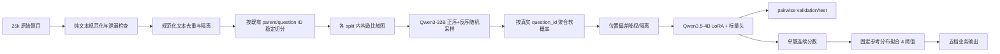

# V3 物理题 QuRating / Bradley–Terry 实施方案

## 1. 目标和边界

输入只有题干、选项、解析和小题文本，不向 teacher 或 student 上传图片。
系统学习连续难度函数 `s(q)`，两题比较概率定义为：

```text
P(A 比 B 难) = sigmoid(s(A) - s(B))
```

最后用在固定参考总体上拟合的 4 个阈值，把连续分数映射成：送分题、基础题、
中等题、拔高题、压轴题。阈值拟合完成后冻结，不能按每次待预测批次重新计算。

### 绝对禁止的数据

25,000 条源数据中的 `difficulty` 是错误、无意义的历史字段；准备数据后出现的
`raw_difficulty` 与它同源。旧 API+V7 结果中的 `teacher_difficulty_id` 和
`teacher_difficulty_level` 也不进入 V3 主链路。这些字段均不得用于：

- pair 候选采样或分层；
- Qwen3-32B Prompt；
- Bradley–Terry target 或 sample weight；
- student 训练；
- 4 阈值校准；
- validation/test 指标。

预处理采用输出白名单，不复制任何历史难度标签或教师特征。源文件曾按错误
`difficulty=1..5` 各抽 5,000 条，因此可以作为 pairwise 题目池，但不能代表自然业务
难度分布，更不能用它的分位数直接定义五档阈值。

## 2. 数据流



所有 pair 都只能在同一 split 内组成，严禁 train 题与 validation/test 题比较。
V3 复用原文件已有 `question_id/parent_id`，不重新生成题目 ID。先用最终模型可见文本
去重，再以 `sha256(seed, question_group_id)` 做 8:1:1 稳定切分；主题和它的小题永远
留在同一条记录和同一 split。

## 3. 原始 25k 文本准备

V3 的题目源固定为
`physics_sampled_5000_per_difficulty_v2.jsonl`。它的 9 个字段合约为：
`parent_id/question_id/stem/options/analysis/sub_questions/stem_pic_url/analysis_pic_url/difficulty`。
脚本要求字段合约完整，但只白名单输出题目 ID、文本、分段、哈希和诊断；
`difficulty` 只被确认为上游已知废弃字段，不复制到任何题目输出。

`prepare_raw_v3_questions.py`：

- 按题干、选项、解析、小题的固定顺序生成 `input_sections/text`；
- 不上传图片，只保留 `has_image/image_dependency_risk` 诊断；
- 隔离只有标题/图片占位的语义空题；
- 隔离“基础题/中等题/试题难易程度”等难度泄漏，但不误判“导电的难易程度”；
- 基于 `NFKC + 纯文本规范化` 去重；
- 按 `question_group_id/parent_id` 稳定哈希切分 8:1:1，完全不用难度标签分层；
- 输出 `all/train/validation/test/quarantine.jsonl` 和带源文件 SHA256 的 manifest。

在本机 Mac 执行原始文件上传：

```bash
scp "/Users/wishfine/Desktop/xdf/ai题库/prompt_test/data/physics_sampled_5000_per_difficulty_v2.jsonl" \
  zhangyonglin@172.22.0.45:~/physics-difficulty-rater/data/raw/
```

服务器准备数据：

```bash
cd ~/physics-difficulty-rater
git pull origin main

PAIR_ROOT=/data/zhangyonglin/physics-difficulty-runtime/pairwise_v3
RAW=data/raw/physics_sampled_5000_per_difficulty_v2.jsonl

python scripts/prepare_raw_v3_questions.py \
  --input "$RAW" \
  --output-dir "$PAIR_ROOT/questions" \
  --manifest "$PAIR_ROOT/questions.manifest.json" \
  --seed 42
```

文本准备阶段保留完整内容，不按 student tokenizer 提前截断。teacher/student 的不同 token
预算在各自 dataset/collator 中处理，避免数据池永久丢失解析。

## 4. 比较图与 pilot

不要把 20k 题做全组合；它会产生约 2 亿条边。采用稀疏、连通、度数均衡的图。
首轮 pilot 固定抽 2,000 题、8,000 pair，每题平均约 8 条边，最少 4、最多 12。

新 raw V3 候选来源必须只使用无标签信息：

- `lexical_near`：用无依赖的字符3-gram SimHash LSH 召回、Jaccard 精排词面接近题；
- `structure_matched`：小题数、长度档、有无解析等接近，防止只按题长判断；
- `random_global`：全局随机边，提供远距离关系；
- `graph_bridge`：连接不同题目簇，统一全局分数标尺；
- `low_degree_repair`：为配对数不足的题目补边。

旧 `build_pair_candidates.py` 的 teacher-level 候选模式不能用于这份 raw V3 数据。
使用独立的 `build_raw_v3_pair_candidates.py`：它递归拒绝历史难度字段，用稳定 ID 哈希
抽题，并在最终输出前强制检查连通性、唯一边和度数范围。

先生成 100 题 / 400 pair smoke：

```bash
mkdir -p "$PAIR_ROOT/smoke"

python scripts/build_raw_v3_pair_candidates.py \
  --config configs/pair_sampling_raw_v3_smoke.json \
  --questions "$PAIR_ROOT/questions/train.jsonl" \
  --output "$PAIR_ROOT/smoke/candidates.jsonl" \
  --selected-questions-output "$PAIR_ROOT/smoke/questions.jsonl" \
  --manifest "$PAIR_ROOT/smoke/candidates.manifest.json"
```

smoke 通过后再生成 2,000 题 / 8,000 pair pilot：

```bash
mkdir -p "$PAIR_ROOT/pilot"

python scripts/build_raw_v3_pair_candidates.py \
  --config configs/pair_sampling_raw_v3_pilot.json \
  --questions "$PAIR_ROOT/questions/train.jsonl" \
  --output "$PAIR_ROOT/pilot/candidates.jsonl" \
  --selected-questions-output "$PAIR_ROOT/pilot/questions.jsonl" \
  --manifest "$PAIR_ROOT/pilot/candidates.manifest.json"
```

候选图生成后仍要求：`node_coverage=1.0`、最大连通分量比例接近 1、最小度数至少 4、
无重复无向边、无 self pair。manifest 还要求 `lexical_near` 的平均 Jaccard 高于
`random_global`；否则说明近邻召回没有真正优于随机边。这里只声称“词面接近”，
不把字符3-gram 误称为深层语义相似。

## 5. 本地 Qwen3-32B teacher

先确认真实模型目录；配置默认假定目录名为 `Qwen3-32B`：

```bash
find /home/share_ssd_data/nfs-env/llm_models -maxdepth 2 \
  -name config.json -printf '%h\n' | grep 'Qwen3-32B'
```

把命令输出的实际路径赋给 `TEACHER`；配置文件故意不猜子目录名，避免加载错模型。
teacher 使用 vLLM 离线推理，不调用 API。

不要直接复用或改动 Vime 训练环境，也不要对已经验证的 CUDA 栈执行 `pip install
vllm`。首次运行下面的幂等脚本：它只把已验证环境克隆到本项目在 `/data` 下的独立
prefix，然后从克隆中卸载 Vime 自身的 Python 包；源环境不受影响：

```bash
bash scripts/bootstrap_teacher_env.sh
conda activate /data/$USER/conda_envs/physics-difficulty-vllm
```

脚本保留已存在的目标环境而不覆盖，并验证：Python 3.11、
`torch 2.11.0+cu129`、`vLLM 0.24.0+cu129`。conda explicit manifest 和 pip freeze
写入 `/data/$USER/physics-difficulty-runtime/env_manifests/`。如果任一版本不符，脚本
直接失败，不能继续 teacher pilot。

每个 pair 同时判断 `(A,B)` 和 `(B,A)`，并把位置字母还原为真实 question ID。
默认每个顺序先采 3 次；软概率接近 0.5 或正反序不一致时自适应增加至 5 或 10
次。原始输出 append 写入，可中断续跑。`temperature` 不能设为 0，否则重复投票会退化成
近乎相同的硬标签，不能估计偏好概率。

先在同一批 20 个 smoke pair 上做 reasoning 消融，三组分别是：

```text
nonthinking:  thinking=false, max_new_tokens=4,    temperature=0.7, top_p=0.8
thinking_512: thinking=true,  max_new_tokens=512,  temperature=0.6, top_p=0.95
thinking_1024:thinking=true,  max_new_tokens=1024, temperature=0.6, top_p=0.95
共同参数: top_k=20, min_p=0, 正反序各自适应采样 3/5/10 次
```

为适配两张 A800 80GB 上的 32B BF16 权重，三组统一设置
`gpu_memory_utilization=0.82`、`max_num_batched_tokens=4096`、`max_num_seqs=32`；
非思考外层 batch 为 8，思考外层 batch 为 4。这里需要给前向激活和 CUDA Graph 留出
余量，不能把 KV cache 预占提高到 0.9。JSON 配置在 argparse 参数注册完成后才作为默认值
加载，命令行显式参数仍可覆盖 JSON。

这里的 512/1024 是生成 Token 预算，不是 vLLM 的 `reasoning_effort=medium/high`；离线
Qwen3 没有统一的低/中/高强度参数。三个模式必须使用各自独立的 raw vote 文件，禁止把
不同温度、不同 thinking 模式的票混成一个 soft target。

在服务器依次运行三组（同一时刻只加载一个 Qwen3-32B，固定占用物理 GPU 6、7）：

```bash
cd ~/physics-difficulty-rater
git pull origin main
conda activate /data/$USER/conda_envs/physics-difficulty-vllm

PAIR_ROOT=/data/$USER/physics-difficulty-runtime/pairwise_v3
TEACHER=/home/share_ssd_data/nfs-env/llm_models/Qwen/Qwen3-32B
ABLATION_ROOT="$PAIR_ROOT/smoke/reasoning_ablation_20"
mkdir -p "$ABLATION_ROOT/logs"

nohup env CUDA_VISIBLE_DEVICES=6,7 \
  bash scripts/server_run_teacher_reasoning_ablation.sh \
  "$TEACHER" \
  "$PAIR_ROOT/smoke/candidates.jsonl" \
  "$ABLATION_ROOT" \
  20 \
  > "$ABLATION_ROOT/logs/ablation.log" 2>&1 &
```

启动脚本同时设置 `VLLM_USE_FLASHINFER_SAMPLER=0`。服务器的 PyTorch CUDA runtime
是 12.9，但系统 `/usr/bin/nvcc` 低于 CUDA 12，无法 JIT 编译 FlashInfer 0.6.x 的
top-k/top-p sampler；关闭该 sampler 后由 vLLM 回退到原生 PyTorch 采样。FlashAttention
和两卡张量并行不受影响。

查看进度和最终报告：

```bash
tail -f "$ABLATION_ROOT/logs/ablation.log"
tail -f "$ABLATION_ROOT/logs/nonthinking.log"
cat "$ABLATION_ROOT/comparison.json"
```

报告比较解析成功率、正反序位置偏差、模糊 pair 比例、平均输出 Token、有效票/秒和三个
模式之间的 hard-label/soft-target 差异。跨模式一致不等于正确率；20 pair 只负责排除
格式和成本明显不合格的模式。正式选择需要另抽人工复核 pair，比较人工 pairwise accuracy。

如果只跑选定模式，仍可直接调用 teacher 脚本。例如非思考模式：

```bash
TEACHER=/home/share_ssd_data/nfs-env/llm_models/实际的Qwen3-32B目录
mkdir -p "$PAIR_ROOT/pilot/logs"

nohup env CUDA_VISIBLE_DEVICES=6,7 python scripts/run_local_pairwise_teacher.py \
  --config configs/qwen3_32b_pairwise_teacher_nonthinking.json \
  --model-path "$TEACHER" \
  --pairs "$PAIR_ROOT/pilot/candidates.jsonl" \
  --raw-votes-output "$PAIR_ROOT/pilot/raw_votes.jsonl" \
  --manifest "$PAIR_ROOT/pilot/teacher.manifest.json" \
  > "$PAIR_ROOT/pilot/logs/teacher.log" 2>&1 &
```

这里调用的是 vLLM Python 离线引擎，不会监听端口。如果以后另行启动 OpenAI 兼容
服务，应使用 `8002` 等未占用端口，避免与现有评测服务冲突。

配置中的 `tensor_parallel_size=2` 对应两张可见 GPU。Prompt 只要求最终输出 A/B，且明确
不能仅按题长、解析长、数字大小或机械步骤判断。思考模式会保留原始推理文本用于审计，
但只有最后独立一行 A/B 才能解析为投票；因 Token 上限截断的输出一律作废。

## 6. 独立 200-pair 级联验证

20-pair smoke 只用于排除明显不可用的模式。不能在同一批 20 pair 上选择路由阈值后直接
扩到 8,000 pair。先从 2,000 题 / 8,000 候选图中按 `pair_source × 双题长度桶` 比例分层
抽取 200 pair，并排除旧 smoke 涉及的全部 `question_id`，而不只是排除旧 `pair_id`。

预注册的一级路由固定为：nonthinking 正反序各 3 票；`position_bias_gap <= 0.25` 且
`soft_target < 0.30` 或 `soft_target > 0.70` 时直接保留，否则升级为
`thinking_1024`。验证实验仍须让全部 200 pair 都运行 thinking，才能计算直接保留子集的
一致率；正式生产级联才只对升级子集运行 thinking。升级后最终标签只使用 thinking 票，
禁止把两种模式的票混合。

先构建 8,000 个无标签候选 pair：

```bash
PAIR_ROOT=/data/$USER/physics-difficulty-runtime/pairwise_v3
mkdir -p "$PAIR_ROOT/pilot"

python scripts/build_raw_v3_pair_candidates.py \
  --config configs/pair_sampling_raw_v3_pilot.json \
  --questions "$PAIR_ROOT/questions/train.jsonl" \
  --output "$PAIR_ROOT/pilot/candidates.jsonl" \
  --selected-questions-output "$PAIR_ROOT/pilot/questions.jsonl" \
  --manifest "$PAIR_ROOT/pilot/candidates.manifest.json"
```

然后使用四张卡运行独立 200-pair 验证。nonthinking 首先使用 GPU 4、5；完成后两个
thinking shard 分别使用 GPU 4、5 和 GPU 6、7，每个 shard 100 pair：

```bash
TEACHER=/home/share_ssd_data/nfs-env/llm_models/Qwen/Qwen3-32B
VALIDATION_ROOT="$PAIR_ROOT/cascade_validation_200_v1"
SMOKE_VOTES="$PAIR_ROOT/smoke/reasoning_ablation_20/thinking_1024/raw_votes.jsonl"
mkdir -p "$VALIDATION_ROOT/logs"

nohup bash scripts/server_run_cascade_validation.sh \
  "$TEACHER" \
  "$PAIR_ROOT/pilot/candidates.jsonl" \
  "$SMOKE_VOTES" \
  "$VALIDATION_ROOT" \
  200 \
  4,5 \
  6,7 \
  80 \
  > "$VALIDATION_ROOT/logs/cascade_validation.log" 2>&1 &
```

查看进度和结果：

```bash
tail -f "$VALIDATION_ROOT/logs/cascade_validation.log"
tail -f "$VALIDATION_ROOT/logs/thinking_1024_shard-000.log"
tail -f "$VALIDATION_ROOT/logs/thinking_1024_shard-001.log"
cat "$VALIDATION_ROOT/evaluation/report.json"
```

`report.json` 自动给出验收门槛和 `PASS/FAIL`：直接保留率至少 40%，直接保留子集与
thinking 的 hard agreement 至少 95%，平均 soft-target 差不超过 0.08，严重反向分歧率
不超过 2%。这些只是 teacher 间一致性门槛，不是人工准确率。还必须填写
`evaluation/human_audit_blind.jsonl` 中的 `human_preference`、`human_confidence` 和
`human_notes`；盲审文件不包含任何模型预测。

输出目录中同时保留抽样 manifest、两个等负载 shard、原始逐票结果、合并 manifest、逐对
路由记录、直接保留/升级列表和盲审集。脚本可从已有逐票文件断点续跑，不同 shard 和模式
不能写入同一个 raw-vote 文件。

## 7. 软标签聚合和清洗

正反序每组得到 Qwen 判断题目 A 更难的平滑概率，再取均值：

```text
p_forward  = (A_wins_forward  + 0.5) / (N_forward  + 1)
p_backward = (A_wins_backward + 0.5) / (N_backward + 1)
soft_target = (p_forward + p_backward) / 2
position_bias_gap = abs(p_forward - p_backward)
```

`0.5` 是 Jeffreys smoothing，避免少量投票出现不可靠的精确 0/1。位置偏差不超过
0.15 时权重为 1；0.15–0.30 权重为 0.5；超过 0.30 隔离。不是用规则修改难度档，
只是控制 teacher 标签可靠性。

```bash
python scripts/aggregate_pairwise_votes.py \
  --pairs "$PAIR_ROOT/pilot/candidates.jsonl" \
  --raw-votes "$PAIR_ROOT/pilot/raw_votes.jsonl" \
  --output "$PAIR_ROOT/pilot/train_pairs.jsonl" \
  --quarantine-output "$PAIR_ROOT/pilot/pairs.quarantine.jsonl" \
  --manifest "$PAIR_ROOT/pilot/pairs.manifest.json"

python scripts/validate_pairwise_data.py \
  --input "$PAIR_ROOT/pilot/train_pairs.jsonl" \
  --questions "$PAIR_ROOT/pilot/questions.jsonl" \
  --output "$PAIR_ROOT/pilot/validation_report.json"
```

若 pilot questions 实际来自 `$PAIR_ROOT/questions/train.jsonl` 的 2,000 条子集，验证
时应传候选 manifest 对应的同一子集文件；不要用完整 20k 文件要求 99% node coverage。

pilot 建议验收门槛：有效输出解析率至少 99%；高位置偏差隔离率低于 10%；最大连通
分量至少 99%；soft target 不能几乎全在 0.5，也不能几乎全在 0/1。先人工抽查 100
个 pair，再扩到全量。

## 8. student 模型和损失

同一个 Qwen3.5-4B + LoRA 编码 A/B，取各自最后一个非 padding token，经过 LayerNorm、
dropout 和共享 Linear 标量头得到 `s_A/s_B`。没有十维辅助头，因此没有多任务抢占；
特征不参与后规则升降档。

```text
logit = s_A - s_B
L_pair = weighted BCEWithLogits(logit, soft_target)
L_total = L_pair + 1e-4 * mean(s_A^2 + s_B^2) / 2
```

很小的 score 正则只固定 Bradley–Terry 分数的平移自由度。主监督完全来自 Qwen3-32B
直接 pair 判断，不由旧档位推导。

```bash
RUN=/data/zhangyonglin/physics-difficulty-runtime/outputs/physics_bt_v3
mkdir -p "$RUN"

nohup env CUDA_VISIBLE_DEVICES=0,1 GPU_COUNT=2 \
  bash scripts/server_run_pairwise_train.sh \
  "$STUDENT" \
  "$PAIR_ROOT/train/pairs.jsonl" \
  "$RUN" \
  configs/v3_bt_pairwise_2gpu.json \
  > "$RUN/train.log" 2>&1 &
```

每 0.25 epoch 保存完整可恢复 checkpoint（LoRA、标量头、optimizer、scheduler、训练
游标）。恢复时把 checkpoint 作为第五个参数。训练日志每 10 个 optimizer step 打印
pair loss、Brier 和速度。

## 9. 评估指标

正式训练前先创建同 seed 的随机 LoRA/标量头基线，并在同一 validation pair 上跑一次。
它应接近 `P(A>B)=0.5`，用于证明提升来自 pairwise 训练：

### 9.1 独立 validation 比较图

pilot 阶段固定使用原始 validation split 中按 SHA256 选出的 500 道题，建立 2000 条边：

```bash
PAIR_ROOT=/data/$USER/physics-difficulty-runtime/pairwise_v3
VALIDATION_ROOT="$PAIR_ROOT/validation_2000_v1"

python scripts/build_raw_v3_pair_candidates.py \
  --config configs/pair_sampling_raw_v3_validation.json \
  --questions "$PAIR_ROOT/questions/validation.jsonl" \
  --output "$VALIDATION_ROOT/candidates.jsonl" \
  --selected-questions-output "$VALIDATION_ROOT/questions.jsonl" \
  --manifest "$VALIDATION_ROOT/candidates.manifest.json"

python scripts/validate_question_split_isolation.py \
  --questions "$PAIR_ROOT/pilot/questions.jsonl" \
  --questions "$VALIDATION_ROOT/questions.jsonl" \
  --output "$VALIDATION_ROOT/split_isolation.json"
```

`split_isolation.json` 必须为 `PASS` 且 question ID overlap 为 0，才允许启动 teacher。
验证图与训练图使用相同的候选边规则和 cascade 阈值，但题目集合完全独立：

```bash
TEACHER=/home/share_ssd_data/nfs-env/llm_models/Qwen/Qwen3-32B
mkdir -p "$VALIDATION_ROOT/logs"

nohup bash scripts/server_run_validation_pairwise_labels.sh \
  "$TEACHER" \
  "$VALIDATION_ROOT/candidates.jsonl" \
  "$VALIDATION_ROOT/questions.jsonl" \
  "$VALIDATION_ROOT" \
  0,1 \
  0,1 \
  > "$VALIDATION_ROOT/logs/cascade.log" 2>&1 &
```

最终评估文件为：

```text
$VALIDATION_ROOT/final/validation_pairs.jsonl
```

2000 条只是 teacher 候选边数；高位置偏差 pair 会隔离，因此最终有效数可能小于 2000。
不得为了凑整重新放回隔离数据。两次传入同一个 `0,1` GPU pair 时，两个 thinking
分片自动串行，完全不占用其他 GPU；按 8000 对生产运行的实测速度预计约需 10–14 小时。
若以后传入两组不同的 TP=2 GPU，则自动并行，预计约需 5–7 小时。实际耗时取决于升级
至 thinking 的比例。

```bash
python scripts/create_initial_pairwise_checkpoint.py \
  --model-path "$STUDENT" \
  --output-dir "$RUN/checkpoint-initial" \
  --seed 42
```

```bash
nohup env CUDA_VISIBLE_DEVICES=7 python evaluate_pairwise.py \
  --model-path "$STUDENT" \
  --checkpoint-dir "$RUN/checkpoint-epoch-1-step-XXX" \
  --eval-file "$PAIR_ROOT/validation/pairs.jsonl" \
  --batch-size 4 \
  --output-file "$RUN/evaluations/validation_epoch_025.json" \
  --predictions-file "$RUN/evaluations/validation_epoch_025_predictions.jsonl" \
  > "$RUN/eval_epoch_025.log" 2>&1 &
```

- `soft_pairwise_log_loss`：对 teacher 概率的交叉熵，越低越好，是选 checkpoint 的主指标；
- `brier_score`：预测概率和软标签的均方差，越低越好，强调概率校准；
- `pairwise_accuracy`：忽略 target=0.5 的平局后，比较方向是否正确，越高越好；
- `decisive_pairwise_accuracy`：只看 `|target-0.5|>=0.2` 的清晰 pair；
- `pairwise_auc`：模型把 teacher 偏向 A 的 pair 排在偏向 B 的 pair 之前的能力；
- graph `node_coverage/degree/largest_component_ratio`：监督覆盖和分数是否可在全图传播；
- `position_bias_gap`：正反序结果差异，反映 teacher 位置偏差而非 student 性能。

过拟合判断：训练 loss 继续下降，但 validation log loss/Brier 连续两个 0.25 epoch 变差，
或 validation accuracy/AUC 下降。最终 test 只对选中的单个 checkpoint 跑一次。

## 10. 连续分数和五档阈值

先在固定、能代表业务题库的 reference/validation 题集上生成单题分数：

```bash
python score_pairwise_questions.py \
  --model-path "$STUDENT" \
  --checkpoint-dir "$RUN/checkpoint-epoch-X" \
  --questions "$PAIR_ROOT/questions/validation.jsonl" \
  --output "$RUN/calibration/reference_scores.jsonl"
```

按声明分布拟合 4 个固定阈值。默认从易到难为 20%/20%/30%/20%/10%；这表示业务
约定的参考总体分布，不是每批数据强行满足该比例：

```bash
python scripts/calibrate_score_thresholds.py \
  --scores "$RUN/calibration/reference_scores.jsonl" \
  --checkpoint-dir "$RUN/checkpoint-epoch-X" \
  --distribution 0.20 0.20 0.30 0.20 0.10 \
  --output "$RUN/calibration/fixed_thresholds.json"
```

推理时加载同一 checkpoint 和冻结阈值：

```bash
python score_pairwise_questions.py \
  --model-path "$STUDENT" \
  --checkpoint-dir "$RUN/checkpoint-epoch-X" \
  --questions incoming_questions.jsonl \
  --calibration "$RUN/calibration/fixed_thresholds.json" \
  --output predictions.jsonl
```

这里的 `incoming_questions.jsonl` 必须先通过
`prepare_pairwise_questions.py --input-contract canonical_raw` 生成，不能把仍含错误
`difficulty` 的原始业务 JSONL 直接交给打分脚本。

固定分布法得到的是“相对于参考总体”的五档。后续获得可靠教研绝对标签后，应增加
anchor calibration 对照实验：用锚点分数拟合四个有教育语义的边界，并在独立 gold
集上比较五档 macro-F1、balanced accuracy、MAE 和 QWK。不能拿错误的原始
`difficulty` 做锚点。

## 11. 分阶段扩大

1. 2k 题 / 8k pair pilot：验证 Prompt、位置偏差、成本和吞吐。
2. 用 pilot pair 训练短跑，确认 validation 明显优于随机分数基线。
3. 全 train 建议平均度 8（约 80k pair/20k 题）；validation/test 分别独立建图。
4. 每轮保存候选 manifest、teacher config hash、原始投票、聚合 manifest、代码 commit、
   checkpoint 和阈值文件，禁止静默覆盖。
5. 主模型选择只看 validation soft log loss；test 和 1,049 条无训练重叠 gold 只做最终
   报告。gold 如需评五档，必须有可信标签且不能使用其中 16 条训练重叠记录。
