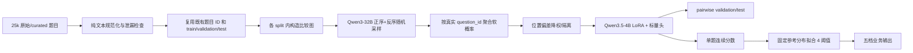

# V3 物理题 QuRating / Bradley–Terry 实施方案

## 1. 目标和边界

输入只有题干、选项、解析和小题文本，不向 teacher 或 student 上传图片。
系统学习连续难度函数 `s(q)`，两题比较概率定义为：

```text
P(A 比 B 难) = sigmoid(s(A) - s(B))
```

最后用在固定参考总体上拟合的 4 个阈值，把连续分数映射成：送分题、基础题、
中等题、拔高题、压轴题。阈值拟合完成后冻结，不能按每次待预测批次重新计算。

### 绝对禁止的数据

25,000 条源数据中的 `difficulty` 是错误、无意义的历史字段；准备数据后出现的
`raw_difficulty` 与它同源。两者均不得用于：

- pair 候选采样或分层；
- Qwen3-32B Prompt；
- Bradley–Terry target 或 sample weight；
- student 训练；
- 4 阈值校准；
- validation/test 指标。

预处理采用输出白名单，不复制原始 metadata；训练数据校验会递归搜索并拒绝这两个
字段。`teacher_difficulty_id` 是之前 API Prompt + V7 的结果，不等于原始
`difficulty`。它只允许在候选生成阶段帮助覆盖相近档和跨档组合，绝不作为新模型
标签，也不会进入模型文本。

## 2. 数据流



所有 pair 都只能在同一 split 内组成，严禁 train 题与 validation/test 题比较。
题目稳定 ID 和 frozen18 split 已经存在，V3 直接复用，不再建立、哈希或重映射题目
ID。预处理遇到缺失 `id/question_id` 的记录会直接失败。已有 `question_group_id` 或
`parent_id` 原样保留；独立题没有组字段时，仅用自身题目 ID 表示单题组。这里只把旧
teacher 档位当分层信息，不当监督。

## 3. 文本准备

V3 的 25,000 条上游输入固定为已经处理完成的
`data/curated/physics_teacher_v2_frozen18.jsonl`，实际运行直接使用它已经生成的
`split_v2_frozen18/{train,validation,test}.jsonl`。不要重新读取原始 25k，不重跑 API
Prompt、V7 或 split；上游已经完成的去重结果直接继承，V3 仅做重复完整性检查。
脚本默认 `--input-contract frozen18`，严格校验服务器确认的 20 个顶层字段、10维特征、
legacy18 完整性、`text/input_sections` 一致性以及既有 `input_sha256`；误传原始文件
会立即失败。

`prepare_pairwise_questions.py`：

- 读取已经固定渲染的题干、选项、解析和小题结构；
- 删除 Markdown/HTML 图片、图片占位符和 URL；
- 按 student tokenizer 做分段截断，优先保留题干、选项和每个小题结构，再分配解析
  token，避免只保留长文本开头；
- 检查“本题难度等级/送分题/压轴题”等显式标签泄漏；
- 去重并输出 manifest/quarantine；
- 通过白名单只保留候选采样需要的知识域、旧 teacher 档位和非文本图片标记。
- 将 `source_dataset_id`、原 `input_sha256` 和 schema/Prompt/V7/model 版本收进
  `source_provenance`，用于追溯但不进入模型。
- 明确丢弃 `raw_difficulty`、`diagnostics.raw_api_disagreement`、旧
  `label_quality.sample_weight` 和 `teacher_features_legacy18`；它们不生成 V3 权重。

服务器示例：

```bash
cd ~/physics-difficulty-rater

STUDENT=/home/zhangyonglin/models/models/Qwen--Qwen3.5-4B/snapshots/master
PAIR_ROOT=/data/zhangyonglin/physics-difficulty-runtime/pairwise_v3
mkdir -p "$PAIR_ROOT/questions"

python scripts/prepare_pairwise_questions.py \
  --input data/curated/split_v2_frozen18/train.jsonl \
  --output "$PAIR_ROOT/questions/train.jsonl" \
  --manifest "$PAIR_ROOT/questions/train.manifest.json" \
  --quarantine-output "$PAIR_ROOT/questions/train.quarantine.jsonl" \
  --split train \
  --student-tokenizer-path "$STUDENT" \
  --max-length 1024
```

validation/test 分别运行同一命令，只替换输入、输出和 `--split`。

`canonical_raw` 仅保留给未来线上新题做相同文本投影，不能用于这次 25k 训练数据：

```bash
python scripts/prepare_pairwise_questions.py ... --input-contract canonical_raw
```

## 4. 比较图与 pilot

不要把 20k 题做全组合；它会产生约 2 亿条边。采用稀疏、连通、度数均衡的图。
首轮 pilot 固定抽 2,000 题、8,000 pair，每题平均约 8 条边，最少 4、最多 12。

候选来源目标占比：

- `adjacent_teacher_level` 35%：旧 API teacher 相邻档，只为增加边界样本；
- `same_teacher_level` 25%：制造难分 pair；
- `baseline_uncertain` 20%：有旧模型分数时匹配邻近分数，否则退化为同层/随机；
- `cross_teacher_level` 10%：清晰远距离 pair；
- `cross_domain_anchor` 10%：跨知识域连接比较图。

这里完全不读取原始 `difficulty`。如果输入没有 `teacher_difficulty_id`，生成器会退化
为度数均衡随机图，仍可运行，但样本效率会低一些。

```bash
mkdir -p "$PAIR_ROOT/pilot"

python scripts/build_pair_candidates.py \
  --config configs/pair_sampling_pilot.json \
  --questions "$PAIR_ROOT/questions/train.jsonl" \
  --output "$PAIR_ROOT/pilot/candidates.jsonl" \
  --selected-questions-output "$PAIR_ROOT/pilot/questions.jsonl" \
  --manifest "$PAIR_ROOT/pilot/candidates.manifest.json"
```

生成后要求：`node_coverage=1.0`、最大连通分量比例接近 1、最小度数至少 4、无重复
无向边、无 self pair。

## 5. 本地 Qwen3-32B teacher

先确认真实模型目录；配置默认假定目录名为 `Qwen3-32B`：

```bash
find /home/share_ssd_data/nfs-env/llm_models -maxdepth 2 \
  -name config.json -printf '%h\n' | grep 'Qwen3-32B'
```

把命令输出的实际路径赋给 `TEACHER`；配置文件故意不猜子目录名，避免加载错模型。
teacher 使用 vLLM 离线推理，不调用 API。

不要直接复用或改动 Vime 训练环境，也不要对已经验证的 CUDA 栈执行 `pip install
vllm`。首次运行下面的幂等脚本：它只把已验证环境克隆到本项目在 `/data` 下的独立
prefix，然后从克隆中卸载 Vime 自身的 Python 包；源环境不受影响：

```bash
bash scripts/bootstrap_teacher_env.sh
conda activate /data/$USER/conda_envs/physics-difficulty-vllm
```

脚本保留已存在的目标环境而不覆盖，并验证：Python 3.11、
`torch 2.11.0+cu129`、`vLLM 0.24.0+cu129`。conda explicit manifest 和 pip freeze
写入 `/data/$USER/physics-difficulty-runtime/env_manifests/`。如果任一版本不符，脚本
直接失败，不能继续 teacher pilot。

每个 pair 同时判断 `(A,B)` 和 `(B,A)`，并把位置字母还原为真实 question ID。
默认每个顺序先采 3 次；软概率接近 0.5 或正反序不一致时自适应增加至 5 或 10
次。原始输出 append 写入，可中断续跑。

```bash
TEACHER=/home/share_ssd_data/nfs-env/llm_models/实际的Qwen3-32B目录
mkdir -p "$PAIR_ROOT/pilot/logs"

nohup env CUDA_VISIBLE_DEVICES=6,7 python scripts/run_local_pairwise_teacher.py \
  --config configs/qwen3_32b_pairwise_teacher.json \
  --model-path "$TEACHER" \
  --pairs "$PAIR_ROOT/pilot/candidates.jsonl" \
  --raw-votes-output "$PAIR_ROOT/pilot/raw_votes.jsonl" \
  --manifest "$PAIR_ROOT/pilot/teacher.manifest.json" \
  > "$PAIR_ROOT/pilot/logs/teacher.log" 2>&1 &
```

这里调用的是 vLLM Python 离线引擎，不会监听端口。如果以后另行启动 OpenAI 兼容
服务，应使用 `8002` 等未占用端口，避免与现有评测服务冲突。

配置中的 `tensor_parallel_size=2` 对应两张可见 GPU。Prompt 只要求输出 A/B，且明确
不能仅按题长、解析长、数字大小或机械步骤判断。默认关闭 thinking，减少格式错误和
成本；温度必须大于 0，才能让多次采样形成概率而不是重复确定性答案。

## 6. 软标签聚合和清洗

正反序每组得到 Qwen 判断题目 A 更难的平滑概率，再取均值：

```text
p_forward  = (A_wins_forward  + 0.5) / (N_forward  + 1)
p_backward = (A_wins_backward + 0.5) / (N_backward + 1)
soft_target = (p_forward + p_backward) / 2
position_bias_gap = abs(p_forward - p_backward)
```

`0.5` 是 Jeffreys smoothing，避免少量投票出现不可靠的精确 0/1。位置偏差不超过
0.15 时权重为 1；0.15–0.30 权重为 0.5；超过 0.30 隔离。不是用规则修改难度档，
只是控制 teacher 标签可靠性。

```bash
python scripts/aggregate_pairwise_votes.py \
  --pairs "$PAIR_ROOT/pilot/candidates.jsonl" \
  --raw-votes "$PAIR_ROOT/pilot/raw_votes.jsonl" \
  --output "$PAIR_ROOT/pilot/train_pairs.jsonl" \
  --quarantine-output "$PAIR_ROOT/pilot/pairs.quarantine.jsonl" \
  --manifest "$PAIR_ROOT/pilot/pairs.manifest.json"

python scripts/validate_pairwise_data.py \
  --input "$PAIR_ROOT/pilot/train_pairs.jsonl" \
  --questions "$PAIR_ROOT/pilot/questions.jsonl" \
  --output "$PAIR_ROOT/pilot/validation_report.json"
```

若 pilot questions 实际来自 `$PAIR_ROOT/questions/train.jsonl` 的 2,000 条子集，验证
时应传候选 manifest 对应的同一子集文件；不要用完整 20k 文件要求 99% node coverage。

pilot 建议验收门槛：有效输出解析率至少 99%；高位置偏差隔离率低于 10%；最大连通
分量至少 99%；soft target 不能几乎全在 0.5，也不能几乎全在 0/1。先人工抽查 100
个 pair，再扩到全量。

## 7. student 模型和损失

同一个 Qwen3.5-4B + LoRA 编码 A/B，取各自最后一个非 padding token，经过 LayerNorm、
dropout 和共享 Linear 标量头得到 `s_A/s_B`。没有十维辅助头，因此没有多任务抢占；
特征不参与后规则升降档。

```text
logit = s_A - s_B
L_pair = weighted BCEWithLogits(logit, soft_target)
L_total = L_pair + 1e-4 * mean(s_A^2 + s_B^2) / 2
```

很小的 score 正则只固定 Bradley–Terry 分数的平移自由度。主监督完全来自 Qwen3-32B
直接 pair 判断，不由旧档位推导。

```bash
RUN=/data/zhangyonglin/physics-difficulty-runtime/outputs/physics_bt_v3
mkdir -p "$RUN"

nohup env CUDA_VISIBLE_DEVICES=0,1 GPU_COUNT=2 \
  bash scripts/server_run_pairwise_train.sh \
  "$STUDENT" \
  "$PAIR_ROOT/train/pairs.jsonl" \
  "$RUN" \
  configs/v3_bt_pairwise_2gpu.json \
  > "$RUN/train.log" 2>&1 &
```

每 0.25 epoch 保存完整可恢复 checkpoint（LoRA、标量头、optimizer、scheduler、训练
游标）。恢复时把 checkpoint 作为第五个参数。训练日志每 10 个 optimizer step 打印
pair loss、Brier 和速度。

## 8. 评估指标

正式训练前先创建同 seed 的随机 LoRA/标量头基线，并在同一 validation pair 上跑一次。
它应接近 `P(A>B)=0.5`，用于证明提升来自 pairwise 训练：

```bash
python scripts/create_initial_pairwise_checkpoint.py \
  --model-path "$STUDENT" \
  --output-dir "$RUN/checkpoint-initial" \
  --seed 42
```

```bash
nohup env CUDA_VISIBLE_DEVICES=7 python evaluate_pairwise.py \
  --model-path "$STUDENT" \
  --checkpoint-dir "$RUN/checkpoint-epoch-1-step-XXX" \
  --eval-file "$PAIR_ROOT/validation/pairs.jsonl" \
  --batch-size 4 \
  --output-file "$RUN/evaluations/validation_epoch_025.json" \
  --predictions-file "$RUN/evaluations/validation_epoch_025_predictions.jsonl" \
  > "$RUN/eval_epoch_025.log" 2>&1 &
```

- `soft_pairwise_log_loss`：对 teacher 概率的交叉熵，越低越好，是选 checkpoint 的主指标；
- `brier_score`：预测概率和软标签的均方差，越低越好，强调概率校准；
- `pairwise_accuracy`：忽略 target=0.5 的平局后，比较方向是否正确，越高越好；
- `decisive_pairwise_accuracy`：只看 `|target-0.5|>=0.2` 的清晰 pair；
- `pairwise_auc`：模型把 teacher 偏向 A 的 pair 排在偏向 B 的 pair 之前的能力；
- graph `node_coverage/degree/largest_component_ratio`：监督覆盖和分数是否可在全图传播；
- `position_bias_gap`：正反序结果差异，反映 teacher 位置偏差而非 student 性能。

过拟合判断：训练 loss 继续下降，但 validation log loss/Brier 连续两个 0.25 epoch 变差，
或 validation accuracy/AUC 下降。最终 test 只对选中的单个 checkpoint 跑一次。

## 9. 连续分数和五档阈值

先在固定、能代表业务题库的 reference/validation 题集上生成单题分数：

```bash
python score_pairwise_questions.py \
  --model-path "$STUDENT" \
  --checkpoint-dir "$RUN/checkpoint-epoch-X" \
  --questions "$PAIR_ROOT/questions/validation.jsonl" \
  --output "$RUN/calibration/reference_scores.jsonl"
```

按声明分布拟合 4 个固定阈值。默认从易到难为 20%/20%/30%/20%/10%；这表示业务
约定的参考总体分布，不是每批数据强行满足该比例：

```bash
python scripts/calibrate_score_thresholds.py \
  --scores "$RUN/calibration/reference_scores.jsonl" \
  --checkpoint-dir "$RUN/checkpoint-epoch-X" \
  --distribution 0.20 0.20 0.30 0.20 0.10 \
  --output "$RUN/calibration/fixed_thresholds.json"
```

推理时加载同一 checkpoint 和冻结阈值：

```bash
python score_pairwise_questions.py \
  --model-path "$STUDENT" \
  --checkpoint-dir "$RUN/checkpoint-epoch-X" \
  --questions incoming_questions.jsonl \
  --calibration "$RUN/calibration/fixed_thresholds.json" \
  --output predictions.jsonl
```

这里的 `incoming_questions.jsonl` 必须先通过
`prepare_pairwise_questions.py --input-contract canonical_raw` 生成，不能把仍含错误
`difficulty` 的原始业务 JSONL 直接交给打分脚本。

固定分布法得到的是“相对于参考总体”的五档。后续获得可靠教研绝对标签后，应增加
anchor calibration 对照实验：用锚点分数拟合四个有教育语义的边界，并在独立 gold
集上比较五档 macro-F1、balanced accuracy、MAE 和 QWK。不能拿错误的原始
`difficulty` 做锚点。

## 10. 分阶段扩大

1. 2k 题 / 8k pair pilot：验证 Prompt、位置偏差、成本和吞吐。
2. 用 pilot pair 训练短跑，确认 validation 明显优于随机分数基线。
3. 全 train 建议平均度 8（约 80k pair/20k 题）；validation/test 分别独立建图。
4. 每轮保存候选 manifest、teacher config hash、原始投票、聚合 manifest、代码 commit、
   checkpoint 和阈值文件，禁止静默覆盖。
5. 主模型选择只看 validation soft log loss；test 和 1,049 条无训练重叠 gold 只做最终
   报告。gold 如需评五档，必须有可信标签且不能使用其中 16 条训练重叠记录。
