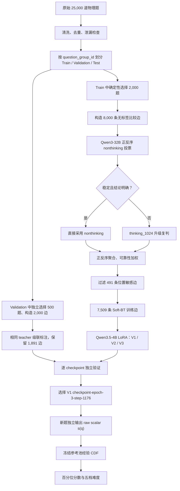
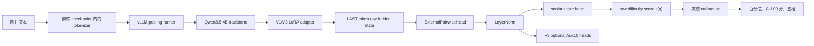

# QuRating V3 8000-Pair 全流程实验汇报

```yaml
project: physics-difficulty-rater
route: QuRating V3 pairwise
teacher_model: Qwen3-32B
student_model: Qwen3.5-4B
candidate_pairs: 8000
final_training_pairs: 7509
training_questions: 2000
independent_validation_pairs: 1891
independent_validation_questions: 500
primary_objective: Soft Bradley-Terry
status:
  data_construction: COMPLETED
  teacher_labeling: COMPLETED
  student_training: COMPLETED
  independent_validation: COMPLETED
  checkpoint_selection: COMPLETED
  single_question_scoring_code: READY
  vllm_backbone_external_head_parity_code: READY
  vllm_parity_result: NOT_YET_PROVIDED
  online_vllm_api_service: NOT_YET_IMPLEMENTED
  five_level_calibration_artifact: NOT_YET_GENERATED
```

> 术语说明：本文中的“QuRating V3”指整条 pairwise 技术路线；学生模型内部又做了
> V1、V2、V3 三个训练版本。两者不是同一个版本概念。

## 1. 项目目标

原有方案直接拟合大模型输出的“送分题—压轴题”五档绝对标签，容易受到档位边界模糊、
不同轮次标尺漂移和类别分布变化的影响。本轮改为学习相对难度：

\[
P(A \text{ 比 } B \text{ 难})=\sigma(s(A)-s(B))
\]

其中 \(s(q)\) 是学生模型对单道题输出的连续难度标量。训练阶段使用题对偏好监督，
推理阶段每道题只需独立计算一次 \(s(q)\)，不需要再为新题寻找一个已知题目进行比较。

本轮实验要回答四个问题：

1. 能否从无效绝对难度标签的原始数据中构造连通、覆盖完整的比较图；
2. 能否用 Qwen3-32B 稳定产生带不确定性的成对偏好标签；
3. Qwen3.5-4B LoRA 学生模型能否学到可泛化的连续难度排序；
4. 十维辅助特征是否能改善排序，或者会产生多任务负迁移。

## 2. 全流程概览



## 3. 原始题目准备

### 3.1 输入与字段使用原则

源文件为：

```text
data/physics_sampled_5000_per_difficulty_v2.jsonl
```

每道题用于建模的内容包括：

- 题干；
- 选项；
- 解析；
- 小题。

不上传图片。图片 URL 和图片依赖风险只作为诊断元数据，不向 teacher 或 student 提供图片
像素。原始 `difficulty` 字段已确认错误且无业务意义，整个 V3 数据构造、teacher 标注、
学生训练和评测均禁止使用该字段。

同时禁止以下旧标签进入 V3 的题目文本或主任务监督：

```yaml
forbidden:
  - difficulty
  - raw_difficulty
  - teacher_difficulty_id
  - teacher_difficulty_level
```

V2/V3 学生模型使用十维辅助特征时，只读取 `teacher_features`；旧绝对难度标签仍不参与
训练。

### 3.2 清洗和切分

处理步骤：

1. 将题干、选项、解析和小题渲染成统一文本；
2. 进行 Unicode NFKC 和文本规范化；
3. 隔离空题、明确难度标签泄漏、重复 ID 和规范化文本重复；
4. 用 `sha256(seed, question_group_id)` 做稳定切分；
5. 同一题组始终进入同一个 split，防止母题/小题跨集合泄漏。

结果如下：

| 项目 | 数量 |
|---|---:|
| 原始记录 | 25,000 |
| 有效记录 | 24,983 |
| Train | 19,988 |
| Validation | 2,468 |
| Test | 2,527 |
| 隔离 | 17 |
| 规范化文本重复 | 6 |
| 标签泄漏 | 10 |
| 语义空记录 | 1 |

数据诊断：

| 项目 | 数量 |
|---|---:|
| 有解析 | 24,924 |
| 有小题 | 2,855 |
| 有图片元数据 | 24,983 |
| 中等图片依赖风险 | 8,131 |
| 高图片依赖风险 | 16,852 |
| 短文本 | 17,991 |
| 中等文本 | 6,579 |
| 长文本 | 413 |

这里的“高图片依赖风险”不表示实际上传了图片，只表示题目元数据或文本中存在图片依赖
迹象。前期抽查表明只依赖题目和解析通常仍可判断难度，因此本实验保持纯文本方案。

还需要保留一个数据边界：这 25,000 条数据历史上曾按照错误的 `difficulty` 字段每档
抽取 5,000 条，所以它适合验证 pairwise 技术链路，但不能代表线上题库的自然难度分布。

## 4. 2,000 题与 8,000 Pair 的比较图构造

### 4.1 选题

从 Train 的 19,988 道题中，按 `sha256(seed=42, question_id)` 的稳定顺序选择 2,000
道题。本轮没有使用历史难度、API 五档标签或十维特征进行选题。

这种选法的优点是完全无标签、可复现；缺点是没有显式保证难度分布和十维特征覆盖。
这也是后续 10k/40k 数据扩展要改进的部分。

### 4.2 建图目标

将题目看作节点、比较关系看作无向边。预注册约束为：

```yaml
nodes: 2000
target_edges: 8000
minimum_degree: 4
maximum_degree: 12
target_mean_degree: 8
connected_components: 1
seed: 42
```

平均度数满足：

\[
\bar d=\frac{2E}{N}=\frac{2\times 8000}{2000}=8
\]

平均每道题参与约 8 次比较。单连通约束使所有题目的相对标量处于同一个可比较坐标系中；
如果图被分成多个互不相连的分量，各分量之间的整体平移无法由 Bradley–Terry 数据确定。

### 4.3 五类边

| Pair 来源 | 作用 | 构造前数量 |
|---|---|---:|
| `lexical_near` | 比较词面较相近的题，增加局部细粒度排序 | 2,473 |
| `structure_matched` | 匹配长度、小题、解析、图片风险等结构特征 | 2,430 |
| `random_global` | 提供跨类型、跨区域的全局比较 | 2,175 |
| `low_degree_repair` | 修复低度节点，保证每题得到足够监督 | 818 |
| `graph_bridge` | 连接不同连通分量，统一全局标尺 | 104 |
| **合计** |  | **8,000** |

构造过程先满足每个节点的最低度数，再填满边预算；当剩余边数接近连接各分量所需的数量
时，优先生成 `graph_bridge`。所有边去重，并限制节点最大度数，避免少量题目占据过多训练
权重。

构造完成时：

```yaml
covered_nodes: 2000
node_coverage: 1.0
edges: 8000
connected_components: 1
degree:
  minimum: 6
  median: 8
  mean: 8.0
  maximum: 12
```

## 5. Teacher 标注方案

### 5.1 Teacher 与 Prompt

Teacher 使用本地 Qwen3-32B，通过 vLLM 离线推理，不调用外部 API。

```yaml
model: Qwen3-32B
model_path: /home/share_ssd_data/nfs-env/llm_models/Qwen/Qwen3-32B
precision: bfloat16
tensor_parallel_size: 2
images_uploaded: false
```

Prompt 要求模型判断“初中学生独立解题时哪道题更难”，综合考虑物理建模、知识整合、
推理深度、信息加工、必要计算和隐含约束，同时明确禁止只根据题目长度、解析长度、数字
大小或机械步骤数判断。解析仅用于还原学生需要完成的解题过程。

每个 pair 同时使用：

- 正序：原始 A、B；
- 反序：交换两题位置。

最终按真实 `question_id` 统计胜负，而不是直接把输出字符 A/B 当作固定题目，从而显式
检测和抵消位置偏差。

### 5.2 为什么使用随机多次投票

Teacher 不是只生成一次 0/1 标签，而是在温度大于 0 时进行多次采样。多次采样的胜率
表示 teacher 对比较结果的不确定性。两道题非常接近时，soft target 会靠近 0.5；结论
清晰时会靠近 0 或 1。

这比“单次判断 A 更难”保留了更多信息，也避免把临界样本强行当成确定标签。

### 5.3 级联路由

为了兼顾质量和成本，先运行不思考模式，再只升级困难 pair：

```yaml
nonthinking:
  samples_per_direction: 3
  temperature: 0.7
  top_p: 0.8
  max_new_tokens: 4

route:
  direct_accept_if:
    soft_target: outside_[0.30, 0.70]
    position_bias_gap: <=_0.25
    valid_votes_each_direction: >=_3
  otherwise: thinking_1024

thinking_1024:
  initial_samples_per_direction: 3
  uncertain_samples_per_direction: 5
  maximum_samples_per_direction: 10
  temperature: 0.6
  top_p: 0.95
  max_new_tokens: 1024
```

在正式生产前，方案经过两级验证：

1. 20-pair reasoning 模式对照，用于选择 nonthinking、thinking_512 或
   thinking_1024；
2. 200-pair 级联验证：直接接受率 58.5%，直接接受部分与 thinking_1024 的硬方向一致率
   97.44%，soft target 平均绝对差 0.04057，预注册 gate 全部通过。

200-pair 中另有 129 对由单一 Codex reviewer 审核。按路由层占比加权，级联方向准确率
点估计为 85.78%。该结果支持级联策略，但不是物理教研双人仲裁真值，汇报时不能把它
解释为严格总体准确率。

## 6. Soft Target 聚合与质量过滤

### 6.1 正反序概率

对每个方向使用 Jeffreys 平滑：

\[
p_d=\frac{w_d+0.5}{n_d+1}
\]

其中 \(w_d\) 为该方向上“原始 question A 更难”的票数，\(n_d\) 为有效票数。

最终 soft target 为：

\[
y_{AB}=\frac{p_{\text{forward}}+p_{\text{backward}}}{2}
\]

位置偏差定义为：

\[
\Delta_{\text{position}}
=|p_{\text{forward}}-p_{\text{backward}}|
\]

### 6.2 可靠性权重

```yaml
position_bias_gap:
  <= 0.15:
    status: stable
    sample_weight: 1.0
  0.15_to_0.30:
    status: order_sensitive
    sample_weight: 0.5
  > 0.30:
    status: unstable
    action: quarantine
```

位置偏差中等的 pair 仍保留，但训练权重减半；高位置偏差 pair 不进入训练。

### 6.3 正式标注结果

| 项目 | 数量/比例 |
|---|---:|
| 候选 Pair | 8,000 |
| nonthinking 直接通过 | 4,935 |
| 升级 thinking_1024 | 3,065 |
| thinking 后进入训练 | 2,574 |
| 隔离 | 491 |
| 最终训练 Pair | 7,509 |
| 最终接受率 | 93.8625% |

thinking 阶段共生成 32,895 条 vote row，其中 32,432 条有效，解析成功率为 98.59%。
最终进入训练的数据均满足正反两个方向各至少 3 个有效票。

最终训练边的质量分布：

```yaml
stable_weight_1.0: 5954
order_sensitive_weight_0.5: 1555
quarantined_high_position_bias: 491
soft_targets:
  clear_a: 3427
  clear_b: 3802
  uncertain: 280
  mean_entropy: 0.417583
  mean_distance_from_half: 0.345350
```

过滤后的图仍保持：

```yaml
nodes: 2000
edges: 7509
node_coverage: 1.0
connected_components: 1
degree:
  minimum: 3
  p10: 6
  median: 8
  mean: 7.509
  p90: 9
  maximum: 12
```

边来源过滤后为：

| Pair 来源 | 最终数量 |
|---|---:|
| `random_global` | 2,086 |
| `lexical_near` | 2,294 |
| `structure_matched` | 2,242 |
| `low_degree_repair` | 788 |
| `graph_bridge` | 99 |
| **合计** | **7,509** |

## 7. 最终训练数据结构

每条训练记录包含：

| 字段 | 含义 |
|---|---|
| `pair_id` | 稳定题对 ID |
| `question_a_id`, `question_b_id` | 两道题的稳定 ID |
| `question_a_text`, `question_b_text` | 统一渲染后的纯文本 |
| `soft_target` | Teacher 聚合得到的 \(P(A>B)\) |
| `sample_weight` | 由正反序稳定性得到的主损失权重 |
| `vote_stats` | 正反序票数、平滑概率、位置偏差 |
| `reliability` | stable / order_sensitive 及处理动作 |
| `cascade_route` | nonthinking 接受或 thinking 升级原因 |
| `label_source` | 最终标签来自 nonthinking 或 thinking_1024 |
| `metadata.pair_source` | 建图时的边类型 |
| `metadata.raw_difficulty_used` | 固定为 `false` |

V2/V3 训练文件额外加入两道题各自的 frozen10 辅助特征和特征质量权重。十维特征为：

```yaml
auxiliary_features:
  - problem_structure
  - step_count
  - calculation_complexity
  - reasoning_chain
  - knowledge_count
  - subquestion_dependency
  - state_count
  - constraint_count
  - variable_relation
  - information_processing
```

7,509 条 pair 涉及的 2,000 道题全部成功匹配十维特征，覆盖率 100%。这些特征来自旧
frozen18 teacher 数据的 frozen10 转换；其中的绝对难度字段被明确忽略。

## 8. 学生模型结构

### 8.1 共享主干

```yaml
backbone: Qwen3.5-4B
tuning: LoRA
representation:
  pooling: last_non_padding_token
  layer_norm: true
  dropout: 0.1
main_head:
  type: Linear
  output: scalar_s_q
```

题目文本直接送入 tokenizer 和 backbone，不使用 teacher 的比较 Prompt。模型取最后一个
非 padding token 的 hidden state，经过 LayerNorm 和 Dropout 后，由线性头输出单题标量
\(s(q)\)。

训练一个 pair 时，将 A、B 两道题拼成一个 batch，各自经过同一个 scorer：

\[
z_{AB}=s(A)-s(B),\qquad \hat p_{AB}=\sigma(z_{AB})
\]

因此模型从结构上保证了反对称性：

\[
P(A>B)=1-P(B>A)
\]

V2/V3 在同一题目表示上增加十个独立分类头。辅助头只用于联合表征学习和解释，不参与
外部硬规则升降档。

### 8.2 三个训练版本

| 版本 | 主任务 | 辅助任务 | 辅助最大权重 |
|---|---|---|---:|
| V1 | Soft Bradley–Terry | 无 | 0 |
| V2 | Soft Bradley–Terry | frozen10 | 0.10 |
| V3 | Soft Bradley–Terry | frozen10 | 0.03 |

V3 是在发现 V2 存在轻微负迁移后追加的单变量对照实验。除辅助权重从 0.10 降到 0.03
外，其余训练条件保持一致。

## 9. 训练目标与参数

### 9.1 主损失

主任务使用带 sample weight 的 soft binary cross-entropy：

\[
\mathcal L_{\text{BT}}
=-\frac{\sum_i w_i[y_i\log\hat p_i+(1-y_i)\log(1-\hat p_i)]}
{\sum_i w_i}
\]

同时加入很小的标量正则，抑制全部 \(s(q)\) 无限制增大：

\[
\mathcal L_{\text{score-reg}}
=\frac{1}{2}\left(\mathbb E[s(A)^2]+\mathbb E[s(B)^2]\right)
\]

### 9.2 辅助损失

每个辅助头使用交叉熵，并做以下处理：

1. 每头损失除以 \(\log(\text{类别数})\)，避免类别多的头天然占据更大损失；
2. 十个头取平均；
3. 类别权重采用 inverse-square-root frequency，并裁剪到 `[0.5, 2.0]`；
4. 单题辅助权重为 `feature_quality / question_degree`，避免高连接度题重复主导辅助任务；
5. 辅助总权重在前 10% optimizer step 从 0 线性 warmup 到最大值。

总损失为：

\[
\mathcal L=
\mathcal L_{\text{BT}}
+10^{-4}\mathcal L_{\text{score-reg}}
+\lambda_{\text{aux}}(t)\mathcal L_{\text{aux}}
\]

### 9.3 训练配置

```yaml
max_length: 1024
pair_batch_size_per_gpu: 1
gradient_accumulation_steps: 16
effective_pair_batch_size: 16
epochs: 3
optimizer: AdamW
learning_rate:
  LoRA: 2.0e-5
  heads: 1.0e-4
weight_decay: 0.01
warmup_ratio: 0.05
scheduler: cosine
gradient_clip_norm: 1.0
precision: bf16
gradient_checkpointing: true
LoRA:
  rank: 8
  alpha: 16
  dropout: 0.05
checkpoint_interval: 0.25_epoch
seed: 42
```

每个 checkpoint 保存：

- LoRA adapter；
- tokenizer；
- LayerNorm、标量头和可选的十维辅助头；
- optimizer 状态；
- scheduler 状态；
- trainer state 和恢复游标；
- 完整训练配置。

因此训练可从 0.25 epoch checkpoint 继续，而不是只加载模型权重重新训练。

## 10. 独立 Validation 构造

模型选择不能从 7,509 条训练边中随机切一部分，因为同一道题可能同时出现在训练边和
验证边中，模型可通过记忆节点分数造成泄漏。

本轮从原始 Validation split 中独立选择 500 道题，重新构造 2,000 条边，并运行同一套
teacher 级联标注。结果为：

| 项目 | 数量 |
|---|---:|
| 候选 Pair | 2,000 |
| 最终 Validation Pair | 1,891 |
| 隔离 | 109 |
| 节点 | 500 |
| 节点覆盖率 | 100% |
| 连通分量 | 1 |
| 最小/平均/最大度数 | 4 / 7.564 / 11 |
| Stable Pair | 1,518 |
| Order-sensitive Pair | 373 |
| nonthinking 标签 | 1,254 |
| thinking_1024 标签 | 637 |

Validation 与 Train 的 `question_id` 交集为 0。Test/OOT 没有参与 checkpoint 选择和
超参数调整。

## 11. 评测指标

| 指标 | 含义 | 趋势 |
|---|---|---|
| Soft Pairwise Log Loss | 对 teacher soft target 的概率交叉熵，既惩罚方向错误也惩罚错误置信度；主选型指标 | 越低越好 |
| Brier Score | \((\hat p-y)^2\) 的均值，衡量概率误差 | 越低越好 |
| Pairwise Accuracy | 对非 0.5 target，只判断预测方向是否正确 | 越高越好 |
| Pairwise AUC | 区分 A 更难与 B 更难的排序能力，对阈值不敏感 | 越高越好 |
| Decisive Accuracy | 只统计 \(|y-0.5|\ge 0.2\) 的明确 pair | 越高越好 |
| Auxiliary Macro F1 | 每个辅助类别等权，关注少数类 | 越高越好 |
| Auxiliary Balanced Accuracy | 各类别召回率平均 | 越高越好 |

模型选择预先规定以 Validation Soft Pairwise Log Loss 为主，不能因为某个 checkpoint
硬准确率更高而临时改变主指标。

## 12. 模型结果

### 12.1 三版本最佳 checkpoint

| 版本 | 辅助权重 | 最佳 checkpoint | Log Loss ↓ | Brier ↓ | Accuracy ↑ | AUC ↑ |
|---|---:|---|---:|---:|---:|---:|
| V1 BT-only | 0.00 | `checkpoint-epoch-3-step-1176` | **0.495801** | **0.028347** | **0.934852** | **0.984417** |
| V2 BT+Aux10 | 0.10 | `checkpoint-epoch-2-step-706` | 0.498750 | 0.030163 | 0.932203 | 0.981134 |
| V3 BT+Aux10 | 0.03 | `checkpoint-epoch-3` | 0.497457 | 0.028997 | 0.932203 | 0.982984 |

结论：

- V2 的 0.10 辅助权重对主任务产生轻微负迁移；
- 将权重降至 0.03 后，V3 明显优于 V2，说明负迁移得到缓解；
- V3 仍未超过 V1 的主指标；
- 最终纯难度排序模型选择 V1 `checkpoint-epoch-3-step-1176`；
- 如果业务需要同时输出十维特征，可保留 V3 作为多任务解释模型，但不能把它描述为
  排序效果最优模型。

### 12.2 V3 与未训练基线

V3 从相同 seed 的未训练 LoRA 和随机 head 开始评测，而不是把没有 task head 的基础模型
当作基线。

| 指标 | 未训练基线 | V3 最终 | 变化 |
|---|---:|---:|---:|
| Log Loss | 0.670189 | 0.497457 | 相对下降 25.77% |
| Brier | 0.113229 | 0.028997 | 相对下降 74.39% |
| Accuracy | 0.639301 | 0.932203 | 提高 29.29 个百分点 |
| AUC | 0.678148 | 0.982984 | 提高 0.304836 |
| Decisive Accuracy | 0.642036 | 0.941981 | 提高 29.99 个百分点 |

V3 主任务在约 step 706 后进入平台期；硬准确率在 epoch 2 达到峰值后轻微下降，但主选型
指标 Log Loss 在 epoch 3 仍达到最低，因此未观察到明显的主指标过拟合。

### 12.3 V3 十维辅助特征结果

| 辅助特征 | Accuracy | Balanced Accuracy | Macro F1 |
|---|---:|---:|---:|
| problem_structure | 0.814120 | 0.634755 | 0.647697 |
| step_count | 0.847171 | 0.771493 | 0.775584 |
| calculation_complexity | 0.862771 | 0.692180 | 0.694541 |
| reasoning_chain | 0.750132 | 0.717037 | 0.714912 |
| knowledge_count | 0.807245 | 0.765234 | 0.758592 |
| subquestion_dependency | 0.840032 | 0.786400 | 0.774515 |
| state_count | 0.806452 | 0.489748 | 0.491588 |
| constraint_count | 0.824696 | 0.752784 | 0.741297 |
| variable_relation | 0.771285 | 0.651220 | 0.636620 |
| information_processing | 0.752512 | 0.364612 | 0.376392 |
| **十头宏平均** | **0.807641** | **0.662546** | **0.661174** |

`state_count` 和 `information_processing` 的 Accuracy 明显高于 Balanced Accuracy 和
Macro F1，说明模型仍偏向多数类别。辅助指标当前按 pair side 统计，同一道题会随图度数
重复出现；该口径适合 checkpoint 横向比较，但正式业务报告还应补充按 500 个唯一
`question_id` 去重后的指标。

## 13. 推理全流程

### 13.1 单题推理不需要临时组 Pair

训练时使用 pair，只是为了构造监督信号。模型本身学习的是共享函数 \(s(q)\)，因此新题
推理过程为：

1. 使用与训练相同的题目渲染规则生成纯文本；
2. tokenizer 截断到 1,024 token；
3. 加载 Qwen3.5-4B、V1 LoRA 和标量头；
4. 取最后一个非 padding token 的表示；
5. 输出 `raw_difficulty_score = s(q)`。

如果需要比较两道新题，可以直接计算：

\[
P(A>B)=\sigma(s(A)-s(B))
\]

如果需要给很多题排序，只需分别计算一次 \(s(q)\) 后排序，计算量是 \(O(N)\)，不需要
构造 \(O(N^2)\) 个推理 pair。

### 13.2 Raw Score 的含义

`raw_difficulty_score`：

- 是实数，不限制在 `[0, 1]`；
- 数值越大表示模型认为题目越难；
- 绝对零点本身没有业务含义；
- 两题分差通过 sigmoid 才转成 pair 概率；
- 不同 checkpoint 的 raw score 不应直接混用。

### 13.3 从连续标量到 0–100 分和五档

设计中的第一版参考池为：

```yaml
source: pairwise_v3/questions/train.jsonl
source_records: 19988
exclude_pair_training_questions: 2000
expected_reference_records: 17988
validation_used: false
test_used: false
```

用最终 V1 checkpoint 对参考池逐题打分，冻结其经验 CDF。对任意新题：

\[
\text{difficulty\_percentile}
=\frac{\#\{s_{\text{ref}}\le s(q)\}}{N_{\text{ref}}}
\]

\[
\text{difficulty\_score}=100\times\text{difficulty\_percentile}
\]

预设五档参考分布：

```yaml
送分题: 20%
基础题: 20%
中等题: 30%
拔高题: 20%
压轴题: 10%
```

对应冻结参考池的 20%、40%、70%、90% 四个分位阈值。阈值只在校准版本发布时计算一次，
不能针对每个新批次重新分箱。这样线上新批次可以自然出现与 20/20/30/20/10 不同的档位
比例。

输出结构为：

```json
{
  "question_id": "example",
  "raw_difficulty_score": 1.2847,
  "difficulty_percentile": 0.823,
  "difficulty_score": 82.3,
  "difficulty_level_id": 3,
  "difficulty_level": "拔高题",
  "calibration_version": "physics_reference_v1",
  "calibration_id": "..."
}
```

`difficulty_score=82.3` 表示该题在冻结参考题库中的相对百分位，不表示“有 82.3% 的概率
是难题”。

### 13.4 当前推理链路状态

```yaml
completed:
  - pairwise checkpoint evaluation
  - single-question scorer implementation
  - checkpoint fingerprint binding
  - empirical-CDF calibration implementation
  - frozen-threshold prediction implementation
not_completed:
  - reference_scores.jsonl generation
  - production calibration.json generation
  - end-to-end production batch acceptance test
```

截至本文整理时，服务器未发现已生成的 `reference_scores.jsonl` 或对应 manifest。因此
不能宣称五档推理已经完成实测。当前准确表述是：单题推理和校准代码已完成，最终模型已
选定，但还需 GPU 对 17,988 道参考题运行一次打分并冻结 calibration artifact。

此外，第一版参考池继承了原始 25k 数据的历史抽样偏差。它可用于工程验证，但正式上线前
应改用不依赖错误 `difficulty` 字段、能代表自然业务流量的固定参考题库。

### 13.5 为什么不能直接用普通 `vllm serve` 加载整个模型

训练 checkpoint 不是一个标准 Hugging Face `SequenceClassification` 模型，而是由两部分
组成：

```text
Qwen3.5-4B base model
        +
LoRA adapter
        +
项目自定义任务头：
  LayerNorm
  scalar difficulty head
  optional ten auxiliary heads
```

vLLM 可以加载 Qwen backbone 和 LoRA，但不会自动读取项目保存的
`pairwise_head.pt`。如果只启动普通生成服务或只取基础模型 embedding，得到的不是训练
完成后的难度分数。

因此部署必须拆成两级：



这里的“任务头”不是生成式 Prompt，也不是 vLLM 内置分类器，而是训练时保存的 PyTorch
参数。

### 13.6 部署所需模型文件

部署一个 checkpoint 至少需要：

```text
/path/to/Qwen3.5-4B/
  config.json
  model weights...

/path/to/checkpoint/
  adapter/
    adapter_config.json
    adapter_model.safetensors
  tokenizer/
  pairwise_head.pt
  pairwise_config.json

/path/to/calibration.json       # 五档输出需要；仅输出 raw score 时可暂缺
```

各文件用途：

| 文件 | 加载方 | 用途 |
|---|---|---|
| Qwen3.5-4B 权重 | vLLM | 基础语言模型 backbone |
| `adapter/` | vLLM `LoRARequest` | 注入难度任务 LoRA |
| `tokenizer/` | 服务预处理与 vLLM | 保证 tokenization 与训练一致 |
| `pairwise_head.pt` | `ExternalPairwiseHead` | 加载 LayerNorm、scalar head 和可选 Aux10 heads |
| `pairwise_config.json` | task-head loader | 判断 checkpoint 是否带辅助头，并恢复结构配置 |
| `calibration.json` | 后处理层 | 将 raw score 映射到固定参考系下的百分位和五档 |

V1 最终模型的 `pairwise_head.pt` 只包含 LayerNorm 和 scalar head；V3 还包含十个辅助分类
头。部署时不能拿 V1 的 head 配 V3 的 adapter，也不能拿一个 checkpoint 的 calibration
配另一个 checkpoint。项目使用 checkpoint fingerprint 对 adapter、task head、配置和
基础模型配置进行绑定。

### 13.7 vLLM Backbone 的实际加载方式

项目现有 parity 实现使用 vLLM pooling runner，而不是文本生成 runner：

```python
from vllm import LLM
from vllm.config import PoolerConfig

pooler_config = PoolerConfig(
    pooling_type="LAST",
    use_activation=False,
)

llm = LLM(
    model=MODEL_PATH,
    tokenizer=CHECKPOINT_TOKENIZER,
    runner="pooling",
    convert="embed",
    pooler_config=pooler_config,
    language_model_only=True,
    trust_remote_code=True,
    dtype="bfloat16",
    max_model_len=1024,
    enable_lora=True,
    max_lora_rank=LORA_RANK,
)
```

这些参数有明确含义：

- `runner="pooling"`：返回序列表示，不进行自回归生成；
- `pooling_type="LAST"`：取最后一个有效 token，与训练代码一致；
- `use_activation=False`：不要让 vLLM 增加额外归一化或激活；
- `language_model_only=True`：只运行 Qwen 语言模型主体；
- `enable_lora=True`：允许请求使用训练得到的 LoRA；
- `max_model_len=1024`：与训练最大长度保持一致。

LoRA 通过请求显式启用：

```python
from vllm.lora.request import LoRARequest

lora_request = LoRARequest(
    "physics_difficulty",
    1,
    "/path/to/checkpoint/adapter",
)

outputs = llm.encode(
    prompts,
    pooling_task="embed",
    lora_request=lora_request,
)
```

如果漏掉 `lora_request`，vLLM 返回的是基础 Qwen 表示，不是难度模型表示。部署启动时必须
同时跑一次 base 与 LoRA 表示对照，确认每条表示确实发生变化。

为保证训练与 vLLM 输入完全一致，当前 parity 脚本先用 checkpoint tokenizer 得到
`prompt_token_ids`，再将 token IDs 交给 `llm.encode`。生产服务也应复用同一逻辑：

```text
规范化题目字段
→ checkpoint tokenizer
→ truncation max_length=1024
→ prompt_token_ids
→ vLLM.encode(..., lora_request=...)
```

不要在推理端新增聊天模板、teacher 比较 Prompt 或 `/think` 指令。学生模型训练时看到的
输入就是渲染后的题目文本。

### 13.8 外置任务头如何加载和计算

项目使用 `ExternalPairwiseHead.from_checkpoint()` 读取 `pairwise_head.pt`：

```python
import torch
from physics_difficulty.models.external_pairwise_head import ExternalPairwiseHead

head = ExternalPairwiseHead.from_checkpoint(
    CHECKPOINT_DIR,
    device="cpu",
    dtype=torch.float32,
)
head.eval()

with torch.no_grad():
    result = head(vllm_last_hidden_state)

raw_scores = result["scores"]
auxiliary_logits = result.get("auxiliary_logits")
```

内部计算为：

```text
vLLM raw LAST hidden state
→ checkpoint LayerNorm
→ scalar Linear
→ raw score s(q)
```

如果是 V3，则同一个 LayerNorm 输出还会送入十个独立 Linear：

```text
normalized representation
├── difficulty scalar head
├── problem_structure head
├── step_count head
├── calculation_complexity head
├── reasoning_chain head
├── knowledge_count head
├── subquestion_dependency head
├── state_count head
├── constraint_count head
├── variable_relation head
└── information_processing head
```

推理阶段模型处于 `eval()`，训练时的 Dropout 不生效。

task head 很小，可以放 CPU，vLLM 表示复制到 CPU 后批量计算；这种方案实现简单且避免与
vLLM 争抢显存。若后续压测表明 CPU 或数据复制成为瓶颈，可以将 head 放到 GPU，但必须
先确认 vLLM 的显存预算，并重新做数值一致性和吞吐验收。

### 13.9 完整在线请求链路

建议将 vLLM engine 和外置 task head 包装在同一个常驻 Python 服务进程中，避免通过
JSON/HTTP 传递高维 hidden state：

```text
请求进入
  ↓
字段校验：question_id、题干、选项、解析、小题
  ↓
复用训练端 formatter 生成 text
  ↓
checkpoint tokenizer 编码，最长 1024 token
  ↓
按 token 数动态组成 batch
  ↓
vLLM pooling + LoRA 输出 raw LAST hidden state
  ↓
ExternalPairwiseHead 输出 s(q) 和可选 Aux10
  ↓
calibration.json 输出 percentile、0–100 分、五档
  ↓
返回结果并记录 checkpoint/calibration 版本
```

建议在线单题/批量接口返回：

```json
{
  "question_id": "example",
  "raw_difficulty_score": 1.2847,
  "difficulty_percentile": 0.823,
  "difficulty_score": 82.3,
  "difficulty_level_id": 3,
  "difficulty_level": "拔高题",
  "checkpoint_fingerprint": "...",
  "calibration_version": "physics_reference_v1",
  "calibration_id": "..."
}
```

如果部署 V3，可以增加：

```json
{
  "auxiliary_features": {
    "step_count": "3-5步",
    "reasoning_chain": "多层因果推理"
  }
}
```

辅助特征仅用于解释，不执行“步骤多则强制升档”之类的外部规则。

如果提供 pair 比较接口，不需要再次运行模型，只需使用两个已得到的 scalar：

```python
probability_a_harder = sigmoid(score_a - score_b)
```

### 13.10 vLLM 部署前必须通过 Parity 验收

现有脚本会在同一批题上同时运行 Hugging Face reference 和 vLLM + external head：

```bash
nohup bash scripts/server_run_vllm_pairwise_parity.sh \
  /path/to/Qwen3.5-4B \
  /path/to/checkpoint-epoch-3-step-1176 \
  /path/to/questions/validation.jsonl \
  /path/to/vllm_parity_output \
  7 \
  32 \
  > /path/to/vllm_parity_output/run.log 2>&1 &
```

验收项包括：

```yaml
external_head_vs_HF_head:
  maximum_absolute_error: <= 1.0e-5
vllm_lora:
  changed_every_representation: true
HF_vs_vLLM:
  raw_hidden_cosine_mean: >= 0.999
  score_mean_absolute_error: <= 0.05
  score_pearson: >= 0.99
  pairwise_ranking_agreement: >= 0.98
```

V3 还会逐个检查十维辅助 logits 的差异和 argmax 一致率。只有 `report.json` 的 status 为
`PASS`，才能采用该 vLLM 服务路径。仅仅看到 vLLM 成功加载模型、显存有占用或能够返回
embedding，都不能证明部署正确。

### 13.11 当前 vLLM 部署状态

```yaml
implemented:
  - vLLM pooling backbone loading
  - LoRA request loading
  - external scalar and auxiliary task-head loading
  - HF/vLLM parity experiment
  - parity acceptance gates
not_yet_confirmed:
  - selected V1 checkpoint parity report
not_yet_implemented:
  - long-running FastAPI/HTTP production wrapper
  - batching queue and backpressure
  - monitoring and health endpoints
  - production calibration artifact
  - production latency and throughput benchmark
```

因此当前不能写成“vLLM 在线服务已经部署完成”。准确状态是：**Qwen backbone + LoRA +
外置任务头的 vLLM 推理方案和一致性测试代码已经实现；还需要在选定 V1 checkpoint 上
跑 parity，通过后再补常驻 API 服务。**

## 14. 实验结论

1. **QuRating 主链路已经跑通。**
   从无标签题目池构图、Qwen3-32B 多次成对标注、位置偏差过滤，到 Qwen3.5-4B Soft
   Bradley–Terry 训练和独立 validation 选型均已完成。

2. **成对比较监督有效。**
   最优 V1 在独立 validation 上达到 Log Loss 0.495801、Accuracy 0.934852、AUC
   0.984417，显著优于未训练基线。

3. **比较图质量满足本轮训练要求。**
   过滤 491 条不稳定边后，2,000 个节点仍 100% 覆盖且保持单连通，平均度数 7.509。

4. **辅助特征确实能被学习，但没有提升主排序指标。**
   辅助权重 0.03 比 0.10 更好，但仍未超过 BT-only。因此难度排序主模型选择 V1；
   V3 更适合作为带解释特征的候选模型。

5. **当前结果证明的是相对排序能力，不等于五档业务准确率。**
   五档输出还依赖冻结参考池和阈值标定。正式上线前还需要生成校准产物，并使用更符合
   线上自然分布的参考池。

## 15. 已知限制与下一步

### 已知限制

- 2,000 道训练题采用无标签哈希抽样，未显式约束十维特征和难度范围覆盖；
- 原始 25k 数据带有历史错误难度分层抽样偏差；
- Teacher 质量审计中的人工参考来自单一 reviewer，不是物理教研双人仲裁；
- 不上传图片，少数真正依赖图形细节的题可能损失关键信息；
- 辅助 validation 指标按 pair side 统计，高度数题权重更大；
- 尚未生成最终 reference score 和 calibration 文件；
- 尚未使用独立 test/OOT 对冻结后的单一最终方案做一次性评测。

### 下一步

1. 对最终 V1 checkpoint 执行单题 reference scoring；
2. 对最终 V1 checkpoint 运行 HF/vLLM parity，并通过全部 acceptance gate；
3. 冻结经验 CDF、四个 raw-score 阈值和 `calibration_id`；
4. 实现常驻 vLLM pooling + external task head API 服务；
5. 在独立批次上完成 raw score → 百分位 → 五档的端到端验收；
6. 补充按唯一 `question_id` 去重的辅助指标；
7. 在新一轮 10k/40k 数据中改为 BT 分数分层选题，并显式控制十维特征覆盖；
8. 方案完全冻结后，只对 test/OOT 运行一次最终评测。

## 16. 关键复现文件

```yaml
data_preparation:
  - scripts/prepare_raw_v3_questions.py
pair_construction:
  - configs/pair_sampling_raw_v3_pilot.json
  - scripts/build_raw_v3_pair_candidates.py
teacher:
  - scripts/run_local_pairwise_teacher.py
  - configs/qwen3_32b_pairwise_teacher_nonthinking.json
  - configs/qwen3_32b_pairwise_teacher_thinking_1024.json
  - scripts/server_run_cascade_production.sh
label_finalization:
  - scripts/finalize_cascade_pairwise_data.py
  - scripts/validate_pairwise_data.py
student_training:
  - train_pairwise.py
  - configs/v3_bt_production_v1.json
  - configs/v3_bt_production_v2_aux10.json
  - configs/v3_bt_production_v3_aux10_w003.json
evaluation:
  - evaluate_pairwise.py
  - scripts/evaluate_pairwise_checkpoint_series.py
single_question_inference:
  - score_pairwise_questions.py
  - scripts/fit_pairwise_difficulty_calibration.py
  - predict_pairwise_difficulty.py
  - docs/pairwise_score_calibration.md
vllm_inference:
  - src/physics_difficulty/models/external_pairwise_head.py
  - scripts/experiment_vllm_pairwise_parity.py
  - scripts/server_run_vllm_pairwise_parity.sh
experiment_index:
  - docs/experiment_log.md
```
