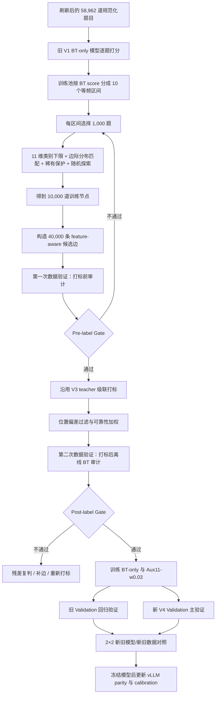

# QuRating V4 数据扩量方案：10k Questions / 40k Pairs

```yaml
document_type: incremental_experiment_plan
baseline:
  experiment: QuRating_V3_8000_pair
  report: docs/quRating_v3_8000pair_weekly_progress_2026w31.md
new_experiment:
  source_records_before_normalized_dedup: 58977
  curated_distinct_records: 58962
  selected_training_questions: 10000
  candidate_training_pairs: 40000
  target_mean_degree: 8
status:
  question_selection_code: READY
  feature_aware_pair_builder: READY
  40000_pair_teacher_launcher: READY
  postlabel_offline_bt_audit: READY
  full_pool_bt_scores: MISSING
  prelabel_score_based_pair_audit: READY
  expanded_validation_graph: TO_IMPLEMENT
  training: NOT_STARTED
```

本文只说明相较
[V3 8000-Pair 阶段性进度报告（2026-W31）](quRating_v3_8000pair_weekly_progress_2026w31.md)
新增或改变的部分。以下旧流程不再重复：

- Qwen3-32B 正反序 nonthinking + thinking_1024 级联标注；
- Jeffreys 平滑、soft target、位置偏差和 sample weight；
- Qwen3.5-4B LoRA、Soft Bradley–Terry 主损失和历史 Aux10 任务头结构；
- checkpoint 保存与断点恢复；
- vLLM pooling backbone + LoRA + 外置 task head 部署；
- raw scalar、经验 CDF 和五档校准的基本定义。

## 1. 本轮为什么扩量

V3 使用 2,000 道题和 7,509 条最终训练 pair，已经证明整条 QuRating 链路可行，但仍有
三个明显限制：

1. 训练题目只覆盖原始题池的一小部分；
2. 2,000 题采用无标签哈希抽样，没有显式控制连续难度区间和辅助特征覆盖；
3. 比较图虽然连通，但局部细粒度边、跨难度桥接边和稀有特征题的数量仍有限。

本轮不改变模型基本原理，而是扩大题目和比较边，并把“数据是否选得合理”纳入正式质量
审计。

```yaml
V3:
  selected_questions: 2000
  candidate_pairs: 8000
  final_pairs: 7509
  mean_candidate_degree: 8

V4_target:
  selected_questions: 10000
  candidate_pairs: 40000
  final_pairs: UNKNOWN_UNTIL_TEACHER_FINALIZATION
  mean_candidate_degree: 8
```

题目数量和边数均扩大约 5 倍，但平均度数仍保持 8。这样增加语义覆盖，而不是简单让每道
旧题重复比较更多次。

## 2. 本轮新增的总体流程



这里存在两组容易混淆的“双验证”：

```yaml
data_quality_double_audit:
  first: prelabel_candidate_graph_audit
  second: postlabel_offline_BT_consistency_audit

model_double_validation:
  first: fixed_V3_validation_regression
  second: new_V4_question_disjoint_validation
```

前一组验证“做出来的数据是否合理”，后一组验证“扩量训练后的模型是否真的更好”。

## 3. 刷新数据的使用边界

刷新文件名中记录了 58,977 条 teacher 输出；经过规范化文本去重后，预计得到 58,962 条
不同题目。最终数量必须以本轮新生成的 manifest 为准，不能只根据文件名推断。

本轮继续遵守以下约束：

```yaml
never_use_for_selection_or_pairing:
  - difficulty
  - raw_difficulty
  - teacher_difficulty_id
  - teacher_difficulty_level

allowed_private_sampling_inputs:
  - old_BT_raw_score
  - aux11_auxiliary_features

teacher_facing_candidate_file_must_exclude:
  - old_BT_raw_score
  - BT_score_decile
  - teacher_features
  - teacher_features_legacy18
  - all_absolute_difficulty_fields
```

旧 BT 分数和 Aux11 只帮助选择题目、构造边和做离线审计，不能写入交给 Qwen3-32B 的
候选 pair，避免 teacher 被旧模型结论提示。

## 4. 先给完整 Train Pool 生成旧 BT 分数

### 4.1 为什么需要旧模型分数

11 维特征描述题目结构和解题过程，但不能代替连续难度轴。如果只按辅助特征平衡选题，
仍可能大量集中在中间难度区域。

因此使用 V3 已选出的最佳排序模型：

```yaml
reference_scorer:
  model: Qwen3.5-4B
  variant: V1_BT_only
  checkpoint: checkpoint-epoch-3-step-1176
  role: frozen_sampling_reference_only
```

该模型只提供一个旧版连续难度坐标，用于保证新 10,000 题覆盖从易到难的完整范围。它
不是本轮 teacher，也不能作为新 pair 的训练标签。

### 4.2 当前阻塞

服务器已经搜索过运行目录，当前没有对应刷新 Train Pool 的：

```text
train_pool_scores.jsonl
train_pool_scores.manifest.json
```

因此 BT 十分位选题尚不能实际执行。CPU 可以快速完成选题，但不能高效替代 GPU 运行
Qwen3.5-4B 全池推理。

```yaml
CPU_selection_benchmark:
  simulated_pool_records: 58962
  selected_records: 10000
  wall_time_seconds: approximately_12.8
  peak_memory: approximately_64_MB

GPU_required_for:
  - generating_raw_BT_scores

CPU_only_after_scores_exist:
  - score_decile_assignment
  - feature_balanced_selection
  - candidate_graph_construction
  - both_pair_data_audits
```

如果分数缺失，脚本必须失败；禁止静默改用 API 五档、错误 `difficulty` 或纯随机选题。
生成分数时必须排除旧 V3 的 2,000 个训练节点，以及所有 validation/test 节点；CPU
选题时必须传入完全相同的 `--exclude-question-ids` 文件。分数文件与题池 hash 绑定，
且分数 ID 集必须与排除后的候选池逐项相等，否则程序直接失败。这样 10,000 题表示新的
训练覆盖，而不是再次为旧题购买 teacher pair 标签。

## 5. 10,000 道题如何选择

### 5.1 BT 十分位

将刷新 Train Pool 按旧 V1 的 `raw_difficulty_score` 从低到高排序，使用稳定 ID 处理同分，
切成 10 个等频区间。每个区间固定选择 1,000 道。在比例分配之前先执行类别覆盖下限：
只要池中存在该类别，全局至少选择 `min(20, 池中数量)` 条；每个 BT 分位层内至少选择
`min(2, 该层数量)` 条。一个题可同时满足 11 个头的多个覆盖目标，因此采用确定性
set-cover 贪心选择，而不是构造 11 维联合笛卡尔积。

```yaml
coverage_floor_first:
  minimum_per_category_global: 20
  minimum_per_category_per_BT_decile_when_available: 2
remaining_slots:
  distribution_matched: 0.80
  rare_feature_protection: 0.10
  deterministic_random_exploration: 0.10
```

最终保证：

```yaml
selected_per_decile: 1000
selected_total: 10000
difficulty_axis_coverage: equal_frequency
```

这里的十分位只表示旧 V1 模型下的相对位置，不是五档业务标签。
每层固定 1,000 题是训练覆盖策略，故意接近“难度轴均匀采样”，并不声称复原线上题库的
自然难度分布。自然分布只应由独立、冻结的 calibration 参考池表达；不能用这 10,000
题的分位数直接设业务五档阈值。

### 5.2 每个区间内部怎样分配

#### 第一步：11 维类别覆盖下限

先避免罕见类别在抽样后消失或只剩一个偶然样本。源池本身不足时取实际可用数量。这个
步骤优先于比例分配，所以最终三种选择原因不必机械等于 800/100/100。

#### 剩余名额的 80%：11 维边际分布匹配

在每个难度区间内，尽量让 10,000 题的 11 维特征边际分布接近完整 Train Pool，避免选出的
题只覆盖少数题型或过程结构。

#### 剩余名额的 10%：稀有类别保护

单纯匹配总体分布仍可能让稀有类别数量太少，因此每个难度区间额外保护稀有特征类别。
保护对象是每个特征的类别，不是强行覆盖 11 维联合笛卡尔积。联合组合过于稀疏，
强行分层会造成大量空格或极小样本格。

#### 剩余名额的 10%：确定性随机探索

保留 10% 不依赖特征启发式的随机样本，避免完全被旧 BT 模型和旧特征体系锁定。随机选择
由 seed 和 question ID 决定，可重复运行得到相同结果。

### 5.3 选题 Gate

```yaml
hard_checks:
  selected_questions: 10000
  BT_deciles: 10
  questions_per_decile: 1000
  old_v3_training_questions_excluded: true
  all_validation_and_test_questions_excluded: true
  missing_score_ids: 0
  missing_feature_ids: 0
  duplicate_question_ids: 0
  train_only: true
  forbidden_fields_in_teacher_output: 0
  score_IDs_exactly_equal_post_exclusion_pool: true

feature_checks:
  zero_covered_source_categories: 0
  minimum_category_count_global: 20_when_available
  minimum_category_count_per_BT_decile: 2_when_available
  maximum_marginal_JSD: <=_0.05
```

`question_selection.private.jsonl` 保存分数、十分位、选择原因和 11 维特征，用于内部审计；
`questions.jsonl` 是无标签 teacher-facing 文件。

## 6. 40,000 Pair 的 Feature-Aware 构图

### 6.1 图约束

```yaml
nodes: 10000
candidate_edges: 40000
expected_mean_degree: 8
minimum_degree: 4
maximum_degree: 16
connected_components: 1
node_coverage: 1.0
duplicate_edges: 0
self_loops: 0
```

相比 V3，最大度数从 12 放宽到 16，为稀有特征节点、局部近邻和图桥接保留调度空间；
平均度数仍为 8，构图后必须检查是否出现少数超高连接节点。

### 6.2 新的七类边

```yaml
pair_source_target_weights:
  feature_near: 0.30
  feature_contrast: 0.25
  random_global: 0.15
  lexical_near: 0.10
  structure_matched: 0.10
  graph_bridge: 0.05
  low_degree_repair: 0.05
```

相较 V3，新增：

- `feature_near`：11 维特征接近，适合学习相似结构题之间的细粒度难度差；
- `feature_contrast`：11 维特征差异较大，提供跨类型、跨过程结构的全局约束。

保留：

- 词面近邻；
- 文本结构匹配；
- 全局随机边；
- 连通分量桥接；
- 低度节点修复。

11 维特征不会作为 teacher 输入。候选 pair metadata 只保留
`feature_hamming_distance`、`feature_match_count` 等聚合统计。

### 6.3 为什么同时需要近边和远边

只比较差异很大的题，teacher 容易判断，但模型主要学到粗粒度方向，临界难度分界不够
精细；只比较很相近的题，局部排序丰富，但图的全局尺度容易不稳。

因此：

```text
feature/lexical near edges
→ 学局部细粒度差异

feature contrast/random edges
→ 学跨区域大尺度方向

graph bridges
→ 将所有局部区域放在同一连续坐标系
```

## 7. 第一次数据验证：Teacher 打标前

第一次验证回答的是：

> 在还没有任何新 teacher 标签时，选出的 10,000 题和 40,000 条边，是否覆盖合理、
> 图结构健康、比较难度有层次，并值得投入昂贵的 Qwen3-32B 标注成本？

### 7.1 已实现的结构与特征审计

候选图生成后立即检查：

```yaml
integrity:
  unique_pair_ids: 40000
  unique_edges: 40000
  self_loops: 0
  unknown_question_endpoints: 0

graph:
  node_coverage: 1.0
  connected_components: 1
  minimum_degree: >=_4
  maximum_degree: <=_16
  mean_degree: approximately_8

features:
  zero_covered_source_categories: 0
  maximum_marginal_JSD: <=_0.05
  report:
    - feature_hamming_distance_distribution
    - category_question_count
    - category_endpoint_occurrences
    - category_degree_min_mean_max
```

还要检查 endpoint 分布，而不只检查 10,000 个节点的分布。同一类别即使入选题目数量足够，
如果在 40,000 条边中出现次数太少，仍得不到足够训练监督。

### 7.2 本轮需要新增的旧 BT 分数审计

当前代码使用旧 BT 分数完成十分位选题，但还缺少一个独立的
`prelabel_candidate_score_audit`，用于审计“边怎么连”。

新审计至少输出：

```yaml
candidate_score_gap:
  absolute_gap_quantiles:
    - p10
    - p25
    - median
    - p75
    - p90
  signed_gap_balance:
    A_harder_share: REQUIRED
    B_harder_share: REQUIRED
  BT_decile_distance_distribution: REQUIRED
  endpoint_occurrences_by_BT_decile: REQUIRED
  source_conditioned_gap_distribution:
    - feature_near
    - feature_contrast
    - lexical_near
    - structure_matched
    - random_global
    - graph_bridge
    - low_degree_repair
```

预期检查逻辑：

- 每个 BT 十分位不仅节点数相同，边端点出现次数也不能严重失衡；
- `feature_near` 和 `lexical_near` 应包含足够局部难度差边，而不是全部退化为大跨度 easy
  pair；
- `feature_contrast`、`random_global` 和 `graph_bridge` 应提供较多跨分位边；
- 不能全部是旧模型认为一眼可分的极易 pair；
- 也不能全部集中在旧模型分差接近 0 的高噪声 pair；
- A/B 正负方向应近似平衡，避免候选文件顺序形成位置先验。

旧 BT 模型只用于描述候选边的跨度和覆盖，不给 pair 生成标签。具体分差阈值不应在看到
teacher 结果后倒推；首轮先报告完整分布并与相同节点上的随机图对照，再冻结后续 gate。

### 7.3 Pre-label Gate 的输出

```text
question_selection.manifest.json
candidates.manifest.json
prelabel_structure_feature_audit.json
prelabel_candidate_score_audit.json
```

只有硬结构检查全部通过、11 维覆盖通过且旧 BT 分差分布没有明显坍缩，才启动 40,000
pair teacher 标注。

## 8. Teacher 打标阶段的新增点

Teacher Prompt、正反序投票、级联路由和可靠性规则沿用 V3，不重复修改。新增的是运行规模
和过程监控：

```yaml
candidate_pairs: 40000
launcher:
  script: scripts/server_run_cascade_production.sh
  required_override: EXPECTED_PAIR_COUNT=40000
resume:
  raw_votes_append_only: true
  config_hash_must_match: true
monitor:
  - nonthinking_completed_pairs
  - direct_acceptance_rate
  - escalated_pair_count
  - valid_vote_parse_rate
  - thinking_shard_progress
  - quarantine_reason_counts
```

不能按 V3 的 93.86% 接受率预先认定最终一定得到约 37,500 条数据。新题池和新构边方式会
改变 pair 难度与位置敏感性，最终训练记录数必须以 final manifest 为准。

## 9. 第二次数据验证：Teacher 打标后

第二次验证回答的是：

> 新 teacher soft labels 能否在 10,000 个节点上形成稳定、自洽的一维全局难度排序？

### 9.1 离线经典 BT 审计

对 final pair 数据拟合一个不读文本、不读辅助特征的经典 scalar Bradley–Terry 模型：

\[
P(A>B)=\sigma(s_A-s_B)
\]

它只给每个 `question_id` 学一个自由标量，因此审计的是 pair 数据本身，不是 Qwen 学生
模型能力。

### 9.2 连通保持的五折交叉验证

普通随机拆边可能导致训练图断开。审计先保留一棵连通骨架，再将冗余边分为五折，使每一折
训练图都：

- 包含全部节点；
- 保持单连通；
- 能在统一尺度上拟合所有题目的 BT score。

held-out 边用于检查由其余边学出的全局分数是否能解释未参与拟合的 teacher pair。

### 9.3 Post-label Gate

```yaml
quality_gate:
  graph_connected: true
  heldout_log_loss_beats_constant_baseline: true
  heldout_brier_beats_constant_baseline: true
  severe_residual:
    threshold: 0.5
    maximum_rate: 0.05
  bootstrap_rank_stability:
    runs: 20
    minimum_mean_spearman: 0.90
```

同时报告：

- held-out Soft Pairwise Log Loss；
- Brier Score；
- Pairwise Accuracy/AUC；
- Decisive Accuracy；
- 每道题 BT score 的近似标准误和 95% 区间；
- bootstrap 最难/最易 10% 集合重叠率；
- teacher target 与 BT 概率残差最大的 pair。

输出：

```text
offline_bt_audit/report.json
offline_bt_audit/question_scores.jsonl
offline_bt_audit/pair_residuals.jsonl
```

如果不通过：

1. 先检查是否因图桥接不足或部分节点度数过低；
2. 对大残差 pair 重新运行 thinking_1024 或人工复核；
3. 对高不确定节点补充有针对性的 pair；
4. 修复后重新跑离线 BT 审计；
5. 不能为了凑数量直接忽略 gate。

该审计只证明标签支持稳定的一维排序，不证明 teacher 符合真实教研标准，也不能替代后续
学生模型的 question-disjoint validation。

## 10. 扩量后的模型训练

### 10.1 只保留两个有意义的版本

V3 已经证明 Aux10 权重 0.10 存在轻微负迁移，0.03 能缓解但仍未超过 BT-only。本轮把
图表和实验信息加工拆成两个独立头，形成 Aux11；因此
不再重复训练已知较差的 0.10 版本。

```yaml
V4_train_A:
  name: BT_only
  initialization: from_base_Qwen3.5_4B
  auxiliary_loss_weight: 0.0

V4_train_B:
  name: BT_plus_Aux11_w003
  initialization: from_base_Qwen3.5_4B
  auxiliary_loss_weight: 0.03
```

两版都从相同基础模型和相同 seed 开始，不从 V3 最佳 checkpoint 接着训练。这样才能把
性能变化解释为数据规模变化，而不是旧模型 warm start 的影响。

其余设置先与 V3 保持一致：

```yaml
max_length: 1024
pair_batch_size_per_gpu: 1
gradient_accumulation_steps: 16
epochs: 3
LoRA:
  rank: 8
  alpha: 16
  dropout: 0.05
learning_rate:
  LoRA: 2.0e-5
  heads: 1.0e-4
checkpoint_interval: 0.25_epoch
primary_metric: validation_soft_pairwise_log_loss
```

实际 optimizer steps/epoch 必须根据 teacher 清洗后的最终 pair 数重新计算，不能按
40,000 候选边直接写死。

### 10.2 为什么仍保留 Aux11 对照

数据扩大且信息加工头拆分后，Aux11 的作用可能变化：

- 每个辅助类别样本更多，少数类头可能更稳定；
- feature-aware 构边让同一题在不同关系中出现，辅助表示可能更有效；
- 也可能因为辅助监督变强而再次抢占主任务。

所以继续训练权重 0.03 的版本，但最终排序模型仍只按主任务 validation 选择。辅助
Macro F1 只能用于说明解释能力，不能替代难度排序指标。

## 11. 模型的两套独立 Validation

### 11.1 Validation A：固定 V3 Validation

继续使用：

```yaml
name: validation_2000_v1
questions: 500
accepted_pairs: 1891
role:
  - regression_test
  - direct_comparison_with_V3_models
```

它的价值是标尺不变，可以直接比较：

- V3 最佳 BT-only；
- V4 扩量 BT-only；
- V4 扩量 Aux11-w0.03。

但它已经参与过 V3 模型选择，不应成为 V4 唯一选型依据。

### 11.2 Validation B：刷新数据上的新 V4 Validation

从刷新数据的 Validation split 中重新选择与训练节点完全不重叠的题目，建议：

```yaml
name: validation_v4_4000
questions: 1000
candidate_pairs: 4000
target_mean_degree: 8
teacher_pipeline: same_frozen_cascade
question_overlap_with_V4_train: 0
normalized_text_overlap_with_V4_train: 0
primary_role:
  - checkpoint_selection
  - in_distribution_generalization
```

新 validation 也要执行本轮的 BT 分数分层、11 维覆盖检查、pre-label audit 和 post-label
offline BT audit，但必须使用独立 validation pool，不能从训练图抽边。

具体 1,000/4,000 规模应在 teacher 成本核算后预注册；一旦启动打标，不能根据模型结果
临时更换题目或 pair。

### 11.3 2×2 对照矩阵

最终至少完成：

| 模型 | 固定 V3 Validation | 新 V4 Validation |
|---|---|---|
| V3 最佳 BT-only | 已有旧结果；必要时复跑确认环境 | 必须评 |
| V4 BT-only | 必须评 | 必须评 |
| V4 Aux11-w0.03 | 必须评 | 必须评 |

这组对照可以拆开两个问题：

1. **数据扩量是否提升旧分布表现？**
   比较 V3 与 V4 模型在固定 V3 Validation 上的结果。

2. **模型是否适应刷新后的题库分布？**
   比较各模型在新 V4 Validation 上的结果。

3. **结果变化来自扩量还是分布迁移？**
   如果新模型只在新 validation 上提升、在旧 validation 上下降，说明可能存在分布迁移，
   不能简单表述为全面提升。

### 11.4 Checkpoint 选择

```yaml
primary_selection_dataset: new_V4_validation
primary_metric: soft_pairwise_log_loss
secondary_metrics:
  - brier_score
  - pairwise_auc
  - pairwise_accuracy
  - decisive_pairwise_accuracy
fixed_V3_validation:
  role: regression_and_cross_version_comparison
test_OOT:
  role: one_time_final_evaluation_after_freeze
```

在看到 V4 结果前，需要根据旧模型在新 validation 上的表现预注册“允许的旧集回退范围”。
不要在结果出来后临时调整回退阈值。

## 12. 推理与部署相较 V3 的变化

推理架构不变，继续使用：

```text
vLLM Qwen backbone
→ selected LoRA
→ external LayerNorm/task head
→ raw scalar
→ frozen calibration
```

本轮必须重新生成的产物：

```yaml
must_regenerate:
  - checkpoint_fingerprint
  - HF_vLLM_parity_report
  - reference_scores
  - calibration.json
  - calibration_id

must_not_reuse:
  - V3_checkpoint_calibration
  - thresholds_from_old_reference_population
```

原因是模型 checkpoint 和参考题库均发生变化。即使 raw score 数值范围看起来接近，也
不能复用旧阈值。

新的 calibration 参考池应来自刷新后的、可代表业务自然分布的固定题库，并排除：

- V4 训练的 10,000 个节点；
- 两套 validation 节点；
- test/OOT；
- 重复或近重复题。

部署细节直接参考 V3 报告，不在本文重复。

## 13. 本轮实验验收表

```yaml
stage_1_refresh_preparation:
  manifest_verified: PENDING
  train_validation_test_group_isolation: PENDING
  forbidden_difficulty_usage: MUST_BE_FALSE

stage_2_pool_scoring:
  V3_V1_checkpoint_bound_scores: MISSING
  score_manifest_hash_match: PENDING

stage_3_question_selection:
  selected_10000: PENDING
  exact_1000_per_BT_decile: PENDING
  all_aux11_categories_covered: PENDING
  maximum_feature_JSD_lte_0.05: PENDING

stage_4_candidate_graph:
  edges_40000: PENDING
  nodes_10000: PENDING
  connected_components_1: PENDING
  mean_degree_8: PENDING
  degree_range_4_to_16: PENDING

stage_5_prelabel_audit:
  structural_feature_gate: PENDING
  old_BT_score_gap_report: TO_IMPLEMENT
  random_graph_comparison: TO_IMPLEMENT

stage_6_teacher:
  cascade_complete: PENDING
  final_pair_count: UNKNOWN
  parse_success_rate: PENDING
  quarantine_rate: PENDING

stage_7_postlabel_audit:
  offline_BT_gate: PENDING
  severe_residual_rate_lte_0.05: PENDING
  bootstrap_mean_spearman_gte_0.90: PENDING

stage_8_training:
  BT_only: PENDING
  Aux11_w003: PENDING
  all_quarter_epoch_checkpoints_evaluated: PENDING

stage_9_double_validation:
  fixed_V3_validation: PENDING
  new_V4_validation: TO_BUILD
  cross_model_cross_dataset_matrix: PENDING

stage_10_deployment:
  selected_checkpoint: PENDING
  vLLM_parity_PASS: PENDING
  new_calibration: PENDING
```

## 14. 当前代码能力与缺口

### 已具备

```yaml
ready:
  - scripts/select_bt_feature_balanced_questions.py
  - configs/question_selection_v4_bt_decile_10k.json
  - scripts/build_raw_v3_pair_candidates.py
  - configs/pair_sampling_v4_feature_aware_10k_40k.json
  - src/physics_difficulty/pairwise/feature_coverage.py
  - scripts/server_run_cascade_production.sh
  - scripts/audit_pairwise_with_bt.py
  - src/physics_difficulty/pairwise/offline_bt.py
```

### 需要新增或补齐

```yaml
to_do:
  - generate_full_refresh_train_pool_scores_on_GPU
  - implement_prelabel_candidate_score_audit
  - define_and_freeze_prelabel_score_distribution_gate
  - add_validation_v4_1000_question_4000_pair_config
  - run_prelabel_and_postlabel_audits_for_new_validation
  - add_cross_model_cross_validation_matrix_report
  - add_new_training_run_configs_and_output_names
  - rerun_vLLM_parity_for_selected_V4_checkpoint
  - build_new_reference_calibration
```

## 15. 决策原则

本轮不以“pair 数更多”作为成功标准。只有同时满足以下条件，才能认为扩量有效：

1. 10,000 题覆盖连续难度轴和 11 维特征，而不是重复堆积主流题；
2. 40,000 条边保持连通、度数受控，并同时包含局部细粒度和全局跨度比较；
3. 打标前审计通过，证明候选图值得投入 teacher 成本；
4. 打标后离线 BT 审计通过，证明 soft labels 支持稳定一维排序；
5. V4 模型在新 validation 上提升，同时在固定 V3 validation 上没有不可接受的回退；
6. 最终 checkpoint 通过新的 HF/vLLM parity；
7. 新参考池和新 calibration 冻结后，才发布新的业务难度分数版本。
