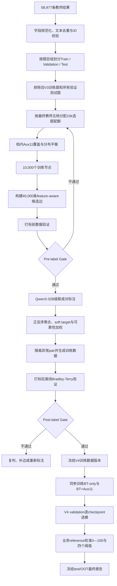

# QuRating V4 数据扩量方案：10k Questions / 40k Pairs

## 1. 目标

本轮目标是在保持 QuRating 成对比较范式不变的前提下，将训练数据从 V3 的 2,000 道题、
7,509 条有效 pair，扩展到 10,000 道题、40,000 条候选 pair。扩量重点不是单纯增加边数，
而是提高题目覆盖、比较图质量以及 teacher soft label 的全局一致性。

```yaml
data_scope:
  source_teacher_records: 58977
  normalized_distinct_questions: 58962
  selected_training_questions: 10000
  candidate_training_pairs: 40000
  expected_mean_degree: 8

primary_objectives:
  - 覆盖送分题到压轴题的完整难度范围
  - 覆盖11个辅助特征的主要类别和稀有类别
  - 构建单连通、度数受控的全局比较图
  - 通过成对比较获得稳定的soft preference监督
  - 在正式训练前验证pair数据是否支持一维全局难度排序
```

### 1.1 数据使用边界

原始题库字段 `difficulty` 及其派生字段 `raw_difficulty` 已确认不可靠，不得用于选题、
构图、pair 标注或训练。允许用于私有选题的难度字段仅为 Prompt 与 V7 后处理生成的最终
教师档位：

```yaml
sampling_difficulty:
  field: teacher_difficulty_level
  source: difficulty_rating.difficulty_level
  meaning: Prompt + V7后处理后的最终教师档位
  usage: 仅用于10k题目的粗粒度分层抽样

forbidden_fields:
  - difficulty
  - raw_difficulty
  - teacher_difficulty_id
```

最终教师档位和 Aux11 特征只存在于私有选题数据中，不写入交给 Qwen3-32B 的候选 pair。
Qwen3-32B 只能看到题干、选项、解析和小题结构，不能看到已有难度结论或辅助标签。

图片不作为模型输入。题目统一使用文本字段和解析字段；图片 URL、图片标记仅用于数据切片
和风险诊断。

### 1.2 范围与非目标

本方案负责回答五个问题：从扩充后的教师数据中选择哪些题、这些题之间建立哪些比较关系、
如何证明最终 pair 数据足以支撑稳定的相对难度学习、学生模型如何消费这些数据，以及如何用
严格对照实验判断 Aux11 是否真正改善模型。以下事项不属于本方案范围：

- 不改变 V3 已验证的“共享文本表示 + 标量难度头 + Bradley–Terry 主损失”主体范式；
- 不在本轮用教师五档直接训练难度分类头；
- 不把 10,000 题的抽样分布解释为真实线上题库分布；
- 不在本文记录训练、评测或部署命令，执行命令由独立运行手册维护；
- 不在数据构建阶段确定最终“送分题—压轴题”的线上分档阈值。

### 1.3 设计原则

- **标签与采样解耦**：教师五档用于控制选题范围，pairwise soft target 才是难度主监督。
- **局部可辨、全局可比**：既保留相近题之间的细粒度边，也保留跨区域边和桥接边。
- **覆盖优先于机械均衡**：保证难度两端与稀有特征可见，同时尽量保留源池主体分布。
- **公开数据最小化**：教师档位和具体辅助标签只进入私有审计文件，不进入 pair teacher 输入。
- **先验证、后投入**：图结构未通过 Pre-label Gate 时不启动大模型标注。
- **全过程可复现**：所有输入快照、随机种子、配置、模型版本、提示词版本和输出哈希均需登记。

## 2. 总体流程



流程包含两次性质不同的数据验证：

- **打标前验证**：检查选出的题目和候选图是否覆盖合理、结构健康，判断是否值得投入
  Qwen3-32B 标注成本。
- **打标后验证**：检查 teacher soft labels 是否自洽，能否在同一尺度上恢复稳定的一维
  难度排序。

## 3. 数据构建策略

### 3.1 选择 10,000 道题

#### 五档配额

从去重、隔离后的 Train Pool 中统计最终教师五档分布。每个档位先分配
`min(1,000, 该档可用题数)`，剩余名额按照各档在源 Train Pool 中的题目数量比例分配。
若某档容量不足，未使用名额自动分配给仍有容量的档位。

```yaml
teacher_level_quota:
  levels:
    - 送分题
    - 基础题
    - 中等题
    - 拔高题
    - 压轴题
  minimum_per_level_when_available: 1000
  remaining_quota: proportional_to_source_distribution
  selected_total: 10000
```

该策略同时保留难度两端和源数据的主体分布。它不要求每档固定 2,000 题，也不把最终
10,000 题解释为线上自然难度分布。业务五档校准仍需使用独立、冻结且代表真实业务分布的
参考池。

旧 V1 BT-only checkpoint 不再用于全池选题。它只可在 10,000 题选定后作为可选诊断，
用于检查旧 pairwise 排序与教师五档是否存在明显冲突，不得参与选题、生成 pair 标签或
作为数据门禁。

#### Aux11 覆盖

在每个教师档位内部，按 11 个辅助特征控制边际覆盖：

```yaml
auxiliary_category_floor:
  global_per_category: 20_when_available
  per_teacher_level_per_category: 3_when_available

remaining_slots_after_floors:
  marginal_distribution_matching: 0.80
  rare_category_protection: 0.10
  deterministic_random_exploration: 0.10
```

- **类别下限**：防止稀有题型或过程特征在抽样后消失。
- **边际分布匹配**：使各档入选题的单特征分布尽量接近对应源池。
- **稀有类别保护**：提高低频类别的有效样本量。
- **随机探索**：避免选题完全受教师档位和既有特征体系约束。

不对“五档 × 11 个特征”构造联合笛卡尔积分层。联合组合高度稀疏，会产生大量空单元和
极小样本单元。选题采用确定性 set-cover 和固定随机种子，同一数据快照可重复得到相同结果。

#### 数据隔离

选题前必须排除：

- V3 已使用的 2,000 个训练节点；
- V3 与 V4 validation/test 中的全部题目；
- 与上述集合规范化文本重复的题目；
- 缺失最终教师档位或任一 Aux11 字段的题目；
- 语义为空、存在明确标签泄漏或 ID 冲突的题目。

选题产物分为两层：

- **公开候选题文件**：仅包含稳定 ID、规范化文本、split 和必要诊断字段；用于后续构图。
- **私有审计文件**：额外保存最终教师档位、Aux11、选中原因和来源信息；不得传给 pair
  teacher。

#### Aux11 数据契约

V4 选题与构图使用当前代码冻结的 11 个单标签辅助特征。它们不是难度真值，也不参与
teacher 的 pair 判断，仅用于保证题目类型和物理过程覆盖。

| 特征 | 当前候选类别 |
|---|---|
| `problem_structure` | 概念判断、直接计算、实验探究、图像表格分析、电路综合、力学综合、热学综合、光学声学综合、跨模块综合 |
| `step_count` | 1-2步、3-5步、6步以上 |
| `calculation_complexity` | 口算或直接判断、简单笔算、多公式联立、复杂方程或范围计算 |
| `reasoning_chain` | 直接套用、简单因果推理、多层因果推理、逆向推理或临界分析 |
| `knowledge_count` | 1个、2-3个、4个及以上 |
| `subquestion_dependency` | 无多问、多问但相互独立、多问且层层递进 |
| `state_count` | 单状态、双状态、多状态、连续变化或临界状态 |
| `constraint_count` | 无约束、单一约束、多约束 |
| `variable_relation` | 无变量关系、简单正反比、图像函数关系、多变量耦合关系 |
| `graph_table_requirement` | 无、直接读数、多组比较归纳、图像反推或外推 |
| `experiment_requirement` | 无、基础操作或读数、控制变量或故障分析、方案设计或误差评价 |

V3 的 `information_processing` 是图表要求与实验要求的合并字段；V4 已将两者拆回独立特征，
因此由 10 个辅助头变为 11 个辅助头。全量 58,977 条教师输出中，原始“9-12步”和
“12步以上”分别只有 22 条和 3 条；四档方案合并后最高档仍只有 25 条。当前使用新的
`aux11_step3_v5` schema，把“6-8步”“9-12步”“12步以上”统一为“6步以上”，形成
30,084 / 25,495 / 3,398 的三档支持。旧四档 checkpoint 只读评估，禁止直接续训。

### 3.2 构建 40,000 条候选 pair

10,000 道题作为图节点，40,000 条 pair 作为无向比较边。目标图约束为：

```yaml
pair_graph:
  nodes: 10000
  edges: 40000
  node_coverage: 1.0
  connected_components: 1
  expected_mean_degree: 8
  minimum_degree: 4
  maximum_degree: 16
  self_loops: 0
  duplicate_edges: 0
```

候选边由七类策略混合生成：

```yaml
pair_source_weights:
  feature_near: 0.30
  feature_contrast: 0.25
  random_global: 0.15
  lexical_near: 0.10
  structure_matched: 0.10
  graph_bridge: 0.05
  low_degree_repair: 0.05
```

- `feature_near`、`lexical_near` 和 `structure_matched` 提供局部、细粒度比较。
- `feature_contrast` 和 `random_global` 提供跨题型、跨难度区域的全局尺度约束。
- `graph_bridge` 合并局部连通分量。
- `low_degree_repair` 保证所有节点获得最低比较次数。

当前已生成的 40,000 条候选边实际构成为：

| 构边策略 | 数量 | 比例 | 主要作用 |
|---|---:|---:|---|
| `feature_near` | 12,347 | 30.87% | 在 Aux11 Hamming 距离较小的题之间建立细粒度边，重点学习“外观相近但仍需排序”的局部差异 |
| `feature_contrast` | 10,158 | 25.40% | 在辅助特征差异明显的题之间建立跨度边，为全局难度轴提供方向清楚的约束 |
| `random_global` | 6,733 | 16.83% | 从全图随机连接不同区域，降低构图只围绕既有特征体系形成局部闭环的风险 |
| `lexical_near` | 4,063 | 10.16% | 比较词汇、知识表述或题面相近的题，减少模型仅凭关键词判断难度的可能 |
| `structure_matched` | 4,033 | 10.08% | 在题型结构、长度或小题形态相近的题之间比较，形成同结构内部的难度排序 |
| `low_degree_repair` | 2,096 | 5.24% | 为比较次数不足的节点补边，避免部分题几乎没有监督信号 |
| `graph_bridge` | 570 | 1.43% | 连接构图过程中形成的局部连通分量，保证所有题处于同一全局标尺 |

这些来源不是互相独立的“题目类型”。一条边只记录最终采用的主要生成原因；例如一条
`feature_near` 边也可能同时文本相近。构边权重是生成目标，实际数量还会受到去重、最大度数、
连通修复和低度修复的影响，因此验收以最终 manifest 的实际数量和图结构为准。

当前打标前图结构为：10,000 个节点全部覆盖、40,000 条无重复无向边、1 个连通分量；度数
最小值 6、P10 为 7、中位数 8、均值 8、P90 为 9、最大值 12。该结果优于预设的
“最小度数至少 4、最大度数不超过 16”门槛。

构边时可读取 Aux11，但只允许在候选 metadata 中保留特征距离、匹配数量等聚合统计，不能
保留具体特征标签或教师难度档位。A/B 方向使用稳定随机规则平衡，避免候选顺序形成位置先验。

### 3.3 Teacher 成对标注

Teacher 继续使用 Qwen3-32B，并沿用已验证的级联策略：

1. 对 `(A, B)` 和 `(B, A)` 分别进行多次 nonthinking 采样；
2. 位置稳定且判断明确的 pair 直接接受；
3. 位置敏感或接近 0.5 的 pair 升级到 thinking_1024；
4. 使用正反序有效票数聚合得到偏好概率；
5. 通过 Jeffreys 平滑生成 `soft_target = P(A>B)`；
6. 根据位置偏差和投票稳定性生成 `sample_weight`；
7. 无法稳定解析、严重位置冲突或证据不足的 pair 进入 quarantine。

最终训练数据的难度监督来自成对偏好概率，而不是选题阶段使用的五档标签：

$$
P(A>B)=\sigma(s_A-s_B)
$$

因此，使用最终教师五档进行抽样不会把学生模型重新变成绝对五分类模型；五档只决定哪些
题目进入比较图，Bradley–Terry soft preference 才是训练主监督。

### 3.4 候选边与最终训练边

40,000 是送入 teacher 的候选边数量，不应在打标完成前写成“40,000 条训练样本”。级联标注
后，解析失败、证据不足或严重位置冲突的边会进入 quarantine，最终训练边数以 final manifest
为准。正式训练前必须基于最终接受边重新计算：

- 有效边数、quarantine 数量和原因；
- 10,000 个节点的覆盖率、连通分量和度数分布；
- 七类 pair source 的保留率；
- 每个 Aux11 类别的节点覆盖和端点覆盖；
- soft target 的清晰、模糊区间分布及 sample weight 分布。

如果隔离异常边后图断连或出现低度节点，不得直接启动训练；应优先对缺失桥接区域补边、
复判或重新标注，再冻结正式训练数据。

## 4. 数据验证

### 4.1 输入数据验证

在选题前验证数据快照和字段契约：

```yaml
input_gate:
  source_manifest_and_sha256_registered: true
  stable_question_id_unique: true
  normalized_text_duplicate_removed: true
  train_validation_test_group_isolation: true
  missing_teacher_level: 0
  missing_aux11: 0
  invalid_aux11_value: 0
  raw_difficulty_used: false
  image_uploaded: false
```

同时记录五档分布、Aux11 各类别分布、文本长度、是否含解析、多小题比例和图片依赖风险，
作为选题前基线。

### 4.2 10k 选题验证

```yaml
question_selection_gate:
  selected_questions: 10000
  duplicate_question_ids: 0
  question_or_normalized_text_overlap_with_exclusions: 0
  selected_counts_equal_frozen_level_quotas: true
  minimum_per_level: 1000_when_available
  zero_covered_aux11_source_categories: 0
  minimum_category_count_global: 20_when_available
  minimum_category_count_per_level: 3_when_available
  maximum_marginal_jensen_shannon_divergence: <=_0.05
  forbidden_fields_in_public_output: 0
```

报告必须同时给出源池与入选集的五档分布、Aux11 边际分布以及选中原因分布。普通 Accuracy
式的“覆盖率”不足以描述抽样质量，必须报告每个类别的绝对数量和边际 JSD。

### 4.3 候选图打标前验证

Pre-label Gate 不使用新 teacher 结果，只检查候选数据本身：

```yaml
prelabel_pair_gate:
  unique_pair_ids: 40000
  unique_undirected_edges: 40000
  self_loops: 0
  unknown_endpoints: 0
  node_coverage: 1.0
  connected_components: 1
  minimum_degree: >=_4
  maximum_degree: <=_16
  mean_degree: approximately_8
  A_B_orientation_balanced: true
  all_pair_source_types_present: true
  auxiliary_endpoint_coverage_pass: true
```

除总体度数外，还需按 pair source、教师档位和 Aux11 类别报告：

- 节点数量与端点出现次数；
- 度数的最小值、中位数、均值、P90 和最大值；
- 五档 pair 组合矩阵；
- 特征 Hamming 距离分布；
- 局部边、全局边和桥接边占比。

这里可以使用私有教师档位做结构审计，但档位不能写入正式候选文件。旧 BT 分差分析仅为
可选诊断，不属于本轮硬门禁。

当前 Pre-label Audit 的图完整性、覆盖和度数指标均通过；唯一警告为源池中
`has_analysis=False` 有 113 道、入选 20 道，低于通用稀有分层阈值 25。该警告不表示题目或
pair 非法，也不影响全图连通；它应保留在数据卡中，并在最终 validation 切片中单独报告无解析
题表现，不应为了消除警告而事后改变已经启动标注的候选图。

### 4.4 Teacher 标注过程验证

标注过程中持续记录：

```yaml
teacher_monitoring:
  completed_pairs: REQUIRED
  valid_vote_parse_rate: REQUIRED
  direct_acceptance_rate: REQUIRED
  thinking_escalation_rate: REQUIRED
  position_sensitive_rate: REQUIRED
  quarantine_rate_and_reasons: REQUIRED
  label_source_counts: REQUIRED
```

不能使用 V3 的接受率推算 V4 最终训练 pair 数。新题池与新构图策略会改变比较难度，最终
有效记录数以冻结的 final manifest 为准。

### 4.5 打标后离线 Bradley–Terry 验证

对最终接受的 pair 拟合一个不读取文本、不读取 Aux11 的经典标量 Bradley–Terry 模型。
该模型只为每个 `question_id` 学习一个自由标量，用于检验 pair 数据本身能否支持一致的
全局排序。

五折交叉验证必须保留连通骨架，再划分冗余边，保证每折训练图包含全部节点且保持单连通。
bootstrap 同样保留生成树，只对冗余边做有放回采样；断连的 bootstrap 结果无效。

```yaml
postlabel_bt_gate:
  graph_connected: true
  heldout_weighted_log_loss_beats_constant_baseline: true
  heldout_unweighted_log_loss_beats_constant_baseline: true
  heldout_weighted_brier_beats_constant_baseline: true
  heldout_unweighted_brier_beats_constant_baseline: true
  severe_residual:
    absolute_error_threshold: 0.5
    maximum_rate: 0.05
  connectivity_preserving_bootstrap:
    runs: 20
    minimum_mean_spearman: 0.90
```

必须报告：

- 加权与非加权 Soft Pairwise Log Loss、Brier Score；
- Pairwise Accuracy、AUC 和 Decisive Accuracy；
- 每道题 BT score 的近似标准误与 95% 区间；
- bootstrap 排名 Spearman，以及最难/最易 10% 集合重叠率；
- teacher soft target 与离线 BT 概率残差最大的 pair；
- 按 pair source、教师档位组合和可靠性类型划分的错误切片。

如果 Post-label Gate 不通过，优先检查图桥接和低度节点，再对高残差 pair 进行
thinking_1024 复判或人工审核；必要时补充针对性边并重新运行审计。不得通过直接删除困难
pair 或降低门槛来凑够训练数量。

离线 BT 审计只能证明数据支持稳定的一维相对排序，不能证明 teacher 符合真实教研标准。
最终业务效果仍需在题目不重叠的独立 validation 和冻结 test/OOT 上验证。

## 5. 学生模型与训练设计

### 5.1 必须保留的两组对照实验

V4 至少训练两版学生模型。两版必须使用同一 backbone、同一最终 pair 数据、同一随机种子、
同一优化器设置和同一训练步数，只允许辅助任务开关不同：

| 实验 | 难度主任务 | 辅助任务 | 目的 |
|---|---|---|---|
| V4 BT-only | Bradley–Terry soft preference | 无 | 测量扩量后的纯相对难度学习上限，作为主基线 |
| V4 BT+Aux11 | Bradley–Terry soft preference | 11 个独立分类头 | 判断辅助监督能否改善表示、难度泛化和结果解释性 |

不能只训练 BT+Aux11。否则即使 V4 优于 V3，也无法区分收益来自题量、pair 数、backbone 训练
随机性，还是 Aux11。Aux11 版本只有在难度主指标不出现实质退化、并且辅助头在独立集上
确实学到有效信号时，才可作为正式候选。

### 5.2 模型结构

每道题独立经过同一个 Qwen backbone 和同一组 LoRA 参数。取最后一个非 padding token 的
隐藏状态，经 LayerNorm 与 Dropout 后得到共享题目表示 $h(q)$。难度头输出一个不限定上下界
的连续标量 $s(q)$；它不是 0—1 概率，也不是五档分类 logits。

```text
question text
└── Qwen backbone + shared LoRA
    └── last non-padding hidden state
        └── LayerNorm + Dropout(0.1) → h(q)
            ├── difficulty_score: Linear(H, 1) → s(q)
            ├── problem_structure: Linear(H, 9)
            ├── step_count: Linear(H, 3)
            ├── calculation_complexity: Linear(H, 4)
            ├── reasoning_chain: Linear(H, 4)
            ├── knowledge_count: Linear(H, 3)
            ├── subquestion_dependency: Linear(H, 3)
            ├── state_count: Linear(H, 4)
            ├── constraint_count: Linear(H, 3)
            ├── variable_relation: Linear(H, 4)
            ├── graph_table_requirement: Linear(H, 4)
            └── experiment_requirement: Linear(H, 4)
```

11 个辅助头均为独立单标签分类头，各自执行 softmax；不是把所有类别拼成一个 45 分类头。
其输出维度合计为：

$$
9+3+4+4+3+3+4+3+4+4+4=45
$$

BT-only 版本只实例化连续难度标量头。BT+Aux11 版本在同一共享表示上增加 11 个分类头，
Aux11 只作为训练期辅助监督和推理期解释输出，不通过外部硬规则强制修改难度分数或档位。

### 5.3 Bradley–Terry 主任务

对于题对 $(A,B)$，模型分别得到 $s_A$ 和 $s_B$，再用二者差值计算 A 更难的概率：

$$
\hat p_{A>B}=\sigma(s_A-s_B)
$$

teacher 提供的 `soft_target` 记为 $p_{A>B}$，主损失为带可靠性权重的软标签二元交叉熵：

$$
\mathcal L_{BT}=
\frac{\sum_i w_i\,\operatorname{BCEWithLogits}(s_{A_i}-s_{B_i},p_i)}
{\sum_i w_i}
$$

其中 $w_i$ 为 pair 的 `sample_weight`，表达 teacher 投票、正反序一致性和解析可靠性；它不
等于类别权重。模型推理单题时直接输出 $s(q)$，不需要为新题临时寻找一个对手题。由于 BT
分数只由差值约束，其整体平移没有意义；0—100 展示分和五档阈值必须在冻结的业务参考集上
另行校准，不能直接把 sigmoid($s$) 当作绝对难度百分比。

### 5.4 Aux11 辅助损失

每个辅助头使用交叉熵。为避免类别数更多的头天然产生更大的随机基线损失，每个头的 CE
除以 $\log(K_f)$，再对有效头取平均：

$$
\mathcal L_{aux}=\frac{1}{|F|}\sum_{f\in F}
\frac{\operatorname{WeightedCE}_f}{\log K_f}
$$

辅助监督还包含三层控制：

1. **题目度数归一化**：同一道题出现在 $d_q$ 条边中时，每次出现的辅助权重除以 $d_q$，
   避免高度节点因重复出现在 pair 中而主导辅助训练；
2. **标签质量权重**：保留教师特征数据中的质量权重，缺失标签权重为 0；
3. **类别权重**：按不同 `question_id` 统计各类别频数，再使用截断的逆平方根权重；不能按
   pair 端点重复次数统计，否则图度数会错误改变类别分布。

辅助权重在总训练步数的前 10% 从 0 线性升到 0.03，防止训练初期由较容易的辅助分类任务
抢占共享表示。V4 的总损失为：

$$
\mathcal L_{total}=\mathcal L_{BT}
+10^{-4}\mathcal L_{score\_reg}
+\lambda_{aux}(t)\mathcal L_{aux}
$$

其中：

$$
\mathcal L_{score\_reg}=\frac{E[s_A^2]+E[s_B^2]}{2},\qquad
\lambda_{aux}(t)\uparrow 0.03
$$

`sample_weight` 只作用于 BT 主损失；辅助损失使用题目质量、度数归一化和类别权重。两套权重
表达不同含义，不应混用。

### 5.5 训练参数与 checkpoint 策略

首轮对照保持已验证的保守配置：最大长度 1,024、LoRA `r=8`、`alpha=16`、dropout 0.05、
backbone 学习率 $2\times10^{-5}$、新建 head 学习率 $10^{-4}$、bf16、gradient checkpointing、
最多训练 3 个 epoch。BT+Aux11 的最大辅助权重固定为 0.03，不在首轮同时搜索大量权重，避免
把数据扩量实验和超参数搜索混在一起。

checkpoint 每 0.05 epoch 保存一次。原因是 V4 每个 epoch 的更新步数显著多于 V3，若仍按
0.25 epoch 保存，会错过早期最佳点。训练过程不根据最后一个 checkpoint 自动定版，也不
根据单步 `last_loss` 判断收敛；所有 checkpoint 必须在同一独立 V4 validation pair 集上
串行评估。

### 5.6 模型选择与评估指标

模型选择首先看难度主任务，优先级如下：

1. Soft Pairwise Log Loss：越低越好，衡量对完整 teacher 概率的拟合；
2. Brier Score：越低越好，衡量概率误差和校准；
3. Pairwise AUC：越高越好，衡量排序能力；
4. Pairwise Accuracy / Decisive Accuracy：越高越好，作为方向正确率补充；
5. 按 pair source、文本长度、题型、Aux11 类别和 teacher 可靠性做切片，不能只报总体均值。

BT+Aux11 还需逐头报告 Accuracy、Balanced Accuracy 和 Macro-F1。类别不均衡明显时，普通
Accuracy 只能作为辅助参考，Balanced Accuracy 和 Macro-F1 更能反映稀有类别是否被学到。

V4 checkpoint 的主选择集必须使用与 V4 训练节点不重叠、按相同 teacher 流程重新构建的
独立 V4 validation pair。旧 V3 validation 可作为回归对照，但不能单独决定 V4 最佳模型。
业务自然分布 reference set 用于检查单题分数的档位单调性、拟合 0—100 映射和四个分档
阈值，不参与 checkpoint 反复选择；冻结 test/OOT 只在模型和阈值定版后报告一次。

## 6. 验收与决策规则

V4 数据只有在以下四层结果同时成立时才可冻结：

1. **输入合格**：字段契约、去重、ID 和数据隔离全部通过；
2. **选题合格**：五档配额、Aux11 类别下限和边际分布偏差达到预设标准；
3. **候选图合格**：节点全覆盖、单连通、度数受控且各类边达到合理占比；
4. **标注数据合格**：teacher 解析与稳定性指标合格，离线 BT 的泛化误差和排序稳定性通过门禁。

门禁失败时按失败阶段处理：

| 失败阶段 | 处理原则 |
|---|---|
| 输入或选题失败 | 修正字段、排除集或配额后重新选题，不进入构图和标注 |
| Pre-label Gate 失败 | 调整构边权重、桥接边或低度修复边，然后重新审计 |
| Teacher 过程失败 | 检查提示词、解析器、采样配置与推理服务，不直接接受不完整结果 |
| Post-label Gate 失败 | 优先复判高残差边、补充低度节点和薄弱区域边，再重新拟合 BT |
| 独立验证失败 | 数据版本不得作为正式升级版本；分析 teacher 偏差、领域切片与模型容量 |

不允许为了通过门禁而事后删除大量模糊 pair、只保留容易比较的题目，或把验证集反馈用于
反复修改测试集。模糊 pair 本身包含难度接近信息，应通过 soft target 和可靠性权重表达。

## 7. 交付物与版本治理

每次正式数据构建至少冻结以下产物：

- 原始教师数据快照的 manifest、记录数和 SHA-256；
- 规范化 Train Pool 及其去重、隔离报告；
- 10k 公开题目文件、私有选题审计文件和选题 manifest；
- 40k 候选 pair、构图 manifest 和 Pre-label 验证报告；
- nonthinking 与 thinking_1024 原始投票、解析统计和路由报告；
- 最终训练 pair、quarantine、final manifest 与 Post-label BT 审计报告；
- 独立 validation/test 的数据版本与重叠检查报告；
- BT-only 与 BT+Aux11 的训练配置、所有 checkpoint 指标、最佳模型选择依据和消融结论；
- 业务参考集上的单题分数分布、档位单调性、0—100 映射参数和四个冻结阈值；
- 数据卡：记录 schema、教师模型、提示词、后处理、随机种子及所有输入输出哈希。

冻结后的数据版本不可原地覆盖。任何会改变题目集合、pair 边、soft target、sample weight、
Aux11 schema 或隔离集合的变更，都必须产生新的版本号，并重新执行受影响阶段之后的全部门禁。

## 8. 主要风险与控制措施

| 风险 | 可能影响 | 控制措施 |
|---|---|---|
| 最终教师五档存在系统性偏差 | 10k 选题覆盖偏移 | 仅将其用于粗分层；报告源池与入选集分布；最终效果使用独立集验证 |
| 五档与 Aux11 来自同一教师链路 | 抽样误差具有相关性 | 保留随机探索份额；对稀有类别和冲突样本做独立抽查 |
| 源数据存在历史分层采样偏差 | 10k 分布不代表线上分布 | 明确其为训练覆盖集；分档校准使用独立业务参考池 |
| 近邻边过多 | 图局部充分但全局尺度漂移 | 配置跨区域边、随机边和桥接边，并检查单连通和谱/度数诊断 |
| 随机远距离边过多 | 比较过易、有效信息量低 | 控制全局随机边比例，保留 feature-near 和结构近邻边 |
| 高步数原始类别极度稀疏 | 五档或四档最高类不可学习 | 使用 `aux11_step3_v5` 三档；原始 Frozen18 值继续保留用于审计 |
| 不上传图片 | 强图依赖题信息不足 | 保留图片依赖风险切片；高风险题进入专项评估或隔离，而非默认等同普通文本题 |
| pair teacher 位置偏差 | soft target 方向性失真 | 强制正反序采样、位置偏差监控和 thinking 升级 |
| 图中少量异常边 | BT 排序局部扭曲 | 使用可靠性权重、残差审计、复判与针对性补边，不盲目全量删除 |
| Aux11 负迁移 | 辅助分类改善但难度排序退化 | 保留严格 BT-only 对照；使用 0.03 低权重和前 10% 线性 warmup；以难度主指标优先选模 |
| pair 端点重复扭曲辅助分布 | 高度节点被重复计入类别权重 | 类别频数按不同 question_id 统计；单题辅助样本再按图度数归一化 |
| checkpoint 间隔过疏 | 错过早期最佳模型并误判过拟合 | 每 0.05 epoch 保存；在固定 V4 validation 上统一评估全部 checkpoint |
| 用参考集反复选模型 | 阈值和业务指标过拟合 | validation 选择 checkpoint；reference 只校准映射与阈值；test/OOT 最后一次报告 |

## 9. 最终成功标准

本轮扩量成功不以“生成了 40,000 条 pair”作为唯一标准，而以以下结果共同判断：

- 10,000 道题在五档和 Aux11 上达到预定覆盖，且与验证测试集合严格隔离；
- 40,000 条候选边形成全覆盖、单连通、度数健康且兼顾局部与全局比较的图；
- teacher 标注具有较高解析成功率、可控的位置敏感率和可解释的 quarantine；
- 离线 BT 在留出边上优于常数基线，残差率与 bootstrap 排名稳定性通过门禁；
- BT-only 与 BT+Aux11 完成严格同参对照，最佳 checkpoint 由独立 V4 validation 主指标选择；
- 新数据训练得到的模型在独立 validation/test 上稳定优于 V3 基线，而不是只降低训练损失；
- Aux11 若被采用，必须在不实质损害 BT 主指标的前提下提供可复现的辅助分类收益；
- 单题连续分数在业务参考集五档上整体单调，并形成冻结、可复现的 0—100 映射和四个阈值；
- 全流程可由冻结的数据快照、配置、manifest 和哈希完整复现。
