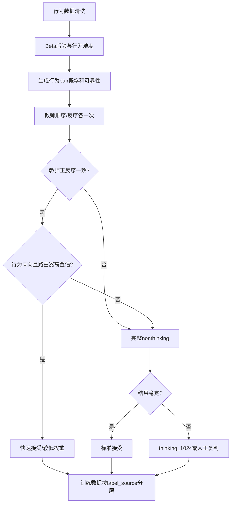

# V4 答题行为数据融合方案

> 目标：充分利用 231,406 条真实业务答题数据，在不降低 pair 标签质量的前提下，减少 Qwen3-32B 教师调用、扩充低成本训练 pair，并为教师 BT 标尺提供独立的业务验证。
>
> 核心原则：行为正确率是“特定学生群体和业务环境下的通过率”，不是天然的绝对难度真值。行为数据负责提供方向、置信度和教师预算分配，教师 pair 继续承担主要语义难度监督。
>
> 公式约定：独立公式统一使用 `$$ ... $$` LaTeX 块格式；行内公式使用 `$ ... $`。

## 1. 执行摘要

当前 V4 教师 pair 的主要成本来自 Qwen3-32B 多轮正反序采样，尤其是升级到 `thinking_1024` 后，同一条 pair 最多需要多次生成。行为数据的价值不只是“再提供一个难度分数”，而是可以介入三个环节：

1. **打标前**：选择最值得调用 Qwen3-32B 的 pair；
2. **打标中**：为高置信 pair 提供提前退出信号；
3. **打标后**：验证教师 BT 标尺、发现冲突边，并生成低权重行为 pair 扩充训练图。

本方案给出六条可以独立实验的路线：

| 方案 | 行为数据角色 | 是否减少教师调用 | 是否改变训练数据 | 推荐阶段 |
|---|---|---:|---:|---|
| 方案一：外部一致性审计 | 独立业务证据 | 否 | 否 | 立即执行 |
| 方案二：行为辅助教师早停 | 路由和预算分配 | 是 | 可能改变标签来源和权重 | 回放通过后 |
| 方案三：行为 soft pair 扩量 | 低权重弱监督 | 间接减少 | 是 | 外部验证通过后 |
| 方案四：行为信息量构边 | 选择高价值教师 pair | 是 | 改变下一轮候选图 | 下一轮构边 |
| 方案五：行为节点先验 | BT 图的软锚点 | 否 | 不一定生成新 pair | 研究型消融 |
| 方案六：行为可信度路由器 | 学习何时相信行为数据 | 是 | 改变级联策略 | 有完整 40k 回放数据后 |

首轮推荐组合不是六选一，而是：

```text
行为数据清洗与Beta后验
        ↓
方案一：对现有40k做外部一致性审计
        ↓
方案二：用完整raw votes回放早停策略
        ↓
方案六：训练行为可信度路由器
        ↓
下一轮生产启用“行为+教师正反序各一次”的快速路径
        ↓
少量高置信行为pair以低权重加入训练
```

## 2. 当前行为数据

### 2.1 数据来源

原始文件：

```text
/home/share_ssd_data/nfs-data1/wangmeng148/coding/vllm-main/scripts/tiku_difficulty_cls/middle-Physics-agent/result/middle-physics_all_filtered_ac_gt20.jsonl
```

已知信息：

```yaml
subject: 初中物理
records: 231406
source_filter: answered_count > 20
data_granularity: question_level_aggregate
```

这 231,406 条记录来自真实业务作答，但 `answered_count > 20` 只是非常宽松的最低门槛。21 次作答和 20,000 次作答对应的正确率置信度完全不同，因此后续不能把所有记录等权使用。

### 2.2 样例记录

```json
{
  "parent_id": "3444091157807124480",
  "question_id": "3444091157807124480",
  "stem": "诗句“江雾锁沙洲，朝露缀枝头”描绘衡阳东洲岛之景，雾的形成过程涉及的物态变化是( )",
  "options": "A. 液化\nB. 汽化\nC. 凝华\nD. 升华",
  "analysis": "雾是空气中的水蒸气遇冷液化形成的小水滴，属于液化现象。 故选：A。",
  "structure_type": "danxuan",
  "answered_count": "148",
  "percent_correct": "81.08",
  "difficulty": "2",
  "sub_questions": []
}
```

### 2.3 字段含义和使用边界

| 字段 | 含义 | 行为链路中的用途 |
|---|---|---|
| `parent_id` | 父题或题组 ID | group split、识别多小题和泄漏 |
| `question_id` | 具体题目 ID | 与 V4、V3、reference 和教师 pair 对齐 |
| `stem` | 题干 | 内容审计、文本长度和题型切片 |
| `options` | 选项 | 判断选择题和猜测效应 |
| `analysis` | 解析 | 题目匹配、冲突内容审计 |
| `structure_type` | 题型结构 | 分层先验、同题型 pair、切片评估 |
| `answered_count` | 累计作答次数 | 样本量和置信度 |
| `percent_correct` | 累计正确率 | 行为通过率观测 |
| `difficulty` | 上游已有绝对难度字段 | 仅保留审计，首轮禁止作为真值 |
| `sub_questions` | 子题数据 | 判断父子题、计分口径和 group split |

`difficulty` 不参与行为难度拟合、pair target、训练权重、教师早停和最终评估。只有 mentor 明确其生成规则、版本和含义并完成独立审计后，才可作为描述性切片。

## 3. 数据审计与清洗

正式使用前必须对全量 231,406 条记录输出审计报告。

### 3.1 完整性

- 总记录数；
- 唯一 `question_id`、唯一 `parent_id`；
- 重复 ID、重复标准化文本；
- 空题干、空解析、空作答数、空正确率；
- 非法 JSON 和未知字段；
- `parent_id != question_id` 的比例；
- `sub_questions` 非空比例。

### 3.2 数值合法性

- `answered_count` 能否全部转换成正整数；
- `percent_correct` 能否全部转换成 $[0,100]$ 数值；
- `answered_count` 的 P1、P10、中位数、P90、P99 和最大值；
- 正确率的分布及 0%、100% 极端值比例；
- 每个 `structure_type` 的作答量和正确率分布。

### 3.3 ID 对齐

分别统计与以下数据的 ID 和标准化文本重叠：

- V4 10,000 训练节点；
- V4 validation / test；
- V3 2,000 训练节点；
- business reference 1,000；
- 40,000 候选 pair 的两端节点。

行为数据的价值高度依赖重叠率。若 `question_id` 体系不同，需要先用规范化题干哈希对齐，并输出 ID 匹配、文本匹配和冲突匹配三类结果。

### 3.4 父子题处理

多小题可能存在三种统计口径：

1. 父题整体正确；
2. 每个子题单独正确；
3. 部分得分或全部答对才算正确。

在口径没有确认前，不应把父题和子题直接混在同一行为标尺中。训练、验证和交叉验证都应按 `parent_id` 分组切分，避免同一题组跨集合泄漏。

## 4. 从正确率恢复行为难度

### 4.1 恢复答对数

设作答次数为 $n_j$，百分制正确率为 $r_j$。由于 `percent_correct` 保留两位小数，先寻找所有满足以下条件的整数 $c_j$：

$$
\operatorname{round}
\left(
100\frac{c_j}{n_j},2
\right)
=r_j
$$

如果只有一个整数解，记录为 `integer_recovered`：

```json
{
  "correct_count": 120,
  "correct_count_source": "recovered_unique"
}
```

如果没有整数解，不能直接把该记录判断为脏数据。多选、主观题、部分得分题或不同分母口径下，正确率可以是连续比例。此时保留：

$$
\tilde c_j=
n_j\frac{r_j}{100}
$$

作为连续伪计数，并标记为 `continuous_rate_pseudocount`。它可以参与 Beta 后验和外部一致性分析，但默认质量权重为整数恢复记录的一半，且不进入“高置信行为冲突”的判定。如果可获取原始 `correct_count`，应直接使用原始计数。

样例中：

$$
n=148,\qquad r=81.08
$$

唯一整数解为：

$$
c=120
$$

### 4.2 Beta-Binomial 后验

当前没有逐用户 ID、学生能力和 cohort，因此首轮不直接拟合 Rasch。对每道题使用 Beta 后验：

$$
p_j\mid data
\sim
\operatorname{Beta}
\left(
\alpha+c_j,\,
\beta+n_j-c_j
\right)
$$

第一版可以使用全局弱先验 $\operatorname{Beta}(1,1)$。第二版再比较：

- 全局经验贝叶斯先验；
- 按 `structure_type` 拟合的先验；
- 选择题和非选择题分别拟合的先验。

不能一开始就使用 `difficulty` 拟合先验，否则会把未经确认的旧难度标签泄漏进行为分数。

### 4.3 行为难度标量

定义后验平均通过率：

$$
\mu_j=\mathbb E[p_j]
$$

定义行为难度：

$$
b_j^{behavior}
=
\log\frac{1-\mu_j}{\mu_j}
$$

分数越大表示行为上越难。该分数没有固定上下界，不映射成 0-100，也不强行与教师 BT 分数处于同一数值尺度。

### 4.4 行为 pair 概率

题目 A 比 B 更难，表示 A 的真实通过率更低：

$$
P_B(A>B)
=
P(p_A<p_B)
$$

可通过 Monte Carlo 计算：

1. 从 A 的 Beta 后验采样 $p_A^{(m)}$；
2. 从 B 的 Beta 后验采样 $p_B^{(m)}$；
3. 统计 $p_A^{(m)}<p_B^{(m)}$ 的比例。

这种概率会自然反映样本量：作答量少时更接近 0.5；作答量充分且差异稳定时才接近 0 或 1。

### 4.5 行为 pair 可靠性权重

定义两端的有效作答量为调和平均：

$$
n_{eff}
=
\frac{2n_An_B}{n_A+n_B}
$$

定义行为概率置信度：

$$
C(P_B)
=
1-
\frac{H(P_B)}{\log 2}
$$

其中：

$$
H(P_B)
=
-P_B\log P_B
-(1-P_B)\log(1-P_B)
$$

建议权重：

$$
w_B
=
w_{max}
\cdot
\min\left(1,\frac{n_{eff}}{n_0}\right)
\cdot C(P_B)
\cdot q_{comparable}
\cdot q_{quality}
$$

其中：

- $q_{comparable}$：题型、人群和计分口径可比性；
- $q_{quality}$：ID、文本、父子题和计数恢复质量；
- $w_{max}$：行为 pair 相对教师 pair 的最大权重上限。

行为 pair 的 `sample_weight` 不应仅由 $|P_B-0.5|$ 决定。

### 4.6 标准行为 pair 数据结构

```json
{
  "pair_id": "behavior_v1_xxx",
  "question_a_id": "...",
  "question_b_id": "...",
  "question_a_text": "...",
  "question_b_text": "...",
  "soft_target": 0.93,
  "sample_weight": 0.18,
  "label_source": "behavior_beta_binomial_v1",
  "pair_source": "behavior_near",
  "metadata": {
    "answered_count_a": 148,
    "answered_count_b": 520,
    "percent_correct_a": 81.08,
    "percent_correct_b": 63.27,
    "correct_count_source_a": "recovered_unique",
    "correct_count_source_b": "recovered_unique",
    "posterior_probability_a_harder": 0.93,
    "same_structure_type": true,
    "same_parent_group": false
  }
}
```

## 5. 行为 pair 图怎么构造

231,406 道题全部两两组合会产生：

$$
\binom{231406}{2}
\approx2.68\times10^{10}
$$

即约 267 亿条 pair，没有必要也不可落地。应构造稀疏图，并控制节点度数、连通性和不同信息类型的边比例。

### 5.1 行为近邻边

选择：

$$
|b_A^{behavior}-b_B^{behavior}|\approx0
$$

作用是训练模型区分行为难度相近的题，局部信息量高。风险是 target 更接近 0.5，对行为偏差和计数误差更敏感。

### 5.2 行为跨度边

选择：

$$
|b_A^{behavior}-b_B^{behavior}|>\delta
$$

作用是提供稳定方向和全局跨度。不能占比过高，否则 pair 过于简单。

### 5.3 行为分位桥接边

将行为分数分成若干分位段，在相邻区间之间构边：

```text
Q1 ↔ Q2
Q2 ↔ Q3
Q3 ↔ Q4
...
```

这些边负责把局部行为簇连接成连续标尺。

### 5.4 同题型和跨题型边

- 主要边在相同 `structure_type` 内构造，降低题型猜测和计分口径混杂；
- 少量跨题型边负责全图连接；
- 父题和子题禁止互相构边；
- 多小题与单题应单独设配额；
- 单选题和非选择题的行为正确率不能完全等价比较。

### 5.5 推荐的试验规模

不要一开始使用全部 231,406 个节点。推荐渐进式验证：

```yaml
pilot_1:
  questions: 20000
  behavior_pairs: 80000
  expected_mean_degree: 8
pilot_2:
  questions: 50000
  behavior_pairs: 200000
scale_up:
  enabled_only_if_pilot_passes: true
```

节点抽样应按 `structure_type`、行为分位段、作答量和文本结构分层，不能只取作答次数最高的题。

## 6. 方案一：行为数据只做外部一致性审计

### 6.1 目标

不修改现有教师标签、不改变训练数据，先回答教师 BT 排序是否与真实业务作答大体一致。

### 6.2 数据流

```text
40k最终教师pair
    ↓
离线Bradley-Terry
    ↓
teacher_bt_score

23.14万行为数据
    ↓
Beta-Binomial
    ↓
behavior_score

两套分数在重叠题上对齐审计
```

### 6.3 指标

- question-level Spearman、Kendall；
- 教师 BT 分位段的平均行为难度；
- 高置信教师 pair 与高置信行为 pair 的方向一致率；
- teacher soft target 与行为概率的 MAE；
- 按作答量、题型、父子题和文本长度切片；
- 强冲突题的内容审计。

强冲突示例：

$$
P_T(A>B)>0.8
$$

同时：

$$
P_B(A>B)<0.2
$$

这些 pair 进入 `teacher_behavior_conflicts.jsonl`，但不自动覆盖教师标签。

### 6.4 当前实现

方案一已经拆成三个可独立复用的程序模块：

| 模块 | 实现 | 主要产物 |
|---|---|---|
| 行为数据清洗与计数恢复 | `scripts/audit_behavior_accuracy.py` | `behavior/scores.jsonl`、隔离数据和审计报告 |
| 40k 教师边离线 BT | `scripts/audit_pairwise_with_bt.py` | `offline_bt/scores.jsonl`、残差和稳定性报告 |
| 外部一致性比较 | `scripts/compare_behavior_with_bt.py` | question 对齐、pair 对齐、高置信冲突和总报告 |

一键编排入口为 `scripts/server_run_v4_behavior_external_audit.sh`。该入口不会生成训练数据，也不会修改教师 `soft_target`。

行为清洗实现会：

- 从两位小数正确率恢复整数答对数，并记录唯一解、歧义解或近似恢复状态；
- 使用 $operatorname{Beta}(1,1)$ 弱先验计算题目通过率后验；
- 输出“越大越难”的行为 logit 分数和 95% 区间；
- 对重复 ID、冲突 ID、空题干、非法计数、非法正确率和作答量不足进行隔离；
- 检查源数据是否包含 `difficulty`，但计算和输出均不使用其数值。

为了让 40k pair 审计可在 CPU 上高效运行，当前 pair 概率用两个 Beta 后验的正态近似计算：

$$
P_B(A>B)
\approx
\Phi\left(
\frac{\mu_B-\mu_A}
{\sqrt{\sigma_A^2+\sigma_B^2}}
\right)
$$

它与第 4.4 节 Monte Carlo 定义方向一致，但计算是确定性的。正式汇报会明确标注近似方法；后续可在冲突样本上追加 Monte Carlo 复核。

最终报告同时给出：

- 行为题与 BT 节点的 ID 覆盖率；
- 教师 pair 两端都有行为证据的覆盖率；
- question-level Pearson、Spearman、Kendall $\tau_b$；
- pair-level log loss、Brier、方向一致率和 soft target MAE；
- 同时考虑教师可靠性与行为作答量的加权指标；
- 按构边来源、教师标签来源和 cascade 路由原因的切片；
- 教师与行为双方都高置信、但方向相反的冲突清单。

### 6.5 价值和限制

优点是零额外 Qwen 成本、零训练污染，可以立即执行。限制是只能为后续生产提供证据，不能追回已经发生的教师打标时间。

## 7. 方案二：行为数据辅助 Qwen3-32B 早停

### 7.1 目标

让行为证据明确的 pair 只执行最低成本教师确认，把完整 nonthinking 和 `thinking_1024` 留给模糊、位置敏感或冲突 pair。

### 7.2 快速路径

对行为高置信 pair，教师仍至少执行：

```text
调用1：顺序(A,B)
调用2：反序(B,A)
```

路由规则：

| 教师正反序 | 行为证据 | 路由 |
|---|---|---|
| 一致 | 同方向且高置信 | 快速接受 |
| 一致 | 与行为高置信冲突 | 完整 nonthinking，必要时 thinking |
| 不一致 | 任意 | 完整 nonthinking |
| 行为不充分 | 任意 | 沿用现有 cascade |

### 7.3 快速接受条件

```yaml
fast_accept_requirements:
  behavior_support_sufficient: true
  behavior_probability_decisive: true
  behavior_interval_narrow: true
  teacher_forward_reverse_agree: true
  teacher_behavior_direction_agree: true
  no_parent_child_conflict: true
  no_data_quality_flag: true
```

行为概率门槛和作答量门槛不能直接写死，建议回放网格：

```yaml
minimum_answered_count_each: [50, 100, 200, 500]
behavior_probability_threshold: [0.80, 0.90, 0.95]
```

### 7.4 快速路径 target

初期建议最终 target 仍由教师正反序结果决定。例如两次均判 A 更难时，使用保守平滑 target，而不是直接复制行为概率：

```yaml
teacher_forward_reverse_both_a:
  soft_target: 0.75
teacher_forward_reverse_both_b:
  soft_target: 0.25
```

快速路径 `sample_weight` 低于完整六票或 thinking 复判数据。具体 target 和权重必须由回放实验选择。

### 7.5 离线回放

现有 V4 40k 已保留 raw votes。对每个 pair 只暴露第一条顺序票、第一条反序票和行为概率，模拟快速路由，再与完整 cascade 最终结果比较。整个过程不需要新增 Qwen 调用。

建议门禁：

```yaml
hard_direction_agreement_with_full_cascade: ">= 0.97"
severe_disagreement_rate: "<= 0.02"
mean_absolute_soft_target_difference: "<= 0.08"
no_major_pair_source_regression: true
no_low_frequency_structure_regression: true
```

## 8. 方案三：行为 soft pair 扩充训练数据

### 8.1 目标

从 23.14 万行为题中构造低成本 pair，扩展当前教师图覆盖，让学生模型见到更多题型和真实业务难度差异。

### 8.2 训练损失

教师和行为标签分开保存，通过损失权重控制：

$$
\mathcal L
=
\mathcal L_{teacher}
+\lambda_B\mathcal L_{behavior}
+\lambda_A\mathcal L_{Aux11}
$$

建议第一轮行为权重消融：

```yaml
behavior_loss_weight: [0.00, 0.03, 0.05, 0.10, 0.20]
```

教师 pair 始终是主监督。行为 pair 必须保留 `label_source`，不能与教师 pair 混成无法追溯的统一文件。

### 8.3 行为 pair 的准入

行为 pair 至少满足：

- 两端作答次数达到候选门槛；
- posterior probability 足够偏离 0.5；
- 题目 ID 和文本匹配无异常；
- 不属于父子题直接比较；
- 题型或计分口径可比；
- 后验区间宽度受控。

### 8.4 风险

行为 pair 可能把投放人群、课程进度和猜测效应学进模型。因此必须同时保留：

- teacher-only 基线；
- behavior-only 诊断；
- teacher + behavior 多权重消融；
- 相同 validation 和 reference set；
- 题型和作答量切片。

## 9. 方案四：用行为数据选择最值得教师标注的 pair

### 9.1 行为近邻 + 语义近邻

两题的行为难度、Aux11 和文本结构都接近。这类 pair 最能训练细粒度局部排序，属于高价值但高难度教师样本。

### 9.2 行为差距大 + 语义相近

两题表面结构近似，但真实通过率差距很大。可能包含易错选项、课程覆盖、计算量或解析无法反映的因素，适合教师和人工重点检查。

### 9.3 教师预测接近 + 行为差距大

若旧学生模型或教师 BT 满足：

$$
|s_A-s_B|\approx0
$$

但行为满足：

$$
P_B(A>B)>0.9
$$

这类 pair 对发现模型盲区最有价值。

### 9.4 教师与行为强冲突

强冲突边不应直接作为普通训练边，而应进入 challenge set 或人工复判。它们用于区分“教研语义难度”和“真实作答难度”的业务边界。

### 9.5 动态教师预算

可以按预期信息价值分配 Qwen 采样次数：

```yaml
easy_behavior_and_teacher_agree: 2_calls
moderate_uncertainty: 6_calls
position_sensitive: 10_calls
teacher_behavior_conflict: thinking_or_human
```

这比所有 pair 使用相同票数更节省成本。

## 10. 方案五：行为分数作为 BT 节点先验

### 10.1 目标

不生成大量行为 pair，而是把高置信行为分数作为教师 BT 图中节点的软锚点。

教师 BT 保持：

$$
P_T(A>B)=\sigma(s_A-s_B)
$$

在重叠题上增加软约束：

$$
\mathcal L
=
\mathcal L_{teacher}
+\lambda
\sum_j
\rho_j
\left[
s_j-(a+b\,b_j^{behavior})
\right]^2
$$

其中 $a,b$ 负责对齐教师和行为分数尺度，$\rho_j$ 由作答量、后验区间和数据质量决定。

### 10.2 优点

- 不需要构造数十万行为 pair；
- 可以稳定低度节点和局部区域；
- CPU 计算成本很低；
- 保留教师图的主导地位。

### 10.3 风险和对照

行为偏差可能整体拉动 BT 标尺，因此必须做：

- teacher-only；
- teacher + global behavior prior；
- teacher + structure-conditioned prior；
- 多个 $\lambda$；
- 人工 gold、reference 和 held-out teacher edge 对照。

## 11. 方案六：训练行为标签可信度路由器

### 11.1 目标

不再用统一的 `answered_count` 和行为概率阈值，而是学习“什么样的行为证据值得信任”。

### 11.2 训练标签

利用完整 V4 cascade 构造：

```text
label=1：行为方向与完整教师cascade方向一致
label=0：方向不一致
```

还可以训练第二个目标：行为概率和教师最终 soft target 的绝对误差。

### 11.3 输入特征

```yaml
features:
  - answered_count_a
  - answered_count_b
  - effective_answered_count
  - percent_correct_gap
  - behavior_pair_probability
  - posterior_interval_width_a
  - posterior_interval_width_b
  - same_structure_type
  - has_subquestions_a
  - has_subquestions_b
  - parent_group_relation
  - text_length_gap
  - auxiliary_feature_distance
  - teacher_forward_reverse_agreement
```

模型可以从 Logistic Regression 或 LightGBM 开始，先保证可解释性，不需要用大模型。

### 11.4 输出和路由

输出：

$$
P
\left(
\text{behavior direction reliable}
\mid x
\right)
$$

只有经过 calibration 后超过门槛的 pair 才进入快速路径。验证必须按 `parent_id` 做 group split，不能让同题组泄漏到训练和验证。

### 11.5 巧思所在

不同题型可自动学到不同可信门槛。例如选择题存在猜测，可能需要更高作答量；实验题或多小题可能需要更严格的计分口径一致性。学习型路由比统一阈值更适合复杂业务数据。

## 12. 推荐的组合生产架构



这套组合将不同来源定位为：

```text
教师完整pair：高权重主监督
教师快速pair：中等权重监督
行为soft pair：低权重弱监督
教师-行为冲突pair：不训练，进入challenge/rejudge
```

## 13. 实验矩阵

| 实验 | 教师 pair | 行为 pair | 行为路由 | 节点先验 | 目的 |
|---|---:|---:|---:|---:|---|
| E0 | 100% | 0 | 无 | 无 | 当前 teacher-only 基线 |
| E1 | 100% | 0 | 只审计 | 无 | 判断行为数据是否有价值 |
| E2 | 100% | 低权重 | 无 | 无 | 行为弱监督增益 |
| E3 | 100% | 0 | 固定阈值 | 无 | 估计教师调用节省 |
| E4 | 100% | 0 | 学习型路由器 | 无 | 自适应教师预算 |
| E5 | 100% | 0 | 无 | 有 | 行为节点先验消融 |
| E6 | 100% | 低权重 | 学习型路由器 | 无 | 推荐完整组合 |

### 13.1 阶段一：功能和数据验证

- 完成行为 schema 审计；
- 恢复或近似 correct count；
- 生成行为分数和后验区间；
- 对齐 V4 10k 节点和 40k pair；
- 输出 E1 外部一致性报告。

### 13.2 阶段二：早停回放

网格搜索：

```yaml
minimum_answered_count_each: [50, 100, 200, 500]
behavior_probability_threshold: [0.80, 0.90, 0.95]
fast_pair_sample_weight: [0.25, 0.50, 0.75]
```

目标是找到调用节省与标签误差的 Pareto 前沿，而不是只追求最高快速接受率。

### 13.3 阶段三：行为 pair 训练消融

先在固定教师训练数据上只改变行为 pair 权重，不改变 backbone、LoRA、学习率和训练 epoch。至少运行三个随机种子验证稳定性。

### 13.4 阶段四：前瞻 pilot

从新 pair 中抽取 2,000-5,000 条：

- 一半使用候选快速路由；
- 一半使用完整 cascade；
- 快速接受样本中随机抽取一部分仍运行完整 cascade；
- 高置信冲突 pair 做人工抽审。

只有前瞻结果复现回放收益，才扩大到下一批生产。

## 14. 评价指标和门禁

### 14.1 行为数据质量

- 有效记录率；
- exact correct count 恢复率；
- V4 10k 题目覆盖率；
- 40k pair 两端完整覆盖率；
- 作答量分布和极端正确率比例；
- 父子题和重复题异常率。

### 14.2 教师-行为一致性

- question-level Spearman / Kendall；
- pair direction agreement；
- teacher target 与 behavior probability 的 MAE；
- 按作答量、题型和行为差距切片；
- 高置信严重冲突率。

### 14.3 路由成本

- fast acceptance rate；
- teacher calls saved；
- thinking escalation rate；
- estimated GPU hours saved；
- 与完整 cascade 的方向一致率；
- soft target MAE；
- severe disagreement rate。

成本节省定义为：

$$
saving
=
1-
\frac{
2N_{fast}+C_{full}N_{full}+C_{think}N_{think}
}{
C_{full}N_{all}+C_{think}N_{think,baseline}
}
$$

### 14.4 下游学生模型

- validation soft pairwise log loss；
- Brier score；
- pairwise accuracy / AUC；
- reference 题目的难度单调性；
- Aux11 各头指标；
- 按行为支持量和 teacher-behavior conflict 切片；
- teacher-only 与 teacher+behavior 的多种子差值。

## 15. 数据拆分和泄漏控制

如果行为数据用于选择 pair、生成 target 或教师早停，就不能再用同一份行为信号宣称完成独立验证。

推荐：

1. 有时间字段时，早期窗口用于建模和路由，后期窗口用于外部验证；
2. 有 cohort 时，按学生群体或业务来源拆分；
3. 只有题目级聚合时，按 `parent_id` 做 group split；
4. 行为构边集、行为阈值校准集、行为最终验证集保持题组隔离；
5. 独立人工 gold 和 V4 validation/test 不参与行为阈值拟合。

还要避免：

- 同一题不同复制 ID 跨集合；
- 父题和子题分别进入训练和验证；
- 用行为正确率选边后，再用相同正确率评价 pair 质量；
- 查看解析后的作答混入首次作答；
- 选择题和主观题未经校准直接比较。

## 16. 当前最不建议的做法

- 直接使用 `difficulty` 作为真值；
- 直接令 `difficulty = 1 - accuracy`；
- 不看 `answered_count` 就生成 hard pair；
- 所有行为 pair 使用相同权重；
- 只调用一次单方向 Qwen 就自动接受；
- 教师和行为一致时直接赋予 thinking 数据同等权重；
- 直接平均教师概率和行为概率；
- 把 23.14 万题全部两两组合；
- 用行为数据构边后，再用同一批行为数据证明行为 pair 正确。

## 17. 最终推荐

第一阶段不要立即把 23.14 万行为数据全部转成训练 pair。应先完成：

1. 全量数据审计和 exact correct count 恢复；
2. Beta 后验和行为难度计算；
3. 与 V4 10k / 40k 的覆盖分析；
4. 对完整 40k 教师结果做外部一致性审计；
5. 使用 raw votes 回放“行为 + 教师正反序各一次”的快速路径；
6. 训练可解释的行为可信度路由器；
7. 回放门禁通过后，启动小规模前瞻 pilot；
8. 最后再把高置信行为 pair 以低权重加入学生训练。

最终建议保留三套可追溯来源：

```text
teacher_full_pair
teacher_fast_behavior_verified_pair
behavior_beta_binomial_pair
```

三类数据分别设置损失权重和评估切片。这样才能真正利用行为数据降低 Qwen3-32B 成本，同时避免把业务人群偏差悄悄变成学生模型的唯一难度标准。
