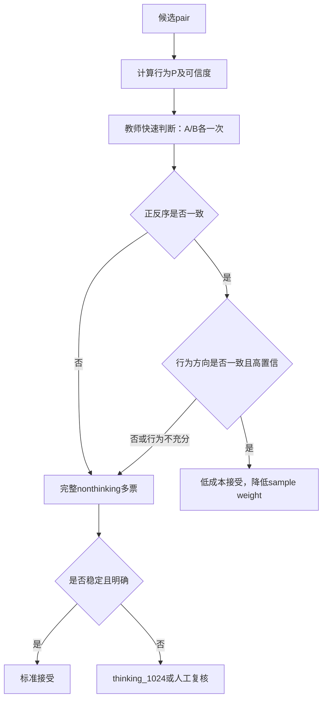

# V4 离线 Bradley–Terry 审计与答题行为数据融合方案

> 适用阶段：V4 10,000 Questions / 40,000 Candidate Pairs 完成教师打标之后、学生模型训练之前
>
> 核心目标：先验证 pair 数据能否恢复稳定的全局难度标尺，再评估答题正确率能否作为外部证据、打标加速信号或弱监督来源
>
> 分数约定：保留原始 BT / IRT 连续标量，不映射为 0—100

## 1. 执行摘要

本方案包含两条相互关联、但必须保持概念区分的链路。

第一条链路是在 V4 教师 pair 打标完成后，直接对最终有效 pair 拟合一个不读取题目文本、
不读取 Aux11、也不训练 Qwen 的经典 Bradley–Terry 模型。该模型只为比较图中的每道题学习
一个自由难度标量，并用全图 pair 关系估计任意两道已覆盖题目的相对难度概率。它的主要用途
不是替代学生模型，而是在投入正式训练之前回答以下问题：

1. 最终 pair 图能否被一个统一的一维难度标尺解释；
2. 每道题的全局难度分数及其不确定性是多少；
3. 哪些 pair 与全局关系明显冲突，可能需要复判；
4. 哪些节点或局部区域比较不足，分数不稳定；
5. 哪一种构边策略贡献了有效信息，哪一种构边策略噪声较大。

第二条链路是利用十几万道题的真实答题数据，估计独立的“行为难度”。答题正确率不能直接
等价为教研难度，因为它还受到学生能力、年级、曝光渠道、作答次数、提示使用和猜测等因素
影响。根据数据粒度不同，应优先使用 Rasch / IRT、分层 Logistic 或 Beta-Binomial 模型，
而不是简单使用 `1 - accuracy`。

行为难度有三种逐步增强的用途：

- **独立外部验证**：检查教师 BT 排序是否符合真实学生作答表现；
- **教师打标路由**：对行为证据充分、快速教师判断稳定且方向一致的 pair 提前接受；
- **弱监督 pair**：将高置信行为比较转换为低权重 soft target，扩充比较图。

首轮推荐只启用前两项。行为数据在完成严格校准和回放实验之前，不应直接替换教师标签，也
不应与教师概率机械平均。

## 2. 背景与问题定义

### 2.1 当前 V4 数据形态

V4 当前设计为：

```yaml
questions: 10000
candidate_pairs: 40000
expected_mean_degree: 8
graph_connected_components: 1
minimum_observed_degree: 6
maximum_observed_degree: 12
teacher: Qwen3-32B
teacher_output:
  - soft_target
  - sample_weight
  - label_source
  - routing_metadata
student_training_status: not_started_for_this_audit
```

40,000 是候选 pair 数。离线 BT 必须读取教师级联、解析和隔离流程完成后的最终有效文件，
实际记录数以最终 manifest 为准，不能默认隔离后仍然正好为 40,000。

每条最终 pair 至少需要包含：

| 字段 | 含义 |
|---|---|
| `pair_id` | 稳定 pair ID |
| `question_a_id` | A 题稳定 ID |
| `question_b_id` | B 题稳定 ID |
| `soft_target` | 教师认为 A 比 B 更难的概率或聚合比例 |
| `sample_weight` | 当前 pair 监督的可信权重 |
| `pair_source` | 构边来源 |
| `label_source` | nonthinking、thinking 或其他最终标签来源 |
| `metadata` | 位置偏差、投票数量、路由原因等审计信息 |

### 2.2 为什么学生模型训练前要先做离线 BT

学生模型同时包含预训练语言模型、LoRA、池化方式和难度头。如果直接训练学生模型后才发现
验证集表现不好，无法立即判断问题来自：

- pair 标签本身互相矛盾；
- 比较图局部连接不足；
- 教师位置偏差或随机性；
- 学生 backbone 表达能力；
- LoRA、优化器或学习率；
- 辅助任务负迁移。

离线 BT 刻意移除文本和神经网络，只询问 pair 数据本身是否支持一个稳定的一维排序。它把
“数据是否健康”和“学生是否学得好”拆成两个问题，是正式训练前成本最低、解释最直接的
数据门禁。

QuRating 的核心做法同样是从 pairwise 判断学习可用于单题推理的标量评分；经典
Bradley–Terry 则提供了最简洁的统计基线。离线 BT 通过不读取文本避免了学生模型对数据问题
的掩盖。

### 2.3 离线 BT 能做什么、不能做什么

离线 BT 能够：

- 给最终比较图覆盖的 10,000 道题估计全局难度标量；
- 将局部 pair 标签传播为全图相对排序；
- 预测图中未直接比较过的两道已覆盖题之间的相对概率；
- 检查标签全局一致性、边残差和排名稳定性；
- 为复判和补边提供优先级。

离线 BT 不能够：

- 对不在这 10,000 个节点中的新题推理；
- 证明教师判断符合人工教研标准；
- 自动生成 Aux11；
- 替代后续读取题目文本的学生模型；
- 仅凭内部拟合优度证明真实业务有效性。

因此，离线 BT 是教师比较图的统计审计器和图内评分器，不是最终线上模型。

## 3. 离线 Bradley–Terry 全局评分

### 3.1 模型定义

对每道题 (q_i) 学习一个连续标量 (s_i\in\mathbb{R})。本项目约定分数越大，题目越难。

对于 pair ((A,B))：

\[
\hat P(A\succ B)=\sigma(s_A-s_B)
=\frac{1}{1+\exp[-(s_A-s_B)]}
\]

其中 (A\succ B) 表示 A 比 B 更难。训练目标为加权 soft-label 交叉熵：

\[
\mathcal L_{BT}=
-\frac{1}{\sum_e w_e}
\sum_e w_e
\left[
y_e\log \hat p_e+(1-y_e)\log(1-\hat p_e)
\right]
+\lambda\lVert s\rVert_2^2
\]

其中：

- (y_e) 为 `soft_target`；
- (w_e) 为 `sample_weight`；
- (lambda) 为很小的正则系数，防止极端分数无限增大；
- 所有题的分数均值固定为 0，用于消除整体平移自由度。

原始 `bt_score` 没有固定上下界。绝对值依赖当前图、正则和标尺约束，真正具有直接概率意义
的是分数差：

| 分数差 (s_A-s_B) | (P(A>B)) |
|---:|---:|
| 0 | 0.500 |
| 0.5 | 0.622 |
| 1.0 | 0.731 |
| 2.0 | 0.881 |
| -1.0 | 0.269 |

### 3.2 图连通与可识别性

如果比较图分成多个不连通分量，每个分量都可以独立整体平移，分量之间无法比较。因此：

```yaml
hard_requirements:
  node_coverage: 1.0
  connected_components: 1
  self_loops: 0
  duplicate_edges: 0
```

当前候选图已满足单连通，但最终教师隔离可能删除部分边，所以必须对最终有效 pair 重新计算
图指标，不能复用打标前 manifest。

单连通只是最低条件，并不代表所有节点分数同样可靠。一个节点如果只通过少数桥接边连接，
其分数方差可能远大于处在高冗余局部网络中的节点。还需要报告：

- 最小、P10、中位数、P90 和最大度数；
- articulation node、bridge edge 数量；
- 图的代数连通度或等价的谱诊断；
- 节点有效信息量；
- 删除关键边后的连通风险。

### 3.3 拟合过程

推荐使用加权 MAP / 正则化最大似然：

1. 读取最终 pair 并校验 ID、soft target、权重和重复边；
2. 为 10,000 个 question ID 建立连续索引；
3. 初始化所有 (s_i\approx0)；
4. 使用全批量 Adam、L-BFGS 或专门的 MM 算法优化加权 BT 目标；
5. 每次更新后减去全部分数均值；
6. 达到损失收敛或最大迭代次数后输出结果；
7. 使用 Hessian / 图 Laplacian 近似和 connectivity-preserving bootstrap 估计不确定性。

10,000 个节点和约 40,000 条边的参数规模很小，不需要 GPU。主要内存开销来自 pair JSON
本身；转换成整数索引和数值数组后，CPU 内存拟合足够。

### 3.4 每道题的输出

建议输出 `question_bt_scores.jsonl`：

```json
{
  "question_id": "...",
  "bt_score": 1.273,
  "bt_standard_error": 0.184,
  "bt_ci95_low": 0.912,
  "bt_ci95_high": 1.634,
  "degree": 8,
  "weighted_information": 1.91,
  "rank": 8731,
  "rank_stability": 0.94,
  "source_split": "train"
}
```

`rank` 可以用于内部排序，但不应把它再映射成 0—100 难度。对外保留 `bt_score`、分数差、
标准误和区间即可。

### 3.5 任意两道图内题目的比较

即使 A 与 B 没有直接边，只要两者都在同一个连通图中，就可以计算：

\[
P(A>B)=\sigma(s_A-s_B)
\]

这个概率是由图中多条路径间接推断出来的。它的可信度还应结合二者分数的不确定性；不能只
看点估计。近似差值方差为：

\[
\operatorname{Var}(s_A-s_B)
=\operatorname{Var}(s_A)+\operatorname{Var}(s_B)
-2\operatorname{Cov}(s_A,s_B)
\]

这也是不能只依赖逐节点对角 Fisher 标准误的原因：图中节点分数通常相关。

## 4. 使用离线 BT 观察 pair 质量

### 4.1 质量判断的四个层级

pair 数据质量不能用单个指标概括，应分成四层：

1. **结构可识别性**：图是否覆盖、连通且具有足够冗余；
2. **全局可解释性**：一个一维 BT 标量能否解释大部分 pair；
3. **局部可靠性**：具体边、节点和构边来源是否存在高冲突区域；
4. **外部有效性**：BT 排序是否与独立教研或真实作答表现一致。

前三层可以只用教师 pair 完成，第四层需要独立 reference、人工 gold 或答题行为数据。

### 4.2 保持连通的交叉验证

普通随机 K 折会在稀疏图中切断节点或局部区域，导致验证结果混入“训练图断连”问题。正确
做法是：

1. 从最终图抽取一棵固定生成树作为连通骨架；
2. 生成树边永远保留在每一折训练集；
3. 只把其余冗余边划分为 K 折；
4. 每折使用骨架和非当前折冗余边拟合；
5. 在当前折冗余边上预测 soft target。

至少报告：

```yaml
cross_validation:
  folds: 5
  connectivity_preserved: true
  weighted_metrics:
    - soft_pairwise_log_loss
    - brier_score
  unweighted_metrics:
    - soft_pairwise_log_loss
    - brier_score
    - pairwise_accuracy
    - pairwise_auc
    - decisive_pairwise_accuracy
```

同时建立常数概率基线：仅使用训练边的加权平均 soft target 作为所有验证边的预测。离线 BT
必须在加权与非加权 Log Loss、Brier 上都优于常数基线，否则说明全局标量没有解释增益。

### 4.3 每条边的残差

对每条 pair 计算：

\[
r_e=\left|y_e-\sigma(s_A-s_B)\right|
\]

建议输出 `pair_bt_residuals.jsonl`：

```json
{
  "pair_id": "...",
  "question_a_id": "...",
  "question_b_id": "...",
  "teacher_soft_target": 0.8333,
  "bt_probability_a_harder": 0.2140,
  "absolute_residual": 0.6193,
  "sample_weight": 1.0,
  "pair_source": "feature_near",
  "label_source": "thinking_1024",
  "review_priority": "high"
}
```

残差需要结合教师置信程度解释：

| 教师结果 | BT 结果 | 解释 | 动作 |
|---|---|---|---|
| 接近 0.5 | 也接近 0.5 | 合理的近难度边 | 保留 |
| 明确 A 更难 | 也明确 A 更难 | 高质量方向边 | 保留 |
| 明确 A 更难 | 明确 B 更难 | 全局方向冲突 | 优先复判 |
| 接近 0.5 | BT 很明确 | 教师不稳定或局部图冲突 | 检查投票与邻边 |
| 教师很明确 | BT 接近 0.5 | 可能存在局部特殊关系 | 检查节点覆盖与题目语义 |

高熵、接近 0.5 的 pair 不等于低质量。相近题 pair 对确定局部排序和边界通常很有价值。
真正危险的是高置信反向冲突，以及对全图影响很大的高残差桥接边。

### 4.4 节点不确定性与局部覆盖

对每道题报告：

- degree；
- 加权 degree；
- 相邻边 soft target 熵；
- BT score 标准误与 bootstrap 区间；
- bootstrap 排名方差；
- 所属最难/最易 10% 集合的稳定率；
- 高残差邻边数量；
- 是否依赖单一 pair source；
- 是否位于桥接区域。

节点风险可以按以下逻辑分层：

```text
低风险：度数充分 + 多来源连接 + 区间窄 + 邻边残差低
中风险：分数处于拥挤区域或邻边教师不确定
高风险：低度 + 桥接依赖 + 区间宽 + 多条方向冲突边
```

### 4.5 按构边来源审计

V4 的七类边承担不同作用，不能只看总体平均值：

| 构边来源 | 主要作用 | 重点观察指标 |
|---|---|---|
| `feature_near` | 特征相近、预期难度接近的细粒度比较 | 教师熵、残差、局部排序信息 |
| `feature_contrast` | 特征差异明显的跨度边 | 方向准确率、是否过于简单 |
| `random_global` | 提供全局随机连接 | 全局覆盖、远距离方向一致性 |
| `lexical_near` | 文本相近题之间比较 | 是否区分表面相似但难度不同 |
| `structure_matched` | 相同题目结构下比较 | 结构控制后的难度分辨能力 |
| `low_degree_repair` | 修复节点度数 | 被修复节点区间是否缩窄 |
| `graph_bridge` | 连接局部区域 | 高残差率、影响力、断连风险 |

每类至少报告：

- pair 数与最终保留率；
- soft target 分布和平均熵；
- 加权 / 非加权留出 Log Loss 与 Brier；
- 平均与 P95 残差；
- 严重残差率；
- 位置敏感率；
- thinking 升级率；
- 对节点不确定性下降的贡献。

如果某类边残差高，不能直接整类删除。需要判断它是标签差，还是恰好承担了更难、更有信息量
的近邻比较。

### 4.6 边影响力与复判优先级

建议增加 leave-one-edge-out 的近似 influence：移除一条边后，观察其端点分数、全局排名或
局部连通性变化。完整逐边重拟合成本较高，可以使用 Hessian 近似计算。

复判优先级建议综合：

\[
priority_e=
residual_e\times influence_e\times reliability_e\times bridge\_risk_e
\]

其中：

- 残差高但影响力很低：适合批量抽样复核；
- 残差高且影响力高：必须优先复判；
- 残差低但影响力高：保留，同时检查是否过度依赖单边；
- `graph_bridge` 与低度节点边应提高优先级。

### 4.7 循环一致性

在理想 BT 模型中：

\[
\operatorname{logit}P(A>B)+
\operatorname{logit}P(B>C)+
\operatorname{logit}P(C>A)\approx0
\]

可在实际存在的三角形或基本循环上统计 closure error，用来发现
`A>B、B>C、C>A` 类型的循环冲突。由于当前图较稀疏，循环一致性适合作为补充诊断，不宜
单独作为硬门禁。

### 4.8 Bootstrap 排名稳定性

Bootstrap 不能直接对全部边有放回采样，因为可能抽掉关键桥接边并造成图断连。正确方案：

1. 固定一棵连通生成树；
2. 生成树边在每次 bootstrap 中始终保留；
3. 只对冗余边进行有放回采样；
4. 每次重新拟合全部节点分数；
5. 计算与全量拟合排名的 Spearman；
6. 计算最难和最易 10% 集合重合率；
7. 汇总每道题的分数、排名和集合归属区间。

当前实现已经固定一棵生成树，并只对冗余边进行有放回重采样。每次 bootstrap 都保持全部
题目处于同一个连通分量，同时输出总体排名 Spearman、最难/最易 10% 重合率，以及逐题
分数区间、排名标准差和进入两端 10% 集合的频率。

### 4.9 负对照

门禁阈值不应只凭经验指定。建议同时运行：

- 随机打乱 soft target 的标签负对照；
- 随机翻转 5%、10% 标签方向的噪声对照；
- 保留图结构但随机置换 question ID 的结构负对照；
- V3 7,509 有效 pair 的历史基线。

健康 V4 数据应明显优于负对照，并与 V3 基线相比在排名稳定性、节点区间和切片覆盖上有可
解释的改善。这样才能证明门禁确实能够识别坏数据，而不是一组无区分力的固定数字。

### 4.10 建议的 Post-label Gate

```yaml
hard_gate:
  final_graph_connected: true
  node_coverage: 1.0
  duplicate_edges: 0
  self_loops: 0
  heldout_weighted_log_loss_beats_constant: true
  heldout_unweighted_log_loss_beats_constant: true
  heldout_weighted_brier_beats_constant: true
  heldout_unweighted_brier_beats_constant: true

provisional_gate:
  severe_residual_threshold: 0.5
  maximum_severe_residual_rate: 0.05
  bootstrap_runs: 20
  minimum_mean_rank_spearman: 0.90

required_slices:
  - pair_source
  - label_source
  - position_bias_type
  - soft_target_confidence_bucket
  - endpoint_degree_bucket
  - auxiliary_feature_distance
```

`0.05` 和 `0.90` 是当前项目的初始门槛，不应直接解释为统计学通用标准。正式冻结时应结合
V3 基线、负对照和人工抽审结果校准。

## 5. 答题行为数据能提供什么

### 5.1 “答题正确率”不是天然绝对难度

观测正确率同时受到以下因素影响：

- 作答学生能力分布；
- 年级、地区、学校与班型；
- 题目投放渠道和曝光策略；
- 作答人数；
- 是否首次作答；
- 是否使用提示、搜索或查看解析；
- 选择题猜测概率；
- 多小题的计分方式；
- 时间变化和课程进度；
- 缺失、跳过和超时的处理方式。

例如，一道压轴题只投放给尖子班时可能具有很高正确率；一道基础题投放给尚未学习对应知识
点的低年级学生时可能具有很低正确率。因此原始正确率首先是“某一人群和业务环境下的通过
率”，不是跨人群天然可比的教研难度。

### 5.2 三种可用数据粒度

#### A. 逐用户作答记录：最佳

最理想字段为：

```yaml
response_level_fields:
  - question_id
  - user_id_or_anonymous_student_id
  - is_correct_or_score
  - attempt_time
  - attempt_index
  - grade
  - source_or_product_scene
  - used_hint
  - viewed_solution_before_answer
  - question_type
```

可以使用 Rasch / 1PL IRT：

\[
P(Y_{uj}=1)=\sigma(\theta_u-b_j)
\]

其中：

- (	heta_u) 是学生能力；
- (b_j) 是题目行为难度；
- (b_j) 越大，题越难。

如果题型差异和猜测效应明显，可以进一步验证 2PL / 3PL，但首轮用 Rasch 更容易解释，也
更适合检查行为难度能否形成统一标尺。

#### B. 分人群聚合的答对数与作答数：可用

例如：

```yaml
aggregate_fields:
  - question_id
  - cohort_id
  - correct_count
  - attempt_count
  - grade
  - time_window
  - source_or_product_scene
```

可以拟合分层 Logistic / Beta-Binomial：

\[
\operatorname{logit}P(correct_{jc})
=\alpha_c-b_j+\beta^TX_{jc}
\]

其中 (alpha_c) 表示 cohort 的整体能力或通过率差异，(X_{jc}) 表示年级、时间和渠道等
协变量。这样可以在一定程度上把题目难度与人群结构分离。

#### C. 只有总正确率：只能作为弱证据

如果只有：

```text
question_id, accuracy
```

没有 `attempt_count`，就无法区分“8/10”和“80,000/100,000”的不确定性。此类数据只能用于
相关性探索和低权重切片，不应直接生成高置信 pair 标签。

## 6. 从行为数据生成 pair 难度概率

### 6.1 有逐用户数据时

拟合 Rasch / IRT 后，对题目 A、B 获得行为难度后验 (b_A,b_B)。真正需要的是：

\[
P_{behavior}(A>B)=P(b_A>b_B\mid responses)
\]

可以从后验或近似正态分布中采样：

1. 重复采样 (b_A^{(m)},b_B^{(m)})；
2. 统计 (b_A^{(m)}>b_B^{(m)}) 的比例；
3. 得到考虑样本量和估计方差的 soft pair probability。

如果只使用点估计，可以写成：

\[
\tilde P_{behavior}(A>B)
=\sigma\left(\frac{b_A-b_B}{\tau}\right)
\]

但温度 (	au) 必须在教师或人工重叠 pair 上校准，不能默认等于 1。后验胜率比随意设置温度
更适合作为首选方案。

### 6.2 只有答对数和作答数时

对同一可比 cohort 内的题目，设题目答对率为 (p_j)：

\[
p_j\sim Beta(\alpha+correct_j,\ \beta+attempt_j-correct_j)
\]

题目 A 比 B 更难表示 A 的答对率更低：

\[
P_{behavior}(A>B)=P(p_A<p_B)
\]

可以通过 Monte Carlo 或 Beta 分布数值积分计算。该方法自然考虑作答人数：

- 两题样本都少时，概率更接近 0.5；
- 作答量大、正确率差距明显时，概率趋近 0 或 1；
- 两题正确率接近时，即使作答量大，也会保留边界不确定性。

如果两题来自不同 cohort，不能直接比较两个 Beta 后验，应先做 cohort 校正或仅在相同分层
内比较。

### 6.3 不建议使用的转换

以下做法不建议：

```text
difficulty = 1 - accuracy
P(A>B) = (1-accuracy_A) / [(1-accuracy_A)+(1-accuracy_B)]
P(A>B) = 1 if accuracy_A < accuracy_B else 0
```

它们忽略样本量、人群能力、猜测和时间变化，也无法给出合理的不确定性。

## 7. 教师 pair 与行为难度的三种结合方式

### 7.1 方式一：只做独立外部验证——首轮必须做

在与行为题库重叠的节点上保留两套分数：

```yaml
teacher_graph:
  score: teacher_bt_score
  uncertainty: teacher_bt_interval

student_behavior:
  score: behavior_irt_score
  uncertainty: behavior_interval
```

先不合并，检查：

- Spearman 和 Kendall 排名相关；
- 按教师 BT 分位段的行为难度均值；
- 高置信教师 pair 与高置信行为 pair 的方向一致率；
- 不同年级、题型、来源、时间和作答量切片的一致率；
- teacher / behavior 强分歧题的内容类型；
- 行为难度的跨时间、跨 cohort 稳定性。

两套分数不完全一致不一定表示教师错误。教师 BT 更接近“题目在给定文本和解析下的教研
语义难度”，行为难度反映“真实学生在特定环境中的答题结果”。机械计算、粗心陷阱、课程
未覆盖或猜测效应都可能产生可解释分歧。

### 7.2 方式二：行为数据参与打标早停——推荐的加速方向

目标是减少每个 pair 的教师采样次数，但仍保留位置偏差检查。即使称为“打一次”，也不建议
只做单方向一次调用；最低应做一次 `(A,B)` 和一次 `(B,A)`。

推荐级联：



快速接受应同时满足：

```yaml
fast_accept_requirements:
  behavior_support_sufficient: true
  behavior_cohort_comparable: true
  behavior_probability_decisive: true
  teacher_forward_reverse_agree: true
  teacher_behavior_direction_agree: true
  no_known_data_quality_flag: true
```

初期不要让行为概率直接决定最终 teacher soft target。更安全的做法是：

- 行为数据只负责决定“是否追加教师采样”；
- 快速接受 pair 使用保守 teacher target，例如正反序均同向时使用平滑后的 0.75 / 0.25；
- 快速接受 pair 的 `sample_weight` 低于完整六票、thinking 复判 pair；
- 完整级联 pair 继续使用现有多票 soft target；
- 待回放验证通过后，再实验概率融合。

### 7.3 方式三：行为概率作为弱监督 pair——后续扩展

当行为难度经过跨 cohort、跨时间和人工重叠集验证后，可以为大量有作答数据的题构造
`behavior_pair`：

```json
{
  "question_a_id": "...",
  "question_b_id": "...",
  "soft_target": 0.91,
  "sample_weight": 0.25,
  "label_source": "behavior_irt_v1",
  "behavior_support": {
    "attempts_a": 18230,
    "attempts_b": 19744,
    "cohort_comparable": true
  }
}
```

建议保留标签来源并分开训练权重：

```yaml
teacher_pair_weight: high
behavior_pair_weight: low_to_medium
conflicted_pair_weight: zero_or_review
```

行为 pair 不应全面替换教师 pair。教师比较提供语义标尺和没有作答历史的新题能力，行为数据
提供真实业务证据，两者承担的角色不同。

## 8. 是否以及如何融合两个概率

### 8.1 首轮不融合

首轮推荐输出：

```yaml
question_level:
  - teacher_bt_score
  - teacher_bt_standard_error
  - behavior_difficulty_score
  - behavior_standard_error
  - teacher_behavior_rank_gap

pair_level:
  - teacher_soft_target
  - teacher_bt_implied_probability
  - behavior_pair_probability
  - agreement_status
  - review_priority
```

保持两个分数独立可以识别系统性分歧，避免把两个错误信号平均成一个看似稳定但无法解释的
数字。

### 8.2 通过验证后再做可靠性加权

如果确有融合需求，可以在教师 / 人工重叠集上先做温度或 isotonic calibration，再进行
logit 空间的可靠性加权：

\[
\operatorname{logit}P_{final}
=\frac{
w_T\operatorname{logit}P_T+
w_B\operatorname{logit}P_B
}{w_T+w_B}
\]

其中：

- (w_T) 来自教师有效票数、位置一致性和路由类型；
- (w_B) 来自作答量、IRT 标准误、cohort 可比性和时间稳定性；
- 融合权重必须通过 held-out pair 或人工审计选择；
- 融合结果必须与 teacher-only、behavior-only 做严格对照。

## 9. 回放实验：先证明能加速，再改变生产流程

V4 的完整教师标签完成后，可以把它当作“全成本结果”，离线模拟低成本早停策略。这个实验
不需要重新调用教师。

### 9.1 回放输入

- 每个 pair 的全部原始正反序投票；
- 完整级联后的最终 soft target；
- nonthinking / thinking 路由结果；
- 两端题目的行为难度后验；
- 作答量、cohort 和时间稳定性；
- 少量人工复核 pair。

### 9.2 回放过程

对每个 pair 只暴露：

1. 第一轮正序票；
2. 第一轮反序票；
3. 行为概率及可靠性。

根据候选早停规则判断是否提前接受，然后将模拟结果与完整级联结果比较。

### 9.3 必须报告的指标

```yaml
cascade_replay_metrics:
  fast_acceptance_rate: higher_is_better
  teacher_calls_saved: higher_is_better
  estimated_gpu_hours_saved: higher_is_better
  hard_direction_agreement_with_full_cascade: higher_is_better
  mean_absolute_soft_target_difference: lower_is_better
  severe_disagreement_rate: lower_is_better
  pair_source_slice_error: required
  behavior_support_slice_error: required
  difficulty_gap_slice_error: required
  position_bias_slice_error: required
```

成本节省可写为：

\[
saving=1-
\frac{
2N_{fast}+C_{full}N_{full}+C_{think}N_{think}
}{
C_{full}N_{all}+C_{think}N_{think,baseline}
}
\]

其中快速路径最低两次调用是正反序各一次。

### 9.4 回放门禁

不能只追求快速接受率。建议：

```yaml
replay_gate:
  hard_direction_agreement_with_full_cascade: ">= 0.97"
  severe_disagreement_rate: "<= 0.02"
  mean_absolute_soft_target_difference: "<= 0.08"
  no_major_pair_source_regression: true
  no_low_frequency_feature_regression: true
```

这些值是试验起点，应结合人工复核重新校准。尤其要检查行为数据充分的题是否集中在高频、
简单题型，避免总体通过但稀有题型严重退化。

## 10. 行为数据对下一轮 pair 构造的帮助

行为难度不仅可以验证标签，还可以改善下一轮构边。

### 10.1 行为近邻边

选择 (b_A\approx b_B) 且两题行为区间较窄的 pair。此类边最难判断，但对局部排序和阈值
附近标尺最有信息。

### 10.2 行为跨度边

选择 (|b_A-b_B|) 较大的 pair，提供稳定方向和全局锚定。这类边标注成本低，但数量过多会
使任务过于简单，不能替代近邻边。

### 10.3 教师—行为冲突边

选择教师 BT 分数接近但行为难度差异明显，或者反向的题对。它们适合用于：

- 识别粗心、计算量、知识未覆盖等真实业务难度因素；
- 检查教师 prompt 是否遗漏某类难度；
- 构建 challenge set；
- 人工定义“教研难度”和“学生作答难度”的业务边界。

### 10.4 不应全部按正确率构边

如果节点和边都由同一份正确率决定，再用同一份正确率验证 pair，会形成循环论证。下一轮
建议保留多来源构边：

```yaml
pair_sources:
  semantic_and_feature_graph: primary
  behavior_near: supplementary
  behavior_contrast: supplementary
  teacher_behavior_conflict: challenge
  random_and_graph_bridge: required_for_connectivity
```

具体比例应通过 pilot 决定，而不是在没有行为数据分布审计前直接写死。

## 11. 数据拆分与泄漏控制

如果行为数据参与提前接受、生成 soft target 或选择边，就不能再用同一批行为数据作为独立
外部验证。

推荐按时间拆分：

```yaml
behavior_label_window:
  usage:
    - fit_behavior_difficulty
    - route_teacher_calls
    - generate_weak_pairs

behavior_validation_window:
  time: later_than_label_window
  usage:
    - external_validation_only
```

还应避免：

- 同一学生的重复尝试跨训练和验证泄漏；
- 查看解析后的作答被计入首次正确率；
- 同一道题不同复制 ID 未去重；
- 题目上线时间不同造成课程进度偏差；
- 选择题猜测率与主观题正确率直接混合；
- 使用行为数据筛选 pair 后，再声称行为一致率是独立证明。

## 12. 分阶段实验方案

### 阶段 A：教师 pair 的离线 BT 审计

**假设 A1**：最终有效 pair 可以被一个一维标量稳定解释。

**假设 A2**：V4 相比 V3 在节点覆盖和排名稳定性上更好。
**假设 A3**：高残差主要集中在少数边和可解释切片，而不是全图系统失配。

产出：

- `offline_bt_report.json`；
- `question_bt_scores.jsonl`；
- `pair_bt_residuals.jsonl`；
- `pair_source_slice_report.json`；
- `bootstrap_rank_stability.json`；
- `rejudge_candidates.jsonl`。

### 阶段 B：行为数据可用性审计

先回答：

1. 有逐用户记录还是只有聚合正确率；
2. 是否有 correct count 和 attempt count；
3. 是否能识别首次作答和提示使用；
4. 是否有年级、来源、时间和题型；
5. 与 V4 10,000 节点和全量题库分别重叠多少；
6. 每题作答量分布与长尾情况；
7. 同一题在不同 cohort 和时间段的正确率是否稳定。

不满足基本可比性时，行为数据只进入外部切片，不进入标签或路由。

### 阶段 C：行为难度建模与外部验证

根据字段选择：

- 逐用户：Rasch / 1PL；
- 分层聚合：分层 Logistic 或 Beta-Binomial；
- 仅总正确率：弱相关性分析。

产出两套独立分数、相关性报告、pair 一致率、时间稳定性和冲突题清单。

### 阶段 D：早停策略回放

在已经完整标注的 pair 上模拟：

- teacher-only 快速判断；
- behavior-only；
- 快速 teacher + behavior 路由；
- 当前完整 cascade。

比较成本、方向错误、soft target 偏差和切片风险。通过门禁后才进入下一批生产 pilot。

### 阶段 E：小规模前瞻 Pilot

从未标注的新 pair 中抽取 2,000—5,000 条：

- 一半按候选早停策略；
- 一半继续完整 cascade；
- 对高置信快速接受样本随机抽取一定比例仍运行完整级联，估计隐藏错误率；
- 对强分歧 pair 做人工复核。

只有前瞻结果与回放结果一致，才扩大使用范围。

## 13. 最终决策表

| 数据情况 | 行为数据用途 | 是否自动通过 | 是否生成 pair P |
|---|---|---:|---:|
| 有逐用户记录、cohort 清晰、作答量充分 | IRT 外部验证与路由 | 回放通过后可以 | 可以 |
| 有分层 correct/attempt count | 分层模型或 Beta-Binomial | 仅高置信可比 pair | 可以 |
| 只有总 correct/attempt count | 弱验证、同人群 pair | 谨慎 | 可生成但低权重 |
| 只有 accuracy 无样本量 | 相关性探索 | 不可以 | 不建议 |
| 行为与快速教师高置信一致 | 早停候选 | 可以，降低权重 | 保留双来源 |
| 行为与教师高置信冲突 | challenge / 复判 | 不可以 | 两个概率分开保存 |
| 行为数据缺失或 cohort 不可比 | 沿用教师 cascade | 不受影响 | 不生成 |

## 14. 推荐结论

### 14.1 4 万 pair 打标结束后的立即动作

1. 以最终有效 pair 而不是候选 40,000 为输入；
2. 暂不启动学生训练；
3. 运行离线加权 BT，输出 10,000 道题的原始全局难度标量；
4. 做保持连通的五折验证；
5. 修正 bootstrap，使其固定生成树、只重采样冗余边；
6. 增加加权指标、真实图相关不确定性、构边来源切片和 influence；
7. 复判高残差、高影响力 pair；
8. Post-label Gate 通过后冻结训练数据，再启动 BT-only 与 BT+Aux11。

### 14.2 答题正确率的推荐定位

第一优先级是独立行为验证，第二优先级是教师调用路由，第三优先级才是弱监督标签融合。

推荐首版保持：

```text
教师pair → teacher_bt_score → 语义难度标尺
真实作答 → behavior_difficulty_score → 行为难度标尺
```

先分析两套标尺的一致、分歧和稳定性，不急于合成一个分数。如果回放证明“快速教师正反序
各一次 + 高置信行为一致”能够在严重错误率可控的前提下显著减少调用，再把它作为下一轮
pair 生产的提前退出条件。

### 14.3 当前最不建议的做法

- 直接把 `1 - accuracy` 当作难度真值；
- 不看作答人数就把正确率转成 hard pair；
- 只调用一次单方向教师并自动通过；
- 教师和正确率方向一致就赋予与完整级联相同的 sample weight；
- 将教师概率和行为概率直接平均；
- 用参与标签生成的同一时间段正确率再次声称完成独立验证；
- 因为高残差就批量删除接近 0.5 的困难 pair；
- 离线 BT 内部指标通过后就跳过人工 gold、独立 validation 和 OOT。

## 15. 现有实现与待补工作

仓库已经具备可运行的离线 BT 主审计链路：

- `src/physics_difficulty/pairwise/offline_bt.py`：加权 soft-label BT、保持骨架的交叉验证、
  保持连通的 bootstrap、逐题稳定性、残差切片和负对照；
- `scripts/audit_pairwise_with_bt.py`：报告、题目分数和残差输出；
- `src/physics_difficulty/pairwise/metrics.py`：加权与非加权 pairwise 指标。

当前已经实现：

1. 最终 pair 的全量加权 BT 拟合和 mean-zero 标尺约束；
2. 固定生成树的五折 held-out 验证；
3. 加权与非加权 Log Loss、Brier、方向准确率等指标；
4. 常数概率基线；
5. 预期题目清单校验，可识别最终清洗导致的节点丢失；
6. self-loop、重复 pair ID、重复无向边和未知端点检查；
7. 固定生成树、只重采样冗余边的 connectivity-preserving bootstrap；
8. 逐题 BT 分数、度数、加权度数、信息量、近似标准误、bootstrap 区间与排名稳定性；
9. pair 残差以及 `pair_source`、`label_source`、路由原因、可靠性等级、位置偏差、
   Aux11 特征距离和 target 置信度的全量残差与 held-out 指标切片；
10. articulation node、bridge edge 及逐题桥接依赖统计；
11. soft target 打乱与 10% 方向翻转负对照。

仍需继续补齐：

1. Hessian / Laplacian 全协方差区间；当前逐节点 Fisher 区间只作近似参考，正式不确定性优先
   使用保持连通的 bootstrap 区间；
2. endpoint degree 等更多 held-out 切片；
3. 谱连通性与边 influence；
4. 自动与 V3 7,509 pair 历史报告对比；
5. 行为数据 schema 审计；
6. Rasch / Beta-Binomial 行为难度拟合；
7. teacher / behavior 对齐报告；
8. 完整级联回放模拟器。

行为数据链路尚未实现为生产代码，因为需要先冻结真实输入字段、时间窗、cohort 定义及正确率
统计口径。在这些信息确认前，不应假设数据只有 `question_id + accuracy`，也不应提前写死
Rasch 或 Beta-Binomial 路径。

## 16. 参考资料

- Bradley, R. A., & Terry, M. E. (1952). [Rank Analysis of Incomplete Block
  Designs: The Method of Paired Comparisons](https://academic.oup.com/biomet/article-abstract/39/3-4/324/326091).
- Wettig, A., Gupta, A., Malik, S., & Chen, D. (2024).
  [QuRating: Selecting High-Quality Data for Training Language Models](https://arxiv.org/abs/2402.09739).
- Rasch, G. (1966). [An Item Analysis Which Takes Individual Differences into
  Account](https://bpspsychub.onlinelibrary.wiley.com/doi/abs/10.1111/j.2044-8317.1966.tb00354.x).
- Gao, C., Shen, Y., & Zhang, A. Y. (2021).
  [Uncertainty Quantification in the Bradley–Terry–Luce Model](https://arxiv.org/abs/2110.03874).
